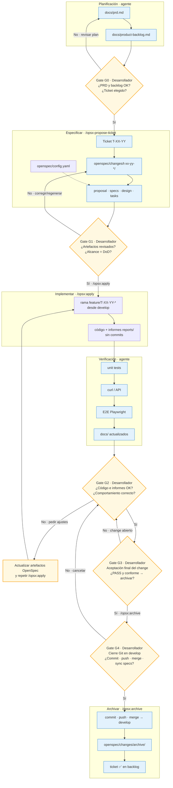

# ConRutina

Aplicación web para seguimiento de hábitos y recompensas: interfaz en **React** (SPA con **Vite**) y un **API HTTP** en **Node** (**Express** + **Prisma**) sobre **PostgreSQL**. Hábitos, semanas, recompensas y canjes persisten en base de datos; el hook `useHabitDashboard` consume `/api/weeks/*` y `/api/rewards` (incluido `POST /api/weeks/:weekId/redemptions`). El perfil de usuario se obtiene con **`GET /api/profile`**.

## Tabla de contenidos

- [Instalación](#instalación)
- [Uso](#uso)
- [Producción (Docker)](#producción-docker)
- [Estructura del proyecto](#estructura-del-proyecto)
- [Configuración](#configuración)
- [Scripts disponibles](#scripts-disponibles)
- [Tecnologías utilizadas](#tecnologías-utilizadas)
- [Flujo agéntico](#flujo-agéntico)
- [Contribución](#contribución)
- [Licencia](#licencia)

## Instalación

### Requisitos previos

- **Node.js** (versión recomendada no está fijada en el repositorio; usa una LTS reciente compatible con Vite 6 y Prisma 5).
- **npm** (hay `package-lock.json` en la raíz) o **pnpm** (existe `pnpm-workspace.yaml`).
- **Docker** y **Docker Compose** (opcional pero recomendable para PostgreSQL local).

### Pasos

1. Clona el repositorio y sitúate en la raíz del proyecto.
2. Instala dependencias (**raíz**):

```bash
npm install
```

3. Copia la plantilla de entorno en la raíz (no versiones el `.env` real):

```bash
cp .env.example .env
```

En Windows (PowerShell o CMD):

```bash
copy .env.example .env
```

Consulta [Configuración](#configuración) para el detalle de cada variable.
4. (Opcional) Levanta PostgreSQL con Docker (**raíz**):

```bash
npm run db:up
```

o

```bash
docker compose up -d db
```

El volumen persistente se llama **`ConRutina_postgres_data`**; los datos se conservan entre reinicios del contenedor.

5. Genera el cliente de Prisma y aplica migraciones (**raíz**; el esquema está en `backend/prisma/schema.prisma`):

```bash
npm run prisma:generate
npm run db:migrate
```

Las migraciones versionadas están en `backend/prisma/migrations/`. En desarrollo local también puedes usar `npx prisma migrate dev` si creas nuevas migraciones. (Opcional) Datos de demo (hábitos, recompensas, semana actual):

```bash
npm run db:seed
```

6. Parada de PostgreSQL con Docker (**raíz**):

```bash
npm run db:down
```

o

```bash
docker compose stop db
```

## Uso

### Desarrollo (frontend + API)

Un solo comando desde la **raíz** levanta la SPA (Vite, puerto **5173**) y el API Express (puerto **3001** o `API_PORT`) en paralelo:

```bash
npm run dev
```

Abre en el navegador `http://localhost:5173` (o la URL que indique la consola).

**Requisitos para el perfil de usuario y el API:**

1. PostgreSQL accesible y `DATABASE_URL` válida en `.env`.
2. Al arrancar, el API crea automáticamente el usuario demo (`id = 1`) si la base está vacía (`ensureDemoUser` en `backend/src/main.ts`). Para hábitos, recompensas y semana de ejemplo, ejecuta `npm run db:seed` (ver [Instalación](#instalación)).

Consulta [Instalación](#instalación) para Docker, Prisma y variables de entorno.

### Atajos de desarrollo parcial

Si solo necesitas uno de los procesos:

```bash
npm run dev:web   # Solo frontend (Vite)
npm run dev:api   # Solo backend (Express + recarga con tsx watch)
```

El API escucha por defecto en `http://localhost:3001`. Vite reenvía las peticiones que empiezan por `/api` a ese origen (ver `vite.config.ts`).

### Ejemplos básicos

- Probar el API directamente (con el servidor en marcha):

```bash
curl http://localhost:3001/api/profile
```

- Vista previa del build estático de la SPA (**raíz**; la salida de Vite es `frontend/dist/`):

```bash
npm run build
npm run preview
```

Para desplegar el stack completo en local (PostgreSQL + API + frontend con nginx), consulta [Producción (Docker)](#producción-docker).

## Producción (Docker)

El fichero **`docker-compose.prod.yml`** orquesta tres servicios: **`db`** (PostgreSQL 16), **`api`** (Express + Prisma) y **`web`** (nginx sirviendo la SPA y haciendo proxy de `/api/` al API). Las migraciones Prisma se aplican al arrancar el contenedor `api` (`prisma migrate deploy` en `backend/Dockerfile`).

### Requisitos previos

1. **Docker** y **Docker Compose** instalados.
2. Fichero **`.env`** en la raíz (copia de `.env.example`). Variables mínimas para el stack:
   - `POSTGRES_USER`, `POSTGRES_PASSWORD`, `POSTGRES_DB` — credenciales del contenedor PostgreSQL.
   - El servicio `api` construye `DATABASE_URL` con hostname `db` (no uses `localhost` para el API dentro de Docker).
   - `WEB_PORT` (opcional) — puerto en el host para la SPA; por defecto **80**.
   - En producción Docker, `CORS_ORIGIN` se fija a `http://localhost` en `docker-compose.prod.yml` (debe coincidir con el origen del navegador al acceder por ese puerto).

### Arranque completo

Desde la **raíz** del repositorio:

```bash
docker compose -f docker-compose.prod.yml up --build -d
```

Comprueba el estado (el servicio `db` debe aparecer como *healthy*):

```bash
docker compose -f docker-compose.prod.yml ps
```

**Acceso:** SPA en [http://localhost](http://localhost) (o `http://localhost:${WEB_PORT}` si lo cambiaste). El API no expone puerto en el host; las peticiones van por el proxy nginx, p. ej. `curl http://localhost/api/health`.

Tras el primer arranque la base queda con el esquema aplicado pero **sin datos de demo**. El API crea el usuario demo (`id = 1`) al iniciar; para hábitos y recompensas de ejemplo puedes ejecutar el seed contra la BD de producción local:

```bash
docker compose -f docker-compose.prod.yml exec api npx tsx backend/prisma/seed.ts
```

### Parada y limpieza

Detener el stack **conservando** el volumen de datos (`ConRutina_postgres_prod_data`):

```bash
docker compose -f docker-compose.prod.yml down
```

Detener y **eliminar** contenedores, redes y volúmenes (borra los datos de PostgreSQL de producción local):

```bash
docker compose -f docker-compose.prod.yml down -v
```

> El volumen de producción (`ConRutina_postgres_prod_data`) es independiente del de desarrollo (`ConRutina_postgres_data` en `docker-compose.yml`).

| Servicio | Imagen / build | Puerto host | Notas |
| -------- | -------------- | ----------- | ----- |
| `db` | `postgres:16-alpine` | *(interno)* | Volumen `ConRutina_postgres_prod_data` |
| `api` | `backend/Dockerfile` → `conrutina-api` | *(interno)* | Espera a `db` healthy; migraciones al arrancar |
| `web` | `frontend/Dockerfile` → `conrutina-web` | **80** (o `${WEB_PORT:-80}`) | Proxy `/api/` → `api:3001` (`frontend/nginx.conf`) |

## Estructura del proyecto

| Ruta                 | Descripción                                                                                                                                                                             |
| -------------------- | --------------------------------------------------------------------------------------------------------------------------------------------------------------------------------------- |
| `frontend/`          | Raíz de la SPA para Vite (`index.html`, `src/`). Presentación (`presentation/`), dominio (`domain/`), casos de uso vía hooks (`application/`), adaptadores HTTP (`infrastructure/`).    |
| `backend/src/`       | API Express: arranque en `main.ts`, composición HTTP en `presentation/http/createApp.ts`, casos de uso en `application/`, puertos en `application/ports/`, Prisma en `infrastructure/`. |
| `backend/prisma/`    | Esquema Prisma (`schema.prisma`) y migraciones (`migrations/`): modelos `User`, `Week`, `Habit`, `Reward`, etc.; datasource PostgreSQL.                                                  |
| `backend/Dockerfile` | Imagen multi-stage del API (Node 20 Alpine): compila TypeScript, aplica migraciones y arranca Express.                                                                                   |
| `frontend/Dockerfile`| Imagen multi-stage del frontend: build Vite + nginx sirviendo estáticos.                                                                                                                |
| `frontend/nginx.conf`| Proxy inverso `/api/` → servicio `api:3001` y fallback SPA (`try_files`).                                                                                                                |
| `docker-compose.yml` | Desarrollo: servicio **`db`** (PostgreSQL 16 Alpine) con volumen `ConRutina_postgres_data`.                                                                                              |
| `docker-compose.prod.yml` | Producción local: servicios **`db`**, **`api`** y **`web`**.                                                                                                                        |
| `vite.config.ts`     | Configuración de Vite: `root` en `frontend/`, alias `@` → `frontend/src`, proxy `/api` → `http://localhost:3001`.                                                                       |
| `docs/`              | Documentación adicional; `docs/infrastructure.md` amplía arquitectura y stack.                                                                                                          |
| `openspec/`          | Configuración OpenSpec (`config.yaml`); no forma parte del runtime de la aplicación.                                                                                                    |

## Configuración

La fuente canónica de variables es **`.env.example`** en la raíz. Copia ese fichero a **`.env`** (no versionado) antes de arrancar servicios; el API lo carga vía `backend/src/loadEnv.ts`.

Variables habituales:

| Variable            | Uso                                                                                                                                              |
| ------------------- | ------------------------------------------------------------------------------------------------------------------------------------------------ |
| `DATABASE_URL`      | Cadena de conexión **PostgreSQL** para Prisma y el `PrismaClient` del API. Obligatoria para el API con base de datos.                            |
| `POSTGRES_USER`     | Usuario de la instancia en Docker Compose.                                                                                                       |
| `POSTGRES_PASSWORD` | Contraseña de la instancia en Docker Compose.                                                                                                    |
| `POSTGRES_DB`       | Nombre de la base en el contenedor (ver `.env.example`).                                                                                      |
| `POSTGRES_PORT`     | Puerto en el host para PostgreSQL de desarrollo; por defecto **5432**.                                                                         |
| `WEB_PORT`          | Puerto en el host para la SPA en `docker-compose.prod.yml`; por defecto **80**.                                                                  |
| `API_PORT`          | Puerto del API Express; por defecto **3001**. Si lo cambias, ajusta también el `server.proxy` de `vite.config.ts` para que el `target` coincida. |
| `CORS_ORIGIN`       | Origen permitido para CORS; por defecto **`http://localhost:5173`** en desarrollo. En Docker prod el compose fija `http://localhost`.           |
| `NODE_ENV`          | Entorno Node (`development`, `production`, `test`); por defecto **`development`**.                                                               |

Los valores de ejemplo y comentarios de cada clave están en **`.env.example`**.

## Scripts disponibles

| Comando                   | Descripción                                                             |
| ------------------------- | ----------------------------------------------------------------------- |
| `npm run dev`             | Frontend (Vite) y API (Express) en paralelo con `concurrently`.         |
| `npm run dev:web`         | Solo servidor de desarrollo Vite (SPA).                                 |
| `npm run dev:api`         | Solo API Express con recarga (`tsx watch` sobre `backend/src/main.ts`). |
| `npm run build`           | Build de producción de la SPA → `frontend/dist/`.                       |
| `npm run typecheck`       | Comprobación de tipos (`tsc --noEmit`) en frontend y backend.           |
| `npm run build:dev`       | Build en modo development.                                              |
| `npm run preview`         | Sirve el contenido de `frontend/dist/` localmente.                      |
| `npm run lint`            | ESLint sobre `frontend/src` y `backend/src`.                            |
| `npm run format`          | Formatea código con Prettier (TS/TSX/CSS, JSON, MD, MJS).             |
| `npm run format:check`    | Comprueba formato Prettier sin modificar ficheros.                      |
| `npm run test`            | Ejecuta tests unitarios con Vitest (`vitest run`).                      |
| `npm run test:watch`      | Vitest en modo observación.                                             |
| `npm run test:coverage`   | Tests unitarios con informe de cobertura (text, html, lcov).            |
| `npm run test:integration`| Tests de integración contra PostgreSQL real (requiere Docker activo).   |
| `npm run db:up`           | `docker compose up -d db` — levanta PostgreSQL (comando canónico).      |
| `npm run db:down`         | `docker compose stop db` — detiene PostgreSQL sin eliminar el volumen.  |
| `npm run docker:up`       | Alias de `db:up`.                                                       |
| `npm run docker:down`     | Alias de `db:down`.                                                     |
| `npm run docker:logs`     | Logs del servicio `db`.                                                 |
| `npm run prisma:init`     | `npx prisma init`.                                                      |
| `npm run prisma:generate` | `npx prisma generate`.                                                  |
| `npm run db:migrate`      | `npx prisma migrate deploy`.                                            |
| `npm run db:seed`         | `npx prisma db seed` — datos de demo (usuario, hábitos, recompensas).   |
| `npm run api`             | Alias de `dev:api` (`tsx watch backend/src/main.ts`).                   |

### Calidad de código (ESLint y Prettier)

| Fichero              | Propósito                                              |
| -------------------- | ------------------------------------------------------ |
| `eslint.config.mjs`  | ESLint 9 flat config: TypeScript + React (frontend) y Node (backend) |
| `.prettierrc`        | `singleQuote`, `semi: false`, `tabWidth: 2`, `printWidth: 100` |
| `.prettierignore`    | Excluye `node_modules`, `dist`, migraciones Prisma     |
| `.editorconfig`      | Indentación, charset UTF-8 y fin de línea LF           |

> Los tests de integración (`npm run test:integration`) requieren Docker con PostgreSQL activo (`npm run docker:up`) y la BD de test creada (ver [docs/development_guide.md](docs/development_guide.md#tests-de-integración)).

## Tecnologías utilizadas

- **Frontend:** React 18, TypeScript, Vite 6, Tailwind CSS 4, Radix UI, Material UI, componentes tipo shadcn, Motion, Sonner, date-fns, entre otras dependencias listadas en `package.json`.
- **Backend:** Node.js, Express, CORS, Prisma 5, `@prisma/client`, `tsx` (desarrollo).
- **Base de datos:** PostgreSQL 16 (imagen Docker oficial Alpine).

## Flujo agéntico

Todas las funcionalidades de ConRutina se han desarrollado mediante un **flujo de agentes de IA personalizado** basado en **OpenSpec** (modo *spec-driven*, ver `openspec/config.yaml`). Cada ticket del backlog de producto (`T-XX-YY` en `docs/product-backlog.md`) se traduce en un *change* OpenSpec bajo `openspec/changes/`; el agente especifica, implementa, verifica y archiva el cambio siguiendo reglas versionadas en el repositorio.

**Orquestación resumida:**

1. **Planificación** — El PRD (`docs/prd.md`) y el backlog ágil (`docs/product-backlog.md`) definen user stories, criterios de aceptación (Gherkin) y tickets priorizados por sprint. Skills dedicadas (`generate-prd`, `generate-product-backlog`) automatizan su generación desde el contexto del producto.
2. **Especificar** — `/opsx-propose-ticket T-XX-YY` (skill `propose-from-ticket`) extrae el ticket, inspecciona el código existente y genera los artefactos del change: `proposal.md`, `specs/`, `design.md` y `tasks.md`, gobernados por `openspec/config.yaml` y `docs/openspec/tasks-core.md`.
3. **Implementar** — `/opsx:apply <change-name>` (skill `openspec-apply-change`) crea la rama `feature/T-XX-YY-nombre` desde `develop`, ejecuta las tareas de `tasks.md` **sin commits intermedios** y genera informes de verificación en `openspec/changes/<name>/reports/`.
4. **Verificar** — Pasos obligatorios según tipo de ticket: tests unitarios, comprobación manual o `curl` del API, pruebas E2E (Playwright MCP) y actualización de documentación técnica en `docs/`. Los ejecuta el agente; el desarrollador no sustituye esa batería, pero sí revisa el resultado.
5. **Archivar** — Tras la aceptación del usuario, `/opsx:archive <change-name>` (skill `openspec-archive-change`) hace commit único, push de la rama feature, merge a `develop`, mueve el change a `openspec/changes/archive/` y marca el ticket como implementado en el backlog.

Los comandos Cursor viven en `.cursor/commands/opsx-*.md`; las skills en `.cursor/skills/openspec-*/`. Las reglas mínimas para todos los agentes están en `docs/base-standards.md`. Para exploración previa o cambios ad hoc existen `/opsx:explore` y `/opsx:propose`.

### Gates de validación (desarrollador)

En el flujo, el agente genera artefactos, código e informes de prueba; el **desarrollador** interviene en puntos concretos para **aprobar, rechazar o pedir correcciones** antes de avanzar. Los nodos en forma de rombo del diagrama representan esos *gates*.

| Gate | Momento | Decisión del desarrollador | Si no aprueba |
| ---- | ------- | -------------------------- | ------------- |
| **G0** | Tras planificación (PRD + backlog) | Valida visión, prioridades y ticket a abordar | Ajusta PRD/backlog o elige otro ticket |
| **G1** | Tras `/opsx-propose-ticket` | Revisa `proposal`, `specs`, `design` y `tasks` (alcance = DoD del ticket) | Pide regenerar o editar artefactos; **no** lanzar `/opsx:apply` hasta estar conforme |
| **G2** | Tras `/opsx:apply` y verificación del agente | Revisa working tree, informes en `reports/` y comportamiento en local | Pide ajustes: primero actualizar artefactos OpenSpec, luego repetir apply (sin commits hasta archivar) |
| **G3** | Antes de `/opsx:archive` | Acepta explícitamente el change (pruebas PASS + código conforme) | Mantiene el change abierto; vuelve a G2 |
| **G4** | Durante `/opsx:archive` | Confirma cierre Git (commit, push, merge) y, si aplica, sincronización de specs delta | Cancela o corrige pendientes antes de integrar en `develop` |



**Leyenda:** rectángulos azules = trabajo del agente; rombos amarillos = **gate** donde el desarrollador decide si continuar, corregir o detener el flujo.

## Contribución

1. Crea una rama a partir de la rama principal del repositorio.
2. Realiza cambios acotados y con mensajes de commit claros.
3. Abre un pull request describiendo el propósito del cambio y cómo probarlo (por ejemplo: `npm run dev` con PostgreSQL y `.env` configurados).

Si el proyecto adopta más adelante guías formales (estilo de código, convenciones de commits, plantillas de PR), enlázalas aquí cuando existan en el repositorio.

## Licencia

Derechos de autor reservados. El texto legal completo está en el archivo `[LICENSE](LICENSE)` en la raíz del repositorio: el software y su código fuente son propiedad exclusiva del autor; no se concede permiso para usarlo, copiarlo, modificarlo, fusionarlo, publicarlo, distribuirlo, sublicenciarlo o venderlo sin permiso explícito por escrito del autor.
