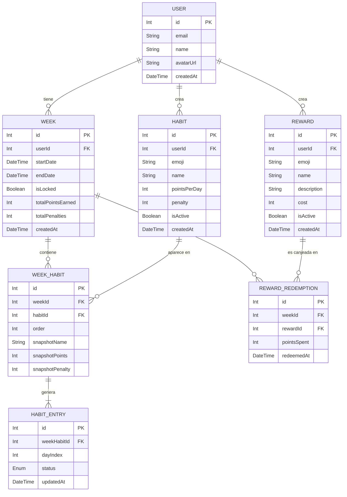

# Modelo de datos — ConRutina

Este documento describe el **modelo de datos objetivo** de ConRutina (seguimiento de hábitos con calendario semanal, puntos y recompensas). Está alineado con las secciones **5.1** y **5.2** de [prd.md](./prd.md) y sirve de referencia para Prisma, migraciones y API.

> **Fuente de verdad:** ante cualquier discrepancia, prevalece el PRD (`docs/prd.md`, §5).

---

## Estado de persistencia (resumen)

| Entidad | PostgreSQL (Prisma) | Notas |
| ------- | ------------------- | ----- |
| `User` | **Migrada** | Schema completo (`avatarUrl`, `createdAt`). Tabla en BD vía migración `20260530120258_init`. |
| `Week` | **Migrada** | Índice `[userId, startDate]`. |
| `Habit` | **Migrada** | Hoy la UI sigue en estado React (`frontend/src/domain/habit.ts`); ver [mapeo provisional](#mapeo-provisional-frontend--modelo-objetivo). |
| `WeekHabit` | **Migrada** | `@@unique([weekId, habitId])`. |
| `HabitEntry` | **Migrada** | Enum `CompletionStatus`. |
| `Reward` | **Migrada** | Hoy la UI sigue en estado React (`frontend/src/domain/reward.ts`). |
| `RewardRedemption` | **Migrada** | FK a `Week` y `Reward`. |

**Implementación actual en base de datos:** las siete entidades del dominio están **definidas en** `backend/prisma/schema.prisma` y **materializadas en PostgreSQL** con la migración inicial `20260530120258_init` (T-03-02 ✅). El endpoint `GET /api/profile` lee el usuario fijo `id = 1` desde la tabla `User`.

---

## Descripción de entidades (alineado con PRD §5.1)

### 1. User (Usuario)

Representa a un usuario que registra hábitos, gestiona semanas y define recompensas.

| Atributo | Tipo | Descripción |
| -------- | ---- | ----------- |
| `id` | `Int` (PK, autoincrement) | Identificador único |
| `email` | `String` (unique) | Correo electrónico |
| `name` | `String?` | Nombre visible en la cabecera |
| `avatarUrl` | `String?` | URL opcional del avatar |
| `createdAt` | `DateTime` | Fecha de creación de la cuenta |

**Persistencia:** migrada a PostgreSQL (T-03-02). **Paso futuro:** exponer `avatarUrl` en la API.

**Implementación actual:**
- Esquema: `backend/prisma/schema.prisma`
- Dominio/API: `backend/src/domain/userProfile.ts`, `GET /api/profile`

**Relaciones (objetivo):**
- 1:N con `Week`, `Habit` y `Reward`

---

### 2. Week (Semana)

Representa una semana calendario del usuario, con bloqueo histórico y totales al cerrar.

| Atributo | Tipo | Descripción |
| -------- | ---- | ----------- |
| `id` | `Int` (PK, autoincrement) | Identificador único |
| `userId` | `Int` (FK → User) | Usuario propietario |
| `startDate` | `DateTime` | Lunes de la semana (00:00:00) |
| `endDate` | `DateTime` | Domingo de la semana (23:59:59) |
| `isLocked` | `Boolean` | `true` cuando la semana ha terminado y no puede modificarse |
| `totalPointsEarned` | `Int` | Puntos positivos acumulados al bloquear |
| `totalPenalties` | `Int` | Penalizaciones acumuladas al bloquear |
| `createdAt` | `DateTime` | Fecha de creación del registro |

**Persistencia:** migrada a PostgreSQL (T-03-02).

**En el frontend (provisional):** la navegación semanal se calcula en memoria con `weekOffset` y `buildWeekData()` (`frontend/src/domain/week.ts`); la entidad `Week` aún no se persiste en BD.

---

### 3. Habit (Hábito)

Catálogo de hábitos del usuario (plantilla reutilizable en varias semanas).

| Atributo | Tipo | Descripción |
| -------- | ---- | ----------- |
| `id` | `Int` (PK, autoincrement) | Identificador único |
| `userId` | `Int` (FK → User) | Usuario propietario |
| `emoji` | `String` | Emoji representativo |
| `name` | `String` | Nombre descriptivo |
| `pointsPerDay` | `Int` | Puntos por día completado |
| `penalty` | `Int` | Puntos perdidos por día fallado |
| `isActive` | `Boolean` | Disponible para añadir a nuevas semanas |
| `createdAt` | `DateTime` | Fecha de creación |

**Persistencia:** migrada a PostgreSQL (T-03-02).

**Reglas de validación (dominio):**
- `pointsPerDay` ≥ 1; `penalty` ≥ 0
- Nombre obligatorio y descriptivo

---

### 4. WeekHabit (Hábito en una semana)

Tabla intermedia: asocia un hábito a una semana concreta. Cada semana puede tener un conjunto distinto de hábitos.

| Atributo | Tipo | Descripción |
| -------- | ---- | ----------- |
| `id` | `Int` (PK, autoincrement) | Identificador único |
| `weekId` | `Int` (FK → Week) | Semana |
| `habitId` | `Int` (FK → Habit) | Hábito asociado |
| `order` | `Int` | Orden en el calendario |
| `snapshotName` | `String` | Nombre al bloquear (histórico inmutable) |
| `snapshotPoints` | `Int` | Puntos al bloquear |
| `snapshotPenalty` | `Int` | Penalización al bloquear |

**Persistencia:** migrada a PostgreSQL (T-03-02).

---

### 5. HabitEntry (Entrada diaria)

Estado de un hábito en un día concreto de la semana (7 filas por `WeekHabit`).

| Atributo | Tipo | Descripción |
| -------- | ---- | ----------- |
| `id` | `Int` (PK, autoincrement) | Identificador único |
| `weekHabitId` | `Int` (FK → WeekHabit) | Hábito de la semana |
| `dayIndex` | `Int` | 0 = Lunes … 6 = Domingo |
| `status` | `Enum` | `pending`, `completed`, `failed` |
| `updatedAt` | `DateTime` | Última actualización |

**Persistencia:** migrada a PostgreSQL (T-03-02).

**Lógica de negocio:**
- Solo `completed` suma `pointsPerDay`; solo `failed` aplica `penalty`
- La racha se deriva de entradas `completed` consecutivas desde el inicio de la semana visible

---

### 6. Reward (Recompensa)

Recompensa canjeable definida por el usuario.

| Atributo | Tipo | Descripción |
| -------- | ---- | ----------- |
| `id` | `Int` (PK, autoincrement) | Identificador único |
| `userId` | `Int` (FK → User) | Usuario propietario |
| `emoji` | `String` | Emoji representativo |
| `name` | `String` | Nombre |
| `description` | `String` | Descripción breve |
| `cost` | `Int` | Coste en puntos |
| `isActive` | `Boolean` | Disponible para canje |
| `createdAt` | `DateTime` | Fecha de creación |

**Persistencia:** migrada a PostgreSQL (T-03-02).

---

### 7. RewardRedemption (Canje de recompensa)

Registro de cada canje en una semana determinada.

| Atributo | Tipo | Descripción |
| -------- | ---- | ----------- |
| `id` | `Int` (PK, autoincrement) | Identificador único |
| `weekId` | `Int` (FK → Week) | Semana del canje |
| `rewardId` | `Int` (FK → Reward) | Recompensa canjeada |
| `pointsSpent` | `Int` | Puntos descontados |
| `redeemedAt` | `DateTime` | Momento del canje |

**Persistencia:** migrada a PostgreSQL (T-03-02).

---

## Objetos de valor (no persistidos)

Estos tipos existen en el frontend para la UI y los cálculos; **no son tablas** en el modelo objetivo del PRD.

### HabitStats (estadísticas agregadas)

Calculado a partir de los hábitos de la semana visible (`frontend/src/domain/habit.ts`):

- `thisWeekPoints`, `lastWeekPoints`, `penalties`, `maxStreak`
- `totalPoints = thisWeekPoints + lastWeekPoints - penalties`

En el modelo objetivo, los totales de semana pasan a `Week.totalPointsEarned` y `Week.totalPenalties` al bloquear; `lastWeekPoints` fijo (72) en demo será sustituido por lectura de semanas históricas.

### WeekData (vista de calendario)

Objeto de presentación (`dates`, `range`) generado por `buildWeekData()` para el componente `WeeklyCalendar`. Se sustituirá por consultas a `Week` + `HabitEntry` cuando exista persistencia.

---

## Mapeo provisional (frontend → modelo objetivo)

Hasta completar la migración a PostgreSQL, el cliente usa un modelo simplificado en memoria:

| Frontend (actual) | Modelo objetivo (PRD) |
| ----------------- | --------------------- |
| `Habit.id` (`string`, UUID) | `Habit.id` (`Int`) + filas en `WeekHabit` / `HabitEntry` |
| `Habit.completionStatus[7]` | 7 × `HabitEntry` por cada `WeekHabit` |
| `Habit.streak` (calculado) | Derivado de `HabitEntry.status` |
| `Reward` en `fixtures.ts` / React | `Reward` + `RewardRedemption` |
| `weekOffset` + fechas calculadas | `Week` (`startDate`, `endDate`, `isLocked`) |

Datos de demo: `frontend/src/domain/fixtures.ts`. Estado: `useHabitDashboard` (`useState`); se pierde al recargar la página.

---

## Diagrama entidad-relación (PRD §5.2)

---

## Relaciones (resumen, PRD §5.3)

| Desde | Hacia | Cardinalidad | Descripción |
| ----- | ----- | ------------ | ----------- |
| `User` | `Week` | 1:N | Semanas del usuario |
| `User` | `Habit` | 1:N | Catálogo de hábitos |
| `User` | `Reward` | 1:N | Catálogo de recompensas |
| `Week` | `WeekHabit` | 1:N | Hábitos activos en esa semana |
| `Habit` | `WeekHabit` | 1:N | Mismo hábito en varias semanas; snapshot al bloquear |
| `WeekHabit` | `HabitEntry` | 1:7 | Siete entradas (Lun–Dom) |
| `Week` | `RewardRedemption` | 1:N | Canjes dentro del presupuesto de la semana |
| `Reward` | `RewardRedemption` | 1:N | Misma recompensa en distintas semanas |

---

## Roadmap de persistencia

1. ~~**Completar schema Prisma**~~ — ✅ T-03-01: siete modelos del dominio + enum `CompletionStatus` en `backend/prisma/schema.prisma`.
2. ~~**Migración inicial a PostgreSQL (T-03-02)**~~ — ✅ `20260530120258_init` en `backend/prisma/migrations/`; tablas del dominio en BD.
3. **Seed de datos demo (T-03-03)** — usuario, hábitos y recompensas de ejemplo.
4. **API y frontend** — CRUD, calendario semanal con bloqueo, canje e historial.
5. **Autenticación multiusuario** — dejar de fijar `userId = 1` en API.

---

## Principios de diseño

1. **Alineación con PRD:** el esquema relacional es el de §5.1; la UI puede usar DTOs hasta migrar.
2. **Clean Architecture:** dominio sin dependencias de Prisma en el frontend.
3. **Histórico inmutable:** snapshots en `WeekHabit` al bloquear la semana.
4. **Semana ISO de producto:** `dayIndex` 0 = lunes, 6 = domingo (coherente con `frontend/src/domain/week.ts`).

---

## Referencias

- [prd.md](./prd.md) — §5 Modelo de datos
- [api-spec.yml](./api-spec.yml) — contrato HTTP
- [infrastructure.md](./infrastructure.md) — PostgreSQL, Prisma, Docker
