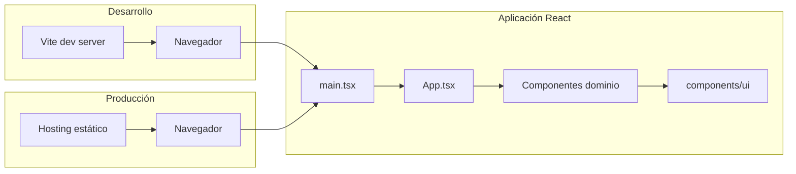
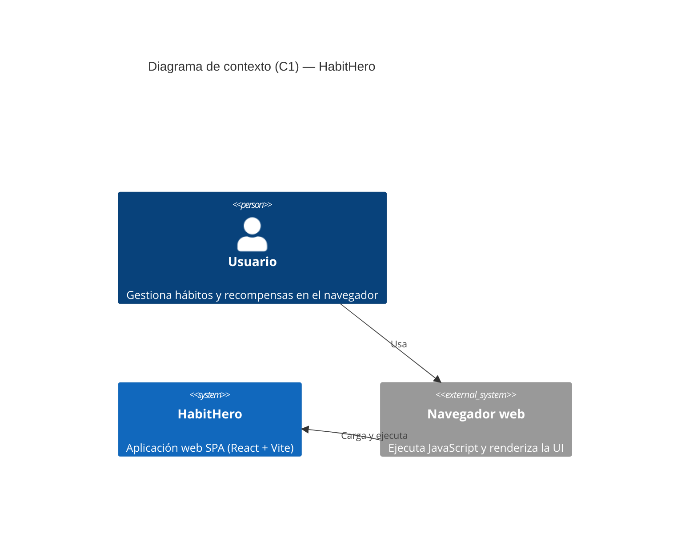
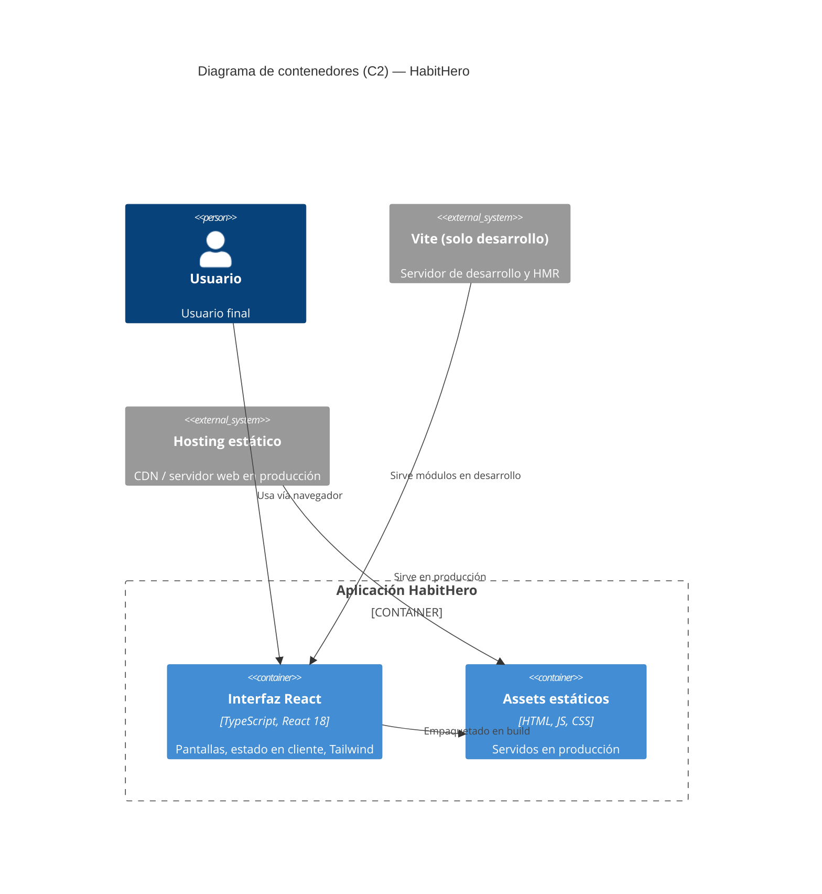

# Infraestructura y arquitectura técnica — HabitHero

Documento orientado a desarrolladores que deben entender el proyecto y añadir funcionalidades. Describe el **stack**, los **componentes de software**, su **relación**, **versiones**, **estructura de carpetas**, **configuración** y **comandos** habituales.

---

## 1. Resumen ejecutivo

**HabitHero** es una aplicación web **SPA (Single Page Application)** escrita en **TypeScript** con **React**. El estado de hábitos y recompensas vive hoy en **memoria del cliente** (`useState` en el componente raíz); no hay API ni base de datos integrada en el código actual.

El empaquetado y el servidor de desarrollo los proporciona **Vite**. Los estilos se basan en **Tailwind CSS v4** (plugin oficial de Vite) y en variables CSS de tema (patrón tipo **shadcn/ui** con **Radix UI** y utilidades como `cn()`).

En `package.json` existen scripts para **Docker** y **Vitest/ESLint**, pero en el repositorio **no aparece** `docker-compose.yml` ni `vitest`/eslint en `devDependencies` (ver [§8 Notas y advertencias](#8-notas-y-advertencias)).

---

## 2. Stack tecnológico

| Capa | Tecnología | Versión en proyecto | Propósito |
|------|------------|---------------------|-----------|
| Runtime (navegador) | JavaScript (ES modules) | — | Ejecución en el cliente |
| Lenguaje | TypeScript (sintaxis `.ts`/`.tsx`) | Sin paquete `typescript` en lockfile; `tsconfig` orienta al IDE y al compilador embebido de Vite | Tipado estático y mejor DX |
| UI | React | **18.3.1** (peer; instalado vía npm) | Componentes y estado reactivo |
| Bundler / dev server | Vite | **6.4.2** (`package.json`; lockfile alineado) | Desarrollo con HMR, build a estáticos |
| Plugin React | `@vitejs/plugin-react` | **4.7.0** | Fast Refresh y JSX |
| Estilos | Tailwind CSS | **4.1.12** | Utilidades CSS y diseño responsive |
| Integración Tailwind–Vite | `@tailwindcss/vite` | **4.1.12** | Procesa Tailwind en el pipeline de Vite |
| Animaciones CSS (Tailwind) | `tw-animate-css` | **1.3.8** | Utilidades de animación |
| Iconos (pantalla principal) | `lucide-react` | **0.487.0** | Iconos vectoriales (p. ej. calendario, regalo) |
| Utilidad clases | `clsx` + `tailwind-merge` | **2.1.1** / **3.2.0** | Componer clases y resolver conflictos (`cn()` en UI) |
| Variantes de componentes | `class-variance-authority` | **0.7.1** | Variantes tipadas de estilos (patrón shadcn) |
| Primitivos accesibles (UI kit) | Radix UI (`@radix-ui/react-*`) | Varias **1.x–2.x** (ver `package.json`) | Diálogos, menús, formularios accesibles |
| Componentes Material | MUI (`@mui/material`, `@emotion/*`) | **7.3.5** / **11.14.x** | Disponibles; la pantalla principal no depende de ellos de forma obligatoria |
| Formularios / UX adicionales | `react-hook-form`, `motion`, `recharts`, `react-router`, etc. | Ver `package.json` | Librerías listas para pantallas más complejas; **React Router** está instalado pero **no se usa aún** en `App.tsx` |

**Versión de la aplicación:** `0.0.1` (`package.json`, campo `version`).

**Node / gestor de paquetes:** el repo incluye `package-lock.json` (npm) y `pnpm-workspace.yaml` (workspace mínimo con el paquete raíz `.`). Puedes usar **npm** o **pnpm** según tu entorno; las versiones concretas de dependencias transitivas están resueltas en el lockfile que uses.

---

## 3. Componentes de software (lógicos)

### 3.1 Contenedor de entrega

| Componente | Descripción |
|------------|-------------|
| **Aplicación cliente (SPA)** | HTML único (`index.html`) + bundle JS/CSS generado por Vite. Toda la lógica de negocio visible está en React. |
| **Servidor de desarrollo Vite** | Sirve módulos ES en caliente durante `npm run dev`. No es un backend de producción. |
| **Artefacto de producción** | Carpeta `dist/` con assets estáticos listos para desplegar en cualquier hosting estático (CDN, S3, Netlify, etc.). |

### 3.2 Módulos dentro del código fuente

| Componente | Ubicación típica | Propósito |
|------------|------------------|-----------|
| **Punto de entrada** | `src/main.tsx` | Monta React en `#root` e importa estilos globales. |
| **Raíz de la app** | `src/app/App.tsx` | Estado global local (hábitos, recompensas, modales, semana), cálculo de estadísticas y composición de vistas. |
| **Componentes de dominio** | `src/app/components/*.tsx` | UI de negocio: cabecera, filas de hábito, calendario semanal, tarjetas de estadísticas/recompensas, modales. |
| **Kit UI reutilizable** | `src/app/components/ui/*` | Primitivos (botones, diálogos, tablas, etc.) alineados con Radix + Tailwind + CVA. |
| **Utilidades UI** | `src/app/components/ui/utils.ts`, `use-mobile.ts` | Helpers (`cn`, detección móvil). |
| **Figma / diseño** | `src/app/components/figma/ImageWithFallback.tsx` | Imagen con fallback (útil si se exporta diseño desde Figma). |
| **Estilos globales** | `src/styles/*` | Encadenado: fuentes → Tailwind → tema (variables CSS). |
| **OpenSpec (metodología)** | `openspec/config.yaml` | Configuración para flujo spec-driven con IA (propuestas, tareas); no afecta al runtime de la app. |

---

## 4. Relación entre componentes

Flujo de **desarrollo**:

1. El desarrollador ejecuta Vite (`npm run dev`).
2. El navegador carga `index.html`, que ejecuta `src/main.tsx` como módulo ES.
3. `main.tsx` renderiza `<App />`, que importa componentes hijos y estilos ya procesados por Tailwind (vía plugin Vite).

Flujo de **producción**:

1. `npm run build` genera `dist/`.
2. Un servidor web estático sirve `index.html` y los assets con hash; el cliente ejecuta el mismo grafo de React sin Vite.

**Dependencias de datos:** no hay llamadas HTTP en el código analizado; el estado es **local** al árbol de React bajo `App`.



---

## 5. Propósito de cada pieza (para perfiles junior)

- **React**: Encapsula la interfaz en **componentes** y reacciona a cambios de **estado**. Si añades una funcionalidad, lo habitual es crear un componente o ampliar `App` y pasar **props** o **callbacks**.
- **Vite**: Une todos los archivos en algo que el navegador entiende. En desarrollo recarga rápido (**HMR**). No sustituye un servidor de API.
- **TypeScript**: Ayuda a detectar errores antes de ejecutar. Los interfaces `Habit` y `Reward` en `App.tsx` definen la forma de los datos.
- **Tailwind**: Estilos como clases en `className`. Evita escribir mucho CSS suelto; consulta la doc de Tailwind v4 para nuevas utilidades.
- **Alias `@/`**: En imports, `@/app/...` apunta a `src/app/...` (configurado en `vite.config.ts` y `tsconfig.json`).
- **Radix + carpeta `ui/`**: Si necesitas un modal, select o tooltip accesible, reutiliza primero lo que ya hay en `components/ui` en lugar de inventar desde cero.

---

## 6. Estructura de directorios

```
HabitHero_v3/
├── .cursor/                 # Comandos y skills de Cursor (flujo OpenSpec, etc.)
├── docs/                    # Documentación del proyecto (este archivo)
├── openspec/                # Config OpenSpec (spec-driven)
├── dist/                    # Salida de `vite build` (generada; no editar a mano)
├── node_modules/            # Dependencias instaladas
├── src/
│   ├── main.tsx             # Entrada React
│   ├── app/
│   │   ├── App.tsx          # Vista principal y estado
│   │   └── components/
│   │       ├── *.tsx        # Componentes de pantalla (hábitos, recompensas…)
│   │       ├── figma/       # Utilidades ligadas a diseño
│   │       └── ui/          # Biblioteca de primitivos UI
│   └── styles/
│       ├── index.css        # Orquesta imports (@import fonts, tailwind, theme)
│       ├── tailwind.css     # Directivas Tailwind v4 + @source
│       └── theme.css        # Variables CSS (tema)
├── index.html               # HTML shell; raíz #root
├── package.json
├── package-lock.json
├── pnpm-workspace.yaml
├── postcss.config.mjs       # PostCSS (vacío por defecto; Tailwind va por Vite)
├── tsconfig.json
├── vite.config.ts
├── default_shadcn_theme.css # Referencia de tema (raíz)
└── ATTRIBUTIONS.md
```

---

## 7. Principales ficheros de configuración

| Archivo | Rol |
|---------|-----|
| `package.json` | Scripts, dependencias, metadatos del paquete (`type: "module"` → ESM nativo en Node para scripts). |
| `vite.config.ts` | Plugins (`react`, `tailwindcss`), alias `@` → `./src`, `assetsInclude` para `.svg` y `.csv`. |
| `tsconfig.json` | `strict`, `jsx: react-jsx`, paths `@/*`, `moduleResolution: bundler` (pensado para Vite). |
| `postcss.config.mjs` | Placeholder; Tailwind v4 con `@tailwindcss/vite` no requiere aquí `tailwindcss` clásico. |
| `pnpm-workspace.yaml` | Declara el workspace monorepo mínimo (solo el directorio actual). |
| `openspec/config.yaml` | Esquema `spec-driven` y contexto opcional para generación de especificaciones con IA. |
| `index.html` | Punto de entrada HTML; `lang="es"`, título HabitHero. |

---

## 8. Comandos para inicializar y trabajar con el proyecto

| Comando | Cuándo usarlo |
|---------|----------------|
| `npm install` | Primera vez o tras cambios en `package.json`; instala dependencias (equiv. `pnpm install` si usas pnpm). |
| `npm run dev` | Arranca Vite en modo desarrollo (URL en consola, suele ser `http://localhost:5173`). |
| `npm run build` | Genera producción en `dist/`. |
| `npm run build:dev` | Build en modo `development` de Vite (útil para depurar builds). |
| `npm run preview` | Sirve localmente el contenido de `dist/` tras un build. |
| `npm run lint` | Ejecuta `eslint .` — **requiere** tener ESLint instalado/configurado; hoy no figura en `devDependencies`. |
| `npm run test` / `npm run test:watch` | Ejecutan Vitest — **requieren** `vitest` en el proyecto; hoy no está declarado en `devDependencies`. |
| `npm run docker:up` / `docker:down` / `docker:logs` | Previstos para Postgres vía Docker Compose — **no hay** `docker-compose.yml` en el árbol actual del repo. |

No existe `npm start` en este proyecto; el equivalente habitual en desarrollo es **`npm run dev`**.

---

## 9. Diagramas C4 (Mermaid)

### 9.1 Nivel C1 — Contexto del sistema

Muestra HabitHero en relación con el usuario y el entorno de ejecución.



> **Nota:** La sintaxis `C4Context` requiere soporte Mermaid con diagramas C4 (p. ej. Mermaid ≥ 9.4 con `c4` habilitado). Si tu visor solo soporta diagramas clásicos, usa la versión alternativa siguiente.

**Alternativa (flowchart estilo contexto):**


### 9.2 Nivel C2 — Contenedores



**Alternativa (flowchart):**


---

## 10. Guía rápida para añadir funcionalidades (junior)

1. **Localiza el estado:** Casi toda la lógica está en `App.tsx`. Si la app crece, conviene extraer contexto (`React.createContext`), un store ligero o llamadas a API; hoy no hay esa capa.
2. **Nuevo componente de pantalla:** Crea un archivo en `src/app/components/`, impórtalo en `App.tsx` y pasa solo las props necesarias.
3. **Reutiliza `ui/`:** Para modales y controles complejos, mira primero `src/app/components/ui/` antes de instalar otra librería.
4. **Estilos:** Prefiere utilidades Tailwind y variables de `theme.css` para mantener coherencia con el kit existente.
5. **Rutas:** `react-router` ya está en dependencias; si añades varias pantallas, configura el router en `main.tsx` o `App.tsx` y divide vistas.
6. **Persistencia:** Los datos se pierden al recargar. Para guardar hábitos de verdad haría falta `localStorage`, IndexedDB o un backend; planifica esa capa aparte del UI.
7. **Pruebas:** Antes de usar `npm run test`, añade `vitest` (y opcionalmente `@testing-library/react`) como `devDependency` y un `vitest.config.ts` si lo necesitas.
8. **OpenSpec:** Si el equipo usa el flujo de especificaciones en `.cursor/skills`, alinea cambios grandes con propuestas/tareas en `openspec/` para mantener trazabilidad.

---

## 11. Notas y advertencias

- **Peer dependencies:** `react` y `react-dom` están como `peerDependencies` con `optional: true` en `package.json`; npm los instala en la práctica (aparecen en `package-lock.json`). Verifica siempre que existan en `node_modules` tras un install limpio.
- **Override pnpm:** El bloque `pnpm.overrides` fija `vite` a **6.3.5**; con **npm** ese bloque no aplica. La versión efectiva con npm es la de `dependencies`/`devDependencies` y el lockfile (**6.4.2**).
- **`src/styles/fonts.css`:** `index.css` lo importa primero; si tu entorno de build exige que el fichero exista y no está en el repo, añade `src/styles/fonts.css` (puede estar vacío o con reglas `@font-face`).
- **Scripts huérfanos:** `docker:*`, `lint` y `test*` pueden fallar hasta que existan los archivos y paquetes correspondientes.
- **Librerías instaladas no usadas en la vista principal:** Muchas dependencias (MUI, Recharts, react-dnd, etc.) preparan el proyecto para evolucionar; no implican que todas se usen en `App.tsx` hoy.

---

*Documento generado a partir del estado del repositorio. Actualízalo cuando cambien dependencias, aparezca backend o se añadan pipelines CI/CD.*
