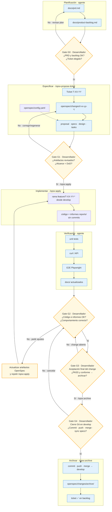

# Guía de customización OpenSpec — ConRutina

> Referencia para entender cómo está adaptado OpenSpec en este proyecto, qué ficheros intervienen y cómo procesar tickets del backlog.

## 1. Resumen

ConRutina usa **OpenSpec** (esquema `spec-driven`) con una capa de customización orientada a:

1. **Vincular cada ticket del backlog** (`T-XX-YY`) a un change OpenSpec.
2. **Mantener calidad** (Git, pruebas, informes, documentación).
3. **Reducir tokens** cargando contexto solo cuando hace falta (optimización en Fases A y B).

Convención clave: **un ticket = un change** en `openspec/changes/<nombre>/`.

El flujo completo (planificación, gates del desarrollador y diagrama) está en la [sección 2](#2-flujo-agéntico).

---

## 2. Flujo agéntico

Todas las funcionalidades de ConRutina se han desarrollado mediante un **flujo de agentes de IA personalizado** basado en **OpenSpec** (modo *spec-driven*, ver `openspec/config.yaml`). Cada ticket del backlog de producto (`T-XX-YY` en `docs/product-backlog.md`) se traduce en un *change* OpenSpec bajo `openspec/changes/`; el agente especifica, implementa, verifica y archiva el cambio siguiendo reglas versionadas en el repositorio.

**Orquestación resumida:**

1. **Planificación** — El PRD (`docs/prd.md`) y el backlog ágil (`docs/product-backlog.md`) definen user stories, criterios de aceptación (Gherkin) y tickets priorizados por sprint. Skills dedicadas (`generate-prd`, `generate-product-backlog`) automatizan su generación desde el contexto del producto.
2. **Especificar** — `/opsx-propose-ticket T-XX-YY` (skill `propose-from-ticket`) extrae el ticket, inspecciona el código existente y genera los artefactos del change: `proposal.md`, `specs/`, `design.md` y `tasks.md`, gobernados por `openspec/config.yaml` y `docs/openspec/tasks-core.md`.
3. **Implementar** — `/opsx:apply <change-name>` (skill `openspec-apply-change`) crea la rama `feature/T-XX-YY-nombre` desde `develop`, ejecuta las tareas de `tasks.md` **sin commits intermedios** y genera informes de verificación en `openspec/changes/<name>/reports/`.
4. **Verificar** — Pasos obligatorios según tipo de ticket: tests unitarios, comprobación manual o `curl` del API, pruebas E2E (Playwright MCP) y actualización de documentación técnica en `docs/`. Los ejecuta el agente; el desarrollador no sustituye esa batería, pero sí revisa el resultado.
5. **Archivar** — Tras la aceptación del usuario, `/opsx:archive <change-name>` (skill `openspec-archive-change`) hace commit único, push de la rama feature, merge a `develop`, mueve el change a `openspec/changes/archive/` y marca el ticket como implementado en el backlog.

Los comandos Cursor viven en `.cursor/commands/opsx-*.md`; las skills en `.cursor/skills/openspec-*/`. Las reglas mínimas para todos los agentes están en `docs/base-standards.md`. Para exploración previa o cambios ad hoc existen `/opsx:explore` y `/opsx:propose`.

### Gates de validación (desarrollador)

En el flujo, el agente genera artefactos, código e informes de prueba; el **desarrollador** interviene en puntos concretos para **aprobar, rechazar o pedir correcciones** antes de avanzar. Los nodos en forma de rombo del diagrama representan esos *gates*.

| Gate   | Momento                                      | Decisión del desarrollador                                                            | Si no aprueba                                                                                          |
| ------ | -------------------------------------------- | ------------------------------------------------------------------------------------- | ------------------------------------------------------------------------------------------------------ |
| **G0** | Tras planificación (PRD + backlog)           | Valida visión, prioridades y ticket a abordar                                         | Ajusta PRD/backlog o elige otro ticket                                                                 |
| **G1** | Tras `/opsx-propose-ticket`                  | Revisa `proposal`, `specs`, `design` y `tasks` (alcance = DoD del ticket)             | Pide regenerar o editar artefactos; **no** lanzar `/opsx:apply` hasta estar conforme                   |
| **G2** | Tras `/opsx:apply` y verificación del agente | Revisa working tree, informes en `reports/` y comportamiento en local                 | Pide ajustes: primero actualizar artefactos OpenSpec, luego repetir apply (sin commits hasta archivar) |
| **G3** | Antes de `/opsx:archive`                     | Acepta explícitamente el change (pruebas PASS + código conforme)                      | Mantiene el change abierto; vuelve a G2                                                                |
| **G4** | Durante `/opsx:archive`                      | Confirma cierre Git (commit, push, merge) y, si aplica, sincronización de specs delta | Cancela o corrige pendientes antes de integrar en `develop`                                            |



**Leyenda:** rectángulos azules = trabajo del agente; rombos amarillos = **gate** donde el desarrollador decide si continuar, corregir o detener el flujo.

### Procesamiento operativo de un ticket

```
┌─────────────┐     ┌─────────────┐     ┌─────────────┐     ┌─────────────┐
│ 1. Especificar  │ ──▶ │ 2. Implementar  │ ──▶ │ 3. Revisar      │ ──▶ │ 4. Archivar     │
│ propose-ticket  │     │ apply           │     │ (usuario)       │     │ archive         │
└─────────────┘     └─────────────┘     └─────────────┘     └─────────────┘
```

| Paso | Comando en Cursor | Qué hace |
|------|-------------------|----------|
| 1 | `/opsx-propose-ticket T-06-01` | Crea change con `proposal.md`, `specs/`, `design.md`, `tasks.md` |
| 2 | `/opsx:apply t-06-01-nombre` | Implementa tareas en rama `feature/...` **sin commits** |
| 3 | Revisión manual | El usuario valida código y pruebas |
| 4 | `/opsx:archive t-06-01-nombre` | Commit único + push feature + merge a `develop` + archivar change + marcar ticket ✅ |
### Comandos auxiliares (terminal)

```bash
# Extraer ticket + User Story sin abrir el backlog completo
npm run openspec:extract-ticket -- --ticket T-06-01

# Mismo contenido en JSON (metadatos, sprint, change/rama sugeridos)
npm run openspec:extract-ticket -- --ticket T-06-01 --json

# Tras archivar: marcar ticket como Implementado en el backlog (también lo intenta archive)
npm run openspec:mark-ticket -- --change t-06-01-nombre
```

### Política Git

| Momento | Rama | Commits |
|---------|------|---------|
| Apply | `feature/T-XX-YY-nombre` desde `develop` | **Prohibidos** |
| Archive | merge feature → `develop` | **Un solo commit** (viñetas breves) + push de la feature |

---

## 3. Artefactos de un change

Cada change activo vive en `openspec/changes/<nombre>/`:

| Artefacto | Propósito |
|-----------|-----------|
| `proposal.md` | Qué y por qué; ticket, US, alcance, non-goals |
| `specs/<capability>/spec.md` | Escenarios BDD verificables |
| `design.md` | Cómo implementar; rutas, capas, decisiones técnicas |
| `tasks.md` | Checklist de implementación y pasos obligatorios |
| `reports/` | Informes de verificación (creados durante apply) |

Los changes completados se mueven a `openspec/changes/archive/YYYY-MM-DD-<nombre>/`.

---

## 4. Ficheros de configuración OpenSpec

| Fichero | Propósito |
|---------|-----------|
| `openspec/config.yaml` | Contexto del proyecto y reglas por artefacto (`proposal`, `specs`, `design`, `tasks`). Fuente que lee el CLI `openspec`. |
| `openspec/specs/` | Specs maestras del producto (sincronizadas al archivar si hay delta specs) |

### Convenciones de nombres

| Concepto | Patrón | Ejemplo |
|----------|--------|---------|
| Change | `t-[US]-[SEQ]-[kebab]` | `t-06-01-obtener-perfil-de-usuario` |
| Rama Git | `feature/T-[US]-[SEQ]-[kebab]` | `feature/T-06-01-obtener-perfil-de-usuario` |

---

## 5. Documentación OpenSpec (`docs/openspec/`)

Documentación dividida para no cargar cientos de líneas en cada operación:

| Fichero | Cuándo usarlo | Contenido |
|---------|---------------|-----------|
| `tasks-core.md` | Crear/actualizar `tasks.md`, apply, archive | Reglas núcleo: §0 rama, secuencia de pruebas, §Cierre Git |
| `tasks-by-type.md` | Al crear `tasks.md` | Matriz unit / curl / e2e / docs según tipo de ticket |
| `templates/verification.md` | Al generar informe N+1 | Plantilla verificación manual / tests |
| `templates/endpoint-testing.md` | Al generar informe curl | Plantilla pruebas API |
| `templates/e2e-testing.md` | Al generar informe E2E | Plantilla Playwright MCP |
| `tasks-full.md` | Consulta humana | Referencia histórica completa |

`docs/openspec-tasks-mandatory-steps.md` es solo una **redirección** a los documentos anteriores.

### Patrón de `tasks.md` (compacto)

Los `tasks.md` nuevos **referencian** `tasks-core` en lugar de copiar plantillas:

- Encabezado con Ticket, US, Change, Rama.
- Línea **Pasos aplicables:** `unit=… · curl=… · e2e=… · docs=…`
- Sección 0 (rama) + tareas del DoD + referencias a §N+1…§Cierre.

---

## 6. Rules de Cursor (contexto para la IA)

### Siempre activa

| Rule | Fichero | Propósito |
|------|---------|-----------|
| Hub mínimo | `docs/base-standards.md` | Principios, tabla de comandos OpenSpec, punteros a docs bajo demanda |

### Bajo demanda (globs — no se inyectan en cada chat)

| Rule | Fichero | Se activa al trabajar en |
|------|---------|--------------------------|
| Backend | `docs/backend-standards.md` | `backend/**`, `api-spec.yml`, artefactos openspec de backend |
| Frontend | `docs/frontend-standards.md` | `frontend/**`, artefactos openspec de frontend |
| Documentación | `docs/documentation-standards.md` | `docs/**`, `README.md` |
| Tasks OpenSpec | `docs/openspec/tasks-core.md` | `openspec/**`, commands/skills opsx |

---

## 7. Skills y commands en Cursor

### Commands (`.cursor/commands/`)

Wrappers cortos que apuntan a la skill correspondiente:

| Command | Skill |
|---------|-------|
| `/opsx-propose-ticket` | `propose-from-ticket` |
| `/opsx:propose` | `openspec-propose` |
| `/opsx:apply` | `openspec-apply-change` |
| `/opsx:archive` | `openspec-archive-change` |
| `/opsx:explore` | `openspec-explore` |

### Skills (`.cursor/skills/`)

| Skill | Propósito |
|-------|-----------|
| `propose-from-ticket` | Flujo principal: extrae ticket (`extract-ticket`), genera artefactos desde backlog |
| `openspec-propose` | Propose ad hoc (sin ticket); mismas reglas de artefactos |
| `openspec-apply-change` | Implementa `tasks.md`; carga incremental (solo `tasks.md` al inicio) |
| `openspec-archive-change` | Cierre Git, archivado, `openspec:mark-ticket` |
| `openspec-explore` | Exploración de ideas sin implementar código |

---

## 8. Scripts npm

| Script | Fichero | Propósito |
|--------|---------|-----------|
| `openspec:extract-ticket` | `scripts/openspec-extract-ticket.mjs` | Extrae sección del ticket + US del backlog |
| `openspec:mark-ticket` | `scripts/openspec-mark-ticket-implemented.mjs` | Marca ticket ✅ en `docs/product-backlog.md` |

---

## 9. Optimización de contexto (Fases A y B)

| Optimización | Efecto |
|--------------|--------|
| **A** — Solo `base-standards` siempre activo; resto con globs | Menos reglas fijas por conversación |
| **A** — Commands como wrappers de skills | Sin duplicar instrucciones largas |
| **A** — Apply con carga incremental | No leer proposal+specs+design al inicio |
| **B** — `tasks-core` + `tasks-by-type` + templates | Sustituye doc monolítico de ~600 líneas |
| **B** — `extract-ticket` | Evita cargar `product-backlog.md` completo |
| **B** — `tasks.md` por referencia | Artefactos más cortos y trazables |

---

## 10. Fuentes de verdad por tarea

| Necesidad | Dónde mirar |
|-----------|-------------|
| Índice de tickets y sprints | `docs/product-backlog-list.md` |
| Detalle de un ticket | `npm run openspec:extract-ticket` o sección en `docs/product-backlog.md` |
| Reglas del proyecto | `docs/base-standards.md` |
| Pasos obligatorios de tareas | `docs/openspec/tasks-core.md` |
| Qué pruebas aplican | `docs/openspec/tasks-by-type.md` |
| Config OpenSpec / reglas artefactos | `openspec/config.yaml` |
| Flujo local (npm, docker, etc.) | `docs/development_guide.md` |

---

## 11. Ejemplo completo: ticket T-06-01

Recorrido operativo del flujo descrito en la [sección 2](#2-flujo-agéntico):

```text
1. /opsx-propose-ticket T-06-01
   → Change: openspec/changes/t-06-01-obtener-perfil-de-usuario/

2. /opsx:apply t-06-01-obtener-perfil-de-usuario
   → Rama: feature/T-06-01-obtener-perfil-de-usuario
   → Código sin commit; informes en reports/

3. Usuario revisa y acepta

4. /opsx:archive t-06-01-obtener-perfil-de-usuario
   → Commit + push + merge a develop
   → Change a openspec/changes/archive/...
   → Ticket T-06-01 → ✅ Implementado
```

---

## 12. Referencias

- [Guía de desarrollo](./development_guide.md) — entorno y scripts
- [Product backlog (índice)](./product-backlog-list.md)
- [Tasks core](./openspec/tasks-core.md)
- [Tasks por tipo](./openspec/tasks-by-type.md)
