# ConRutina — Product Requirements Document (PRD)

> **Versión:** 1.0 · **Fecha:** Abril 2026 · **Estado:** MVP

---

## Tabla de contenidos

1. [Descripción del software](#1-descripción-del-software)
2. [Funciones principales](#2-funciones-principales)
3. [Lean Canvas](#3-lean-canvas)
4. [Casos de uso](#4-casos-de-uso)
5. [Modelo de datos](#5-modelo-de-datos)
6. [API (Alto-Nivel)](#6-api-alto-nivel)
7. [Diseño de sistema a alto nivel](#7-diseño-de-sistema-a-alto-nivel)
8. [Diagramas C4](#8-diagramas-c4)
9. [Out of Scope / Non-Goals](#9-non-goals)

---

## 1. Descripción del software

> **Propósito de esta sección:** Presentar ConRutina como producto, su propuesta de valor diferencial y su posición competitiva en el mercado de aplicaciones de hábitos y productividad personal.

**ConRutina** es una aplicación web orientada a la gestión de rutinas y buenos hábitos semanales mediante un sistema de puntuación gamificado. Permite al usuario registrar sus hábitos diarios, monitorizar su progreso a lo largo de la semana y canjear recompensas personalizadas a medida que acumula puntos, todo desde una interfaz amigable, visual e intuitiva.

El sistema combina tres palancas psicológicas fundamentales para el cambio de comportamiento:

- **Refuerzo positivo:** cada hábito completado suma puntos que el usuario puede convertir en recompensas tangibles que él mismo elige.
- **Consecuencia suave:** los hábitos no realizados aplican una penalización, creando una fricción controlada que no desmotiva pero sí mantiene la atención.
- **Visibilidad del progreso:** la pantalla principal muestra en todo momento el estado del día, la semana y el histórico, dando al usuario una narrativa clara de su evolución.

### 1.1 Propuesta de valor


| Para quién                                           | Problema que resuelve                                         | Cómo lo resuelve                                                   | Diferencial                                                                            |
| ---------------------------------------------------- | ------------------------------------------------------------- | ------------------------------------------------------------------ | -------------------------------------------------------------------------------------- |
| Personas con voluntad de cambio pero baja constancia | Falta de motivación sostenida para mantener rutinas           | Sistema de puntos + recompensas propias como incentivo             | El usuario define sus propias recompensas, haciendo el incentivo genuinamente personal |
| Usuarios que quieren ver su progreso de forma visual | Frustración ante métodos de seguimiento complejos o aburridos | Interfaz gamificada y ligera (SPA, sin instalación)                | Zero-friction: funciona en cualquier navegador, no requiere app nativa                 |
| Personas que rompen rachas y abandonan               | El "todo o nada" anula el esfuerzo parcial                    | Las semanas se bloquean al terminar, preservando el historial real | El pasado no desaparece: el usuario ve su evolución honesta semana a semana            |


### 1.2 Ventajas competitivas


| Competidor                | Debilidad del competidor                                                 | Ventaja de ConRutina                                            |
| ------------------------- | ------------------------------------------------------------------------ | --------------------------------------------------------------- |
| Habitica                  | Curva de aprendizaje alta, interfaz RPG puede alienar a algunos usuarios | UI minimalista, sin registro obligatorio, entrada inmediata     |
| Streaks / Loop            | Sin sistema de recompensas ni penalizaciones                             | Mecánica bidireccional (puntos + penalizaciones) más motivadora |
| Notion / hojas de cálculo | No gamifican ni sintetizan el progreso automáticamente                   | Dashboard visual automatizado, sin configuración manual         |
| Aplicaciones de coach     | Coste mensual elevado, dependencia de terceros                           | Autónomo, autodirigido, sin suscripción en MVP                  |


---

## 2. Funciones principales

> **Propósito de esta sección:** Describir de forma concisa cada capacidad del producto que el usuario puede ejercer en la versión MVP, agrupadas por área funcional.

### 2.1 Gestión de hábitos

- **Crear hábito:** el usuario define nombre, emoji representativo, puntos por día completado y penalización por fallo. El hábito queda activo en la semana en curso.
- **Marcar estado diario:** cada celda del calendario semanal tiene tres estados: `pendiente` → `completado` → `fallado` → `pendiente` (ciclo de tres estados por clic).
- **Eliminar hábito:** el usuario puede borrar un hábito de la semana en curso. El histórico de semanas anteriores no se altera.
- **Continuidad semanal:** al inicio de cada nueva semana, los hábitos de la semana anterior se trasladan automáticamente a la nueva con puntuaciones a cero.

### 2.2 Sistema de puntuación

- Cada día completado suma los `pointsPerDay` del hábito al marcador semanal.
- Cada día fallado resta los `penalty` configurados del hábito.
- Los días en estado `pendiente` no suman ni restan.
- El marcador semanal se reinicia a cero al inicio de cada semana.
- Los puntos acumulados en la semana en curso son los únicos disponibles para canjear recompensas.

### 2.3 Recompensas

- **Crear recompensa:** el usuario define nombre, emoji, descripción y coste en puntos.
- **Canjear recompensa:** si el saldo disponible de la semana (`puntos ganados − penalizaciones − canjes previos`) alcanza el coste, el usuario puede canjear **una única recompensa por semana**. Los puntos se descuentan del marcador y quedan registrados en `RewardRedemption`. El resto de recompensas quedan bloqueadas hasta la semana siguiente.
- **Eliminar recompensa:** solo si nunca ha sido canjeada (sin filas en `RewardRedemption`). Las recompensas ya utilizadas permanecen visibles pero no se pueden eliminar.
- **Invalidación de canje:** si tras modificar hábitos los puntos netos de la semana en curso (`thisWeekPoints − penalties`) quedan por debajo de los puntos gastados en el canje activo, el canje se revierte automáticamente y la recompensa vuelve a estar disponible. La UI muestra el mensaje *"Recompensa invalidada. Puntos insuficientes."*

La sección del panel principal se titula **"Recompensas disponibles"**.

### 2.4 Calendario semanal y navegación histórica

- La pantalla principal muestra la semana en curso, con los días de la semana como columnas y los hábitos como filas.
- El usuario puede navegar a semanas anteriores para consultar su historial (modo lectura, bloqueado).
- Al finalizar la semana, ésta queda congelada y no puede modificarse.

### 2.5 Estadísticas y progreso

- **Barra de progreso del día:** porcentaje de hábitos completados sobre el total en el día actual.
- **Contadores resumen:** puntos de la semana anterior, puntos de la semana actual, penalizaciones totales de la semana, mejor racha.
- **Racha activa (por hábito):** días consecutivos `completed` hacia atrás desde el día actual; visible en cada fila del calendario (🔥 X días) cuando es mayor que 0.
- **Mejor racha (contador resumen):** mayor secuencia consecutiva de días `completed` alcanzada por cualquier hábito en la semana visible (lunes → día actual), aunque el día actual esté `failed` o `pending`.

### 2.6 Perfil de usuario

- El sistema reconoce al usuario y muestra su nombre y correo en la cabecera.
- En la versión MVP el perfil es un registro único del sistema (simulación de sesión), listo para expandirse a autenticación real.

---

## 3. Lean Canvas

> **Propósito de esta sección:** Sintetizar el modelo de negocio de ConRutina en nueve bloques para entender su viabilidad, los vectores de crecimiento y los riesgos más relevantes desde una perspectiva de producto y negocio.

```
┌──────────────────────┬──────────────────────┬──────────────────────┬──────────────────────┬──────────────────────┐
│   PROBLEMA           │   SOLUCIÓN           │  PROPUESTA DE VALOR  │  VENTAJA ESPECIAL    │  SEGMENTOS CLIENTE   │
│                      │                      │      ÚNICA           │                      │                      │
│                      │                      │                      │                      │ Jóvenes de 10-24 años│
│                      │                      │                      │                      │ con poca constancia. │
│                      │                      │                      │                      │                      │
│ La motivación para   │ Calendario gamificado│ "Convierte tus       │ Recompensas 100%     │ Adultos 25-45 años   │
│ mantener rutinas     │ con puntos y         │ hábitos en una       │ personalizadas por   │ con voluntad de      │
│ decae en días 10-14  │ penalizaciones.      │ misión semanal       │ el propio usuario.   │ cambio pero poca     │
│ del inicio de        │                      │ que vale la pena     │                      │ constancia.          │
│ cualquier hábito.    │ Recompensas propias  │ ganar."              │ Historial inmutable  │                      │
│                      │ como incentivo       │                      │ que no permite       │ Trabajadores         │
│ Las apps de hábitos  │ tangible.            │ Sistema dual:        │ el revisionismo.     │ knowledge workers    │
│ existentes son       │                      │ puntos + recompensas │                      │ con agenda ocupada.  │
│ complejas o          │ Bloqueo semanal que  │ definidas por ti.    │                      │                      │
│ desmotivadoras.      │ preserva el historial│                      │                      │ Personas en procesos │
│                      │ real.                │                      │                      │ de cambio personal   │
│ El "todo o nada"     │                      │                      │                      │ o coaching.          │
│ elimina el esfuerzo  │                      │                      │                      │                      │
│ parcial.             │                      │                      │                      │                      │
├──────────────────────┴──────────────────────┼──────────────────────┴──────────────────────┴──────────────────────┤
│   MÉTRICAS CLAVE                            │   CANALES                                                          │
│                                             │                                                                    │
│ • DAU / WAU ratio (retención)               │ • SEO orgánico (búsquedas "app hábitos")                           │
│ • Semanas con bloqueo completado (tasa de   │ • Redes sociales (compartir logros semanales)                      │
│   uso sostenido)                            │ • Product Hunt / comunidades de productividad                      │
│ • Nº de recompensas canjeadas / semana      │ • Boca a oreja en entornos de coaching y bienestar                 │
│ • Nº medio de hábitos activos / usuario     │                                                                    │
│ • Tasa de creación de nuevos hábitos        │                                                                    │
├─────────────────────────────────────────────┼────────────────────────────────────────────────────────────────────┤
│   ESTRUCTURA DE COSTES                      │   FLUJOS DE INGRESOS                                               │
│                                             │                                                                    │
│ • Hosting frontend (CDN / Netlify / Vercel) │ • MVP: free-to-use (validación)                                    │
│ • Servidor API + PostgreSQL (cloud)         │ • Freemium: límite de hábitos / recompensas en plan gratuito       │
│ • Dominio y certificado TLS                 │ • Suscripción mensual (hábitos ilimitados, estadísticas avanzadas) │
│ • Desarrollo y mantenimiento                │ • Versión B2B: integración en programas de bienestar corporativo   │
│ • Potencial soporte al cliente              │                                                                    │
└─────────────────────────────────────────────┴────────────────────────────────────────────────────────────────────┘
```

### Resumen narrativo por bloque


| Bloque                       | Descripción                                                                                                                                                                                   |
| ---------------------------- | --------------------------------------------------------------------------------------------------------------------------------------------------------------------------------------------- |
| **Problema**                 | La mayoría de personas abandona los hábitos antes de la tercera semana. Las apps de hábitos actuales no ofrecen incentivos suficientes ni capturan la dimensión emocional del logro personal. |
| **Solución**                 | Calendario semanal gamificado con mecánica de puntos doble (ganar / perder), recompensas autoconfiguradas y bloqueo histórico que preserva la verdad del usuario semana a semana.             |
| **Propuesta de valor única** | "Convierte tus hábitos en una misión semanal que vale la pena ganar." La recompensa la decide el propio usuario, haciendo el incentivo 100% relevante y personal.                             |
| **Ventaja especial**         | El historial inmutable de semanas bloqueadas y las recompensas autoconfiguradas son difíciles de replicar sin cambiar la filosofía del producto.                                              |
| **Segmentos de cliente**     | Jóvenes de 10-24 años con poca constancia; adultos 25-45 años en transición (cambio de estilo de vida), knowledge workers con agenda ocupada, y usuarios en procesos de coaching o bienestar. |
| **Canales**                  | SEO, comunidades de productividad (Reddit, LinkedIn), Product Hunt, y boca a oreja en entornos de bienestar y coaching.                                                                       |
| **Métricas clave**           | Retención semanal (WAU), tasa de semanas bloqueadas completadas, número de recompensas canjeadas, y racha máxima como indicador de adherencia.                                                |
| **Estructura de costes**     | Hosting ligero (SPA en CDN + API en cloud pequeño), dominio y desarrollo. Coste marginal casi cero por usuario gracias a la arquitectura stateless del frontend.                              |
| **Flujos de ingresos**       | Freemium con limitación de hábitos/recompensas. Suscripción mensual para funciones avanzadas. Versión B2B para programas de bienestar corporativo.                                            |


---

## 4. Casos de uso

> **Propósito de esta sección:** Describir los escenarios de interacción más relevantes entre el usuario y el sistema, formalizados como casos de uso con su diagrama UML asociado. Cada caso de uso incluye el escenario, el problema que resuelve, la solución y el resultado esperado.

### 4.1 Resumen de casos de uso


| ID    | Nombre                                   | Actor   | Prioridad |
| ----- | ---------------------------------------- | ------- | --------- |
| UC-01 | Consultar y navegar el dashboard semanal | Usuario | Alta      |
| UC-02 | Añadir nuevo hábito                      | Usuario | Alta      |
| UC-03 | Registrar estado diario de un hábito     | Usuario | Alta      |
| UC-04 | Eliminar hábito de la semana en curso    | Usuario | Media     |
| UC-05 | Añadir nueva recompensa                  | Usuario | Alta      |
| UC-06 | Canjear recompensa                       | Usuario | Alta      |
| UC-07 | Consultar semana anterior (histórico)    | Usuario | Media     |
| UC-08 | Bloqueo y transición de semana           | Sistema | Alta      |


---

### 4.2 Diagrama general de casos de uso

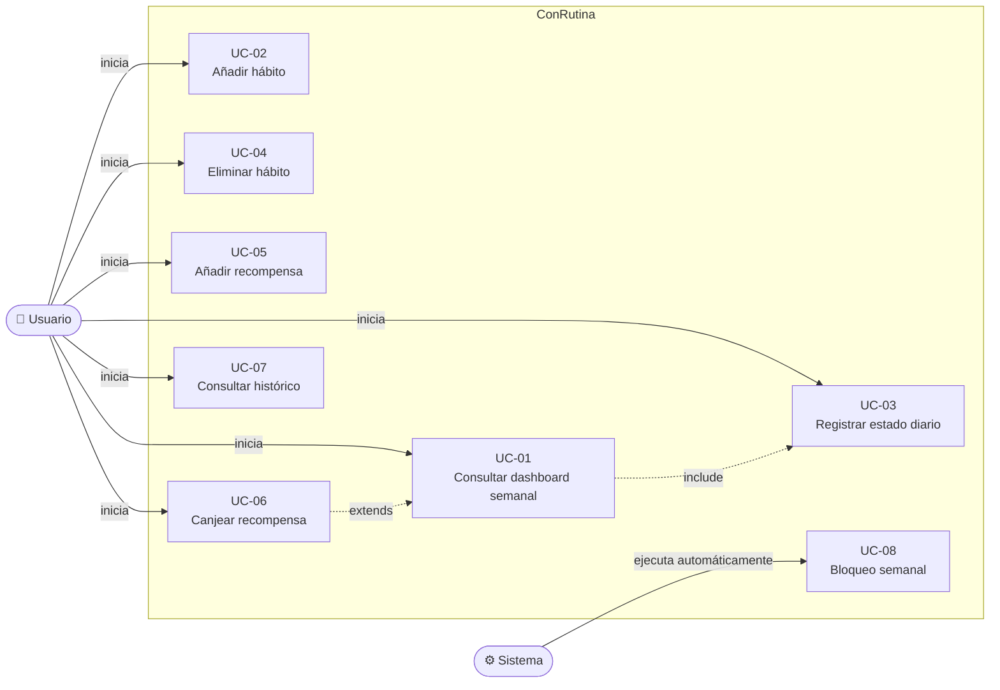


---

### UC-01 — Consultar y navegar el dashboard semanal

**Escenario:** El usuario abre la aplicación y visualiza la semana en curso con todos sus hábitos, estadísticas, recompensas disponibles y el progreso del día.

**Problema:** El usuario necesita una visión unificada y rápida de su situación actual sin navegar por múltiples pantallas.

**Solución:** La SPA carga en una única pantalla la barra de progreso del día, los contadores globales, el calendario semanal con los hábitos y el bloque de recompensas.

**Resultado esperado:** En menos de 3 segundos el usuario sabe cuántos hábitos ha completado hoy, cuántos puntos lleva esta semana y cuántos puntos le faltan para canjear su próxima recompensa.

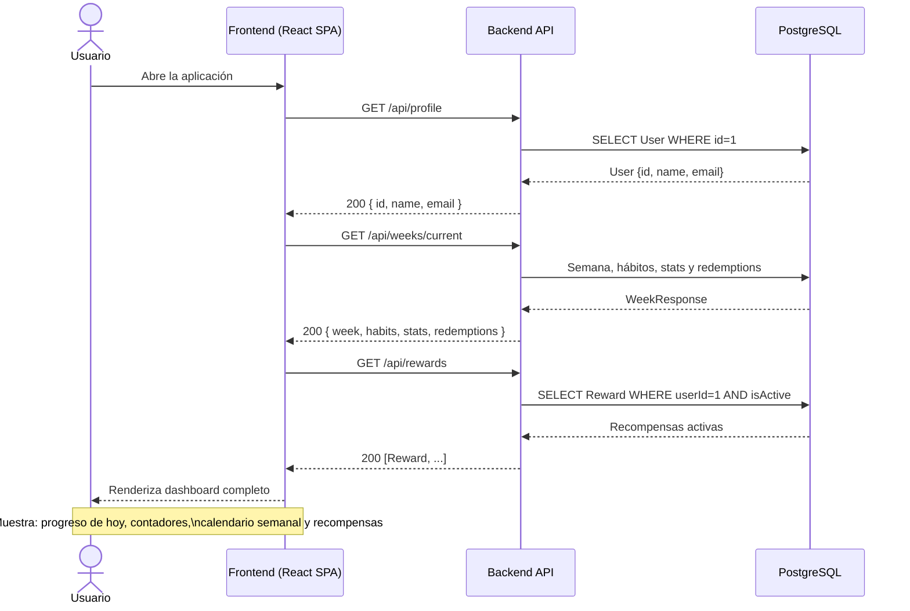


---

### UC-02 — Añadir nuevo hábito

**Escenario:** El usuario quiere incorporar un nuevo hábito a su semana actual, por ejemplo "Meditar 10 minutos".

**Problema:** Las rutinas evolucionan; el usuario debe poder añadir hábitos en cualquier momento sin perder el contexto de la semana en curso.

**Solución:** Un modal emergente permite elegir emoji, nombre, puntos por día y penalización. Al confirmar, el hábito se incorpora al calendario de la semana en curso con estado `pendiente` en todos los días.

**Resultado esperado:** El nuevo hábito aparece inmediatamente en el calendario semanal con 7 celdas en blanco, listo para ser registrado.

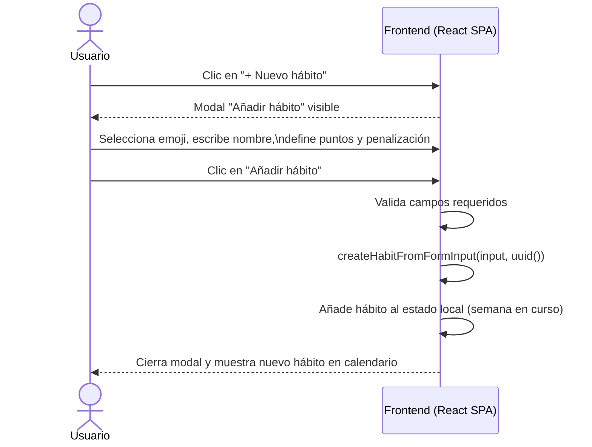


---

### UC-03 — Registrar estado diario de un hábito

**Escenario:** El usuario marca si ha completado o fallado el hábito "Ejercicio 30 min" en el día de hoy.

**Problema:** El registro diario debe ser rápido, visual y no confuso. El usuario no debe tardar más de 1-2 segundos en actualizar el estado.

**Solución:** Cada celda del calendario funciona como un checkbox de tres estados: pendiente (vacío) → completado (verde ✓) → fallado (rojo ✗) → pendiente. El marcador de puntos se recalcula en tiempo real.

**Resultado esperado:** El estado queda registrado visualmente, el marcador semanal se actualiza y la barra de progreso del día refleja el cambio.

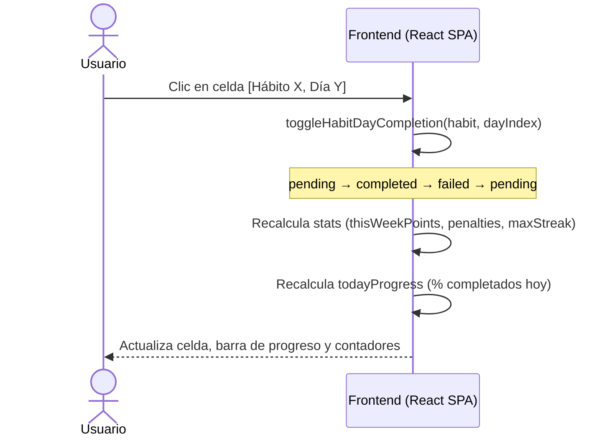


---

### UC-04 — Eliminar hábito de la semana en curso

**Escenario:** El usuario decide que un hábito ya no es relevante para la semana y lo elimina.

**Problema:** Los hábitos no son permanentes; el usuario debe poder hacer limpieza sin afectar el historial de semanas anteriores.

**Solución:** Cada fila de hábito tiene un botón de eliminación (×). Al pulsarlo, el hábito desaparece del calendario de la semana en curso y sus puntos dejan de computarse.

**Resultado esperado:** El hábito desaparece del calendario. Los puntos ya acumulados por ese hábito en días anteriores de la semana se eliminan del marcador.

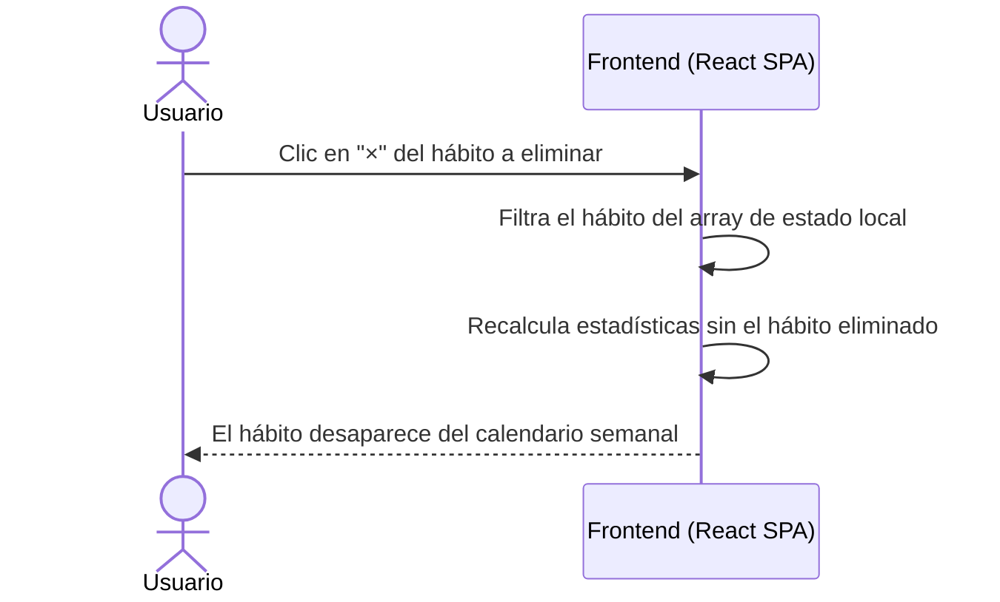


---

### UC-05 — Añadir nueva recompensa

**Escenario:** El usuario quiere definir "Ver una peli en el cine" como recompensa que cuesta 50 puntos.

**Problema:** Las recompensas genéricas no motivan; cada usuario tiene incentivos distintos y necesita definirlos él mismo.

**Solución:** Un modal de creación de recompensa permite definir emoji, nombre, descripción y coste en puntos. La recompensa queda disponible para canjear en la semana en curso.

**Resultado esperado:** La nueva recompensa aparece en el bloque de recompensas con el coste indicado y el número de puntos restantes para poder canjearla.

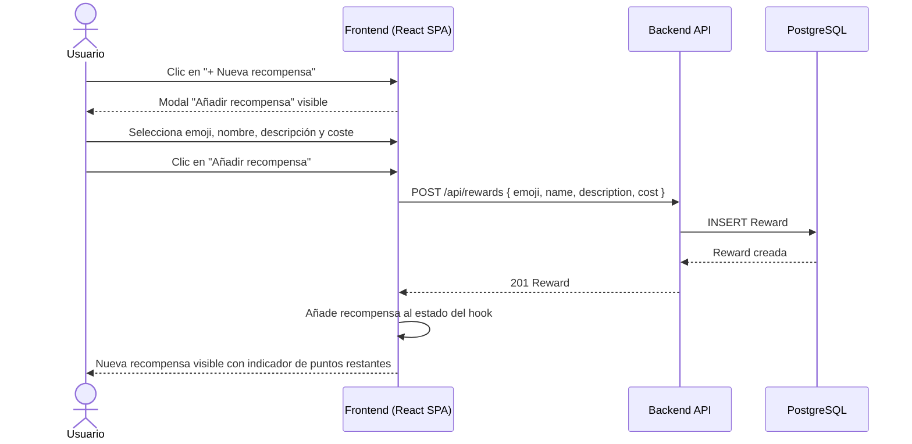


---

### UC-06 — Canjear recompensa

**Escenario:** El usuario acumula 100 puntos y decide canjear "Día libre" que cuesta 100 puntos.

**Problema:** El sistema de puntos carece de valor si no puede convertirse en algo concreto. El canje cierra el ciclo motivacional.

**Solución:** Si `totalPoints >= reward.cost` (saldo = puntos ganados − penalizaciones − canjes previos de la semana) y **aún no se ha canjeado ninguna recompensa esa semana**, el botón de canjear se activa. Al pulsarlo, `RewardCard` llama a `POST /api/weeks/:weekId/redemptions` y descuenta el coste del saldo visible. Las demás tarjetas muestran *"Límite semanal"*.

**Resultado esperado:** Los puntos se deducen visualmente en tiempo real. La recompensa queda registrada como canjeada en `RewardRedemption`. Si el usuario reduce después sus puntos netos de la semana por debajo del coste canjeado (p. ej. desmarcando días completados), el canje se invalida y la recompensa vuelve a estar disponible.

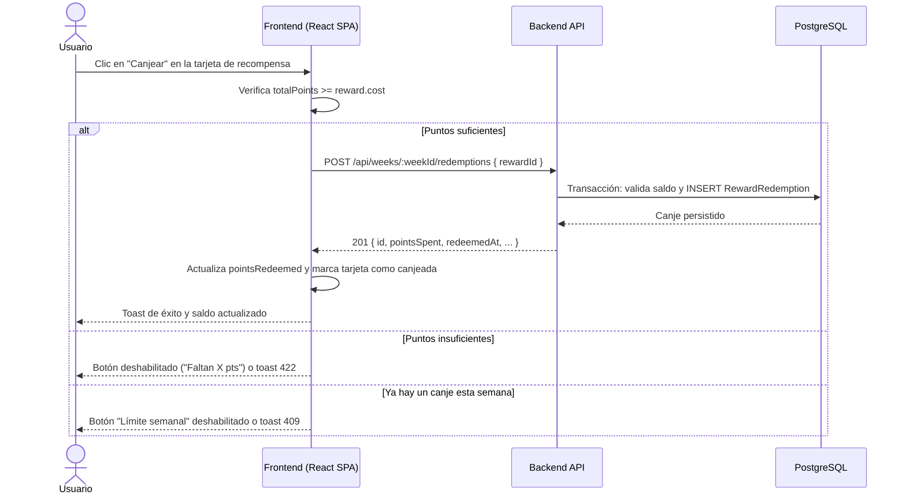


---

### UC-07 — Consultar semana anterior (histórico)

**Escenario:** El usuario quiere ver cómo fue su rendimiento la semana pasada.

**Problema:** Sin historial, el usuario no puede medir su evolución ni aprender de sus patrones de comportamiento.

**Solución:** Los controles de navegación (`<` `>`) permiten desplazarse a semanas anteriores. Las semanas pasadas se muestran en modo solo lectura (bloqueado).

**Resultado esperado:** El usuario visualiza el calendario de la semana seleccionada con los estados de cada hábito congelados y un indicador visual de "semana bloqueada".

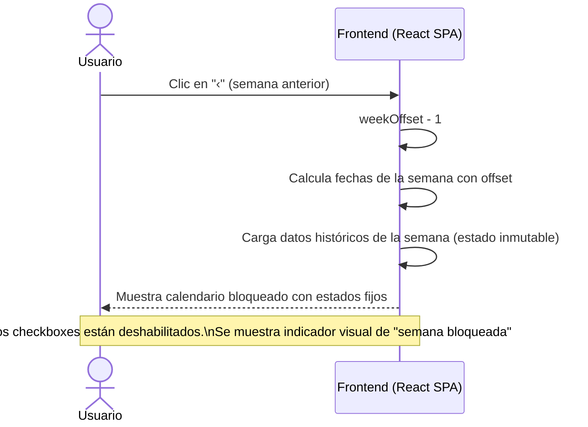


---

### UC-08 — Bloqueo automático y transición de semana

**Escenario:** El lunes por la mañana el usuario abre la aplicación y ve la nueva semana con sus hábitos heredados y puntuación a cero.

**Problema:** Sin un mecanismo automático de cierre, el usuario podría retroactivamente modificar semanas pasadas, lo que corrompe la integridad del historial.

**Solución:** El sistema detecta automáticamente el cambio de semana al cargar la aplicación. Si la semana anterior no está bloqueada, la bloquea y crea una nueva semana con los mismos hábitos en estado `pendiente` y puntos a cero.

**Resultado esperado:** La semana anterior queda congelada en el historial. La semana en curso muestra los mismos hábitos con todas las celdas en blanco, lista para empezar.

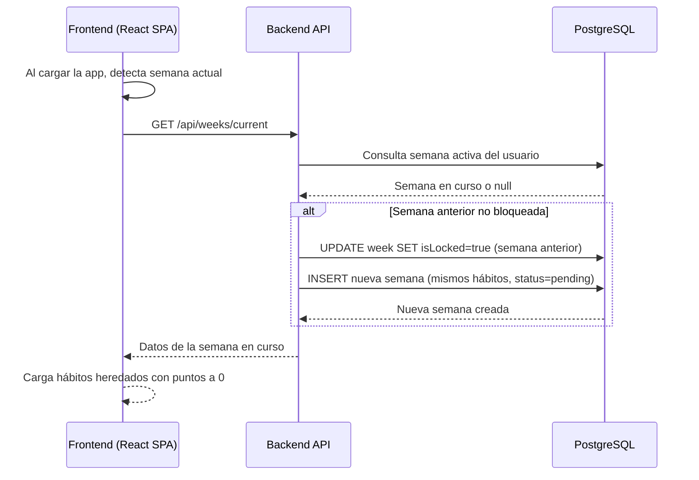


---

## 5. Modelo de datos

> **Propósito de esta sección:** Definir el esquema de entidades que persiste ConRutina, sus atributos tipados, las relaciones entre ellas y un diagrama entidad-relación que sirva de referencia para la implementación de la base de datos.

### 5.1 Entidades y atributos

#### User (Usuario)


| Atributo    | Tipo                      | Descripción                     |
| ----------- | ------------------------- | ------------------------------- |
| `id`        | `Int` (PK, autoincrement) | Identificador único del usuario |
| `email`     | `String` (unique)         | Correo electrónico              |
| `name`      | `String?`                 | Nombre visible en la cabecera   |
| `avatarUrl` | `String?`                 | URL opcional del avatar         |
| `createdAt` | `DateTime`                | Fecha de creación de la cuenta  |


#### Week (Semana)


| Atributo            | Tipo                      | Descripción                                                 |
| ------------------- | ------------------------- | ----------------------------------------------------------- |
| `id`                | `Int` (PK, autoincrement) | Identificador único de la semana                            |
| `userId`            | `Int` (FK → User)         | Usuario propietario                                         |
| `startDate`         | `DateTime`                | Lunes de la semana (00:00:00)                               |
| `endDate`           | `DateTime`                | Domingo de la semana (23:59:59)                             |
| `isLocked`          | `Boolean`                 | `true` cuando la semana ha terminado y no puede modificarse |
| `totalPointsEarned` | `Int`                     | Puntos positivos acumulados al bloquear                     |
| `totalPenalties`    | `Int`                     | Penalizaciones acumuladas al bloquear                       |
| `createdAt`         | `DateTime`                | Fecha de creación del registro                              |


#### Habit (Hábito)


| Atributo       | Tipo                      | Descripción                                                      |
| -------------- | ------------------------- | ---------------------------------------------------------------- |
| `id`           | `Int` (PK, autoincrement) | Identificador único del hábito                                   |
| `userId`       | `Int` (FK → User)         | Usuario propietario                                              |
| `emoji`        | `String`                  | Emoji representativo                                             |
| `name`         | `String`                  | Nombre descriptivo del hábito                                    |
| `pointsPerDay` | `Int`                     | Puntos ganados por día completado                                |
| `penalty`      | `Int`                     | Puntos perdidos por día fallado                                  |
| `isActive`     | `Boolean`                 | Indica si el hábito está disponible para añadir a nuevas semanas |
| `createdAt`    | `DateTime`                | Fecha de creación                                                |


#### WeekHabit (Hábito en una Semana)

Tabla intermedia que representa la asociación de un hábito concreto a una semana específica. Permite que cada semana tenga un conjunto de hábitos diferente.


| Atributo          | Tipo                      | Descripción                                                       |
| ----------------- | ------------------------- | ----------------------------------------------------------------- |
| `id`              | `Int` (PK, autoincrement) | Identificador único                                               |
| `weekId`          | `Int` (FK → Week)         | Semana a la que pertenece                                         |
| `habitId`         | `Int` (FK → Habit)        | Hábito asociado                                                   |
| `order`           | `Int`                     | Orden de visualización en el calendario                           |
| `snapshotName`    | `String`                  | Nombre del hábito en el momento del bloqueo (histórico inmutable) |
| `snapshotPoints`  | `Int`                     | Puntos del hábito en el momento del bloqueo                       |
| `snapshotPenalty` | `Int`                     | Penalización en el momento del bloqueo                            |


#### HabitEntry (Entrada diaria de un Hábito)

Registra el estado de cada hábito por cada día de la semana.


| Atributo      | Tipo                                      | Descripción                          |
| ------------- | ----------------------------------------- | ------------------------------------ |
| `id`          | `Int` (PK, autoincrement)                 | Identificador único                  |
| `weekHabitId` | `Int` (FK → WeekHabit)                    | Relación con el hábito de la semana  |
| `dayIndex`    | `Int`                                     | Índice del día (0=Lunes … 6=Domingo) |
| `status`      | `Enum` (`pending`, `completed`, `failed`) | Estado del hábito para ese día       |
| `updatedAt`   | `DateTime`                                | Última actualización                 |


#### Reward (Recompensa)


| Atributo      | Tipo                      | Descripción                             |
| ------------- | ------------------------- | --------------------------------------- |
| `id`          | `Int` (PK, autoincrement) | Identificador único                     |
| `userId`      | `Int` (FK → User)         | Usuario propietario                     |
| `emoji`       | `String`                  | Emoji representativo                    |
| `name`        | `String`                  | Nombre de la recompensa                 |
| `description` | `String`                  | Descripción breve                       |
| `cost`        | `Int`                     | Coste en puntos para canjear            |
| `isActive`    | `Boolean`                 | Indica si la recompensa está disponible |
| `createdAt`   | `DateTime`                | Fecha de creación                       |


#### RewardRedemption (Canje de Recompensa)

Registra cada vez que el usuario canjea una recompensa en una semana determinada.


| Atributo      | Tipo                      | Descripción                                |
| ------------- | ------------------------- | ------------------------------------------ |
| `id`          | `Int` (PK, autoincrement) | Identificador único                        |
| `weekId`      | `Int` (FK → Week)         | Semana en que se canjeó                    |
| `rewardId`    | `Int` (FK → Reward)       | Recompensa canjeada                        |
| `pointsSpent` | `Int`                     | Puntos descontados en el momento del canje |
| `redeemedAt`  | `DateTime`                | Timestamp del canje                        |


---

### 5.2 Diagrama Entidad-Relación (ER)

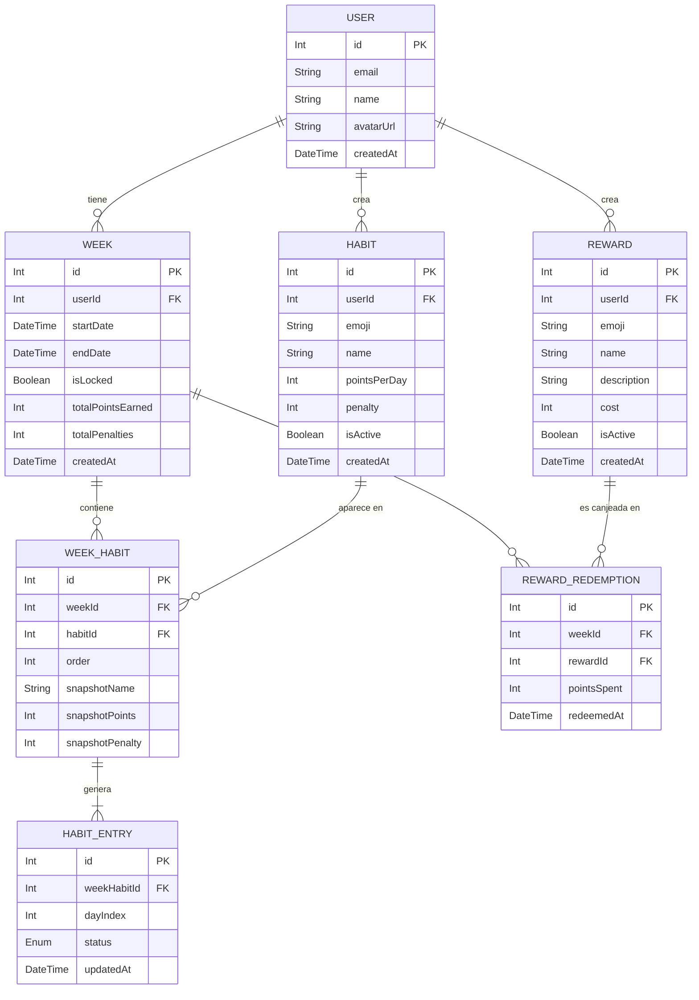


---

### 5.3 Relationships (summary)


| From        | To                 | Cardinality | Description                                                                                                                   |
| ----------- | ------------------ | ----------- | ----------------------------------------------------------------------------------------------------------------------------- |
| `User`      | `Week`             | 1:N         | Un usuario tiene muchas semanas. Cada semana pertenece a un único usuario.                                                    |
| `User`      | `Habit`            | 1:N         | Un usuario crea y gestiona sus propios hábitos. Cada hábito pertenece a un único usuario.                                     |
| `User`      | `Reward`           | 1:N         | Un usuario define sus propias recompensas. Cada recompensa pertenece a un único usuario.                                      |
| `Week`      | `WeekHabit`        | 1:N         | Una semana tiene varios hábitos activos. Permite que cada semana tenga un conjunto diferente de hábitos.                      |
| `Habit`     | `WeekHabit`        | 1:N         | Un hábito puede aparecer en múltiples semanas. La tabla intermedia guarda un snapshot inmutable de sus valores al bloquearse. |
| `WeekHabit` | `HabitEntry`       | 1:7         | Cada asociación hábito-semana genera exactamente 7 entradas diarias (Lun-Dom).                                                |
| `Week`      | `RewardRedemption` | 1:0..1         | Como máximo **un canje activo por semana**; los puntos gastados pertenecen al presupuesto de esa semana.                                                                                      |
| `Reward`    | `RewardRedemption` | 1:N         | Una recompensa puede ser canjeada en múltiples semanas diferentes por el mismo usuario.                                       |


---

## 6. API (Alto-Nivel)

> **Propósito de esta sección:** Describir la superficie HTTP que expone el backend frente a la SPA, con suficiente detalle para alinear implementación y PRD sin entrar en esquemas JSON exhaustivos ni en reglas de validación campo a campo (eso vivirá en OpenAPI o en tests de contrato cuando existan).

### 6.1 Estilo y convenciones generales

- **Paradigma:** API **REST** sobre **HTTPS** (en desarrollo, HTTP local con proxy desde Vite).
- **Prefijo:** todas las rutas viven bajo `**/api`** para distinguirlas del enrutado del frontend.
- **Formato:** cuerpos y respuestas en **JSON** (`Content-Type: application/json`; UTF-8).
- **Fechas y horas:** valores `DateTime` en **ISO 8601** en zona UTC o con offset explícito; el cliente calcula la semana civil según la configuración regional del usuario.
- **Identificadores:** recursos persistidos expuestos como enteros (`id`) coherentes con el modelo relacional salvo que en una iteración futura se adopte UUID en capa HTTP.
- **Errores (orientación):** respuestas 4xx/5xx con cuerpo JSON estable (por ejemplo `code`, `message`, `details` opcional) para facilitar diagnóstico en la SPA; los códigos HTTP reflejan la clase de error (validación, conflicto, no encontrado, etc.).

### 6.2 Identidad, autorización y límites del MVP

En el **MVP descrito en este PRD** no hay flujo de login; la API debe poder evolucionar hacia autenticación real sin romper la forma de los recursos. Hasta entonces:

- Se asume un **usuario único** o un **identificador de usuario** resuelto en servidor (variable de entorno, cabecera interna de desarrollo, etc.) sin exponer un modelo de sesión complejo en el documento de producto.
- Cualquier ruta que muta datos debe estar preparada para, en el futuro, exigir **token** (por ejemplo `Authorization: Bearer …`) y comprobar que el `userId` del recurso coincide con el del token.

### 6.3 Recursos y operaciones (vista contrato)

La tabla siguiente resume los **verbos y recursos** alineados con el modelo de datos (sección 5) y los casos de uso (sección 4). Los cuerpos de petición/respuesta se entienden como **DTO** que proyectan entidades y tablas puente (`WeekHabit`, `HabitEntry`, `RewardRedemption`).


| Área                    | Método   | Ruta (plantilla)                    | Comportamiento esperado (alto nivel)                                                                                                                                                                                                                         |
| ----------------------- | -------- | ----------------------------------- | ------------------------------------------------------------------------------------------------------------------------------------------------------------------------------------------------------------------------------------------------------------ |
| **Perfil**              | `GET`    | `/api/profile`                      | Devuelve datos del usuario para la cabecera (`User`: nombre, email, avatar, etc.). *Estado en código al redactar este PRD: implementación inicial.*                                                                                                          |
| **Semana en curso**     | `GET`    | `/api/weeks/current`                | Devuelve la semana activa del usuario con sus `WeekHabit`, las siete `HabitEntry` por hábito y metadatos (`isLocked`, totales de puntos/penalizaciones si aplica). Puede **disparar el cierre** de la semana anterior y la creación de la nueva según UC-08. |
| **Histórico semanal**   | `GET`    | `/api/weeks?offset={n}`             | Semana asociada al desplazamiento respecto a la actual (`n=0` equivale a en curso; `n<0` semanas pasadas). Las semanas con `isLocked=true` son **solo lectura** en cliente.                                                                                  |
| **Bloqueo semanal**     | `POST`   | `/api/weeks/{weekId}/lock`          | Persiste snapshot de hábitos (`WeekHabit`), congela entradas y totales de la semana indicada y, si procede, crea la semana siguiente con hábitos heredados en `pending`. Idempotente si la semana ya estaba bloqueada.                                       |
| **Catálogo de hábitos** | `GET`    | `/api/habits`                       | Lista hábitos del usuario (`isActive` según negocio).                                                                                                                                                                                                        |
|                         | `POST`   | `/api/habits`                       | Crea un `Habit` asociado al usuario.                                                                                                                                                                                                                         |
|                         | `PATCH`  | `/api/habits/{habitId}`             | Actualiza nombre, emoji, puntos o penalización; sincroniza snapshot en la semana desbloqueada actual y puede invalidar un canje (`redemptionInvalidated`).                                                                                                                                                                                                  |
|                         | `DELETE` | `/api/habits/{habitId}`             | Baja lógica; excluye el hábito de la semana actual si aplica. Respuesta `{ redemptionInvalidated }` si el cambio de puntos invalida un canje.                                                                                                                                                                                   |
| **Entrada diaria**      | `PATCH`  | `/api/habit-entries/{habitEntryId}` | Actualiza `status` (`pending` / `completed` / `failed`) y `updatedAt` para una celda concreta; rechaza mutaciones si la `Week` está bloqueada. Tras el cambio, reconcilia el canje semanal e incluye `redemptionInvalidated` en la respuesta. *Alternativa equivalente:* `PATCH` sobre `/api/week-habits/{weekHabitId}/days/{dayIndex}`.                    |
| **Recompensas**         | `GET`    | `/api/rewards`                      | Lista recompensas activas del usuario con `hasBeenRedeemed` (indica si tiene canjes históricos).                                                                                                                                                                                                                       |
|                         | `POST`   | `/api/rewards`                      | Crea `Reward`.                                                                                                                                                                                                                                               |
|                         | `PATCH`  | `/api/rewards/{rewardId}`           | Actualiza coste, texto o `isActive`.                                                                                                                                                                                                                         |
|                         | `DELETE` | `/api/rewards/{rewardId}`           | Baja lógica (`isActive=false`). Rechaza con `409 REWARD_ALREADY_REDEEMED` si la recompensa tiene canjes registrados.                                                                                                                                                                                                   |
| **Canjes**              | `GET`    | `/api/weeks/{weekId}/redemptions`   | Lista `RewardRedemption` de esa semana (presupuesto de puntos de la semana).                                                                                                                                                                                 |
|                         | `POST`   | `/api/weeks/{weekId}/redemptions`   | Registra un canje: valida saldo, **máximo uno por semana**, descuenta y persiste `RewardRedemption`.                                                                                                                                                             |


### 6.4 Paginación, filtros y versionado

- **MVP:** listados acotados (pocos hábitos y recompensas por usuario) pueden devolver **página única** sin parámetros de paginación.
- **Evolución:** introducir `limit`, `cursor` o `page` en consultas de histórico si el volumen de semanas crece.
- **Versionado de API:** reservar la posibilidad de prefijo `/api/v1` si en producción conviven clientes incompatibles; el PRD no impone aún el número de versión en la ruta para no desincronizar el código de ejemplo existente (`/api/profile`).

---

## 7. Diseño de sistema a alto nivel

> **Propósito de esta sección:** Explicar la arquitectura general del sistema, sus capas, flujos de datos y decisiones de diseño relevantes para cualquier desarrollador que quiera extender o desplegar ConRutina.

### 7.1 Principios de diseño

ConRutina sigue una **Clean Architecture** en dos árboles independientes: un frontend SPA y un backend API REST. Esta separación garantiza:

- **Independencia de framework:** La lógica de dominio (hábitos, semanas, puntos) no depende de React ni de Express.
- **Testabilidad:** Los casos de uso del dominio son funciones puras fácilmente testeables sin necesidad de montar servidor ni navegador.
- **Escalabilidad:** El frontend puede desplegarse en cualquier CDN; el backend puede escalar horizontalmente sin afectar a la UI.

### 7.2 Capas del sistema

```
┌─────────────────────────────────────────────────────────────────┐
│  FRONTEND (React SPA)                                           │
│  ┌─────────────────┐  ┌──────────────────┐  ┌────────────────┐  │
│  │  Presentación   │  │   Aplicación     │  │    Dominio     │  │
│  │  (componentes   │→ │  (hooks:         │→ │  (tipos puros, │  │
│  │   React, UI)    │  │  useHabitDash-   │  │  funciones de  │  │
│  │                 │  │  board,          │  │  cálculo,      │  │
│  │  App.tsx        │  │  useUserProfile) │  │  interfaces)   │  │
│  └─────────────────┘  └──────────────────┘  └────────────────┘  │
│                               │                                 │
│                    ┌──────────────────┐                         │
│                    │ Infraestructura  │                         │
│                    │ (profileApi,     │                         │
│                    │ fetch HTTP)      │                         │
│                    └──────────────────┘                         │
└────────────────────────────┬────────────────────────────────────┘
                             │ HTTP /api (JSON)
                             ▼
┌─────────────────────────────────────────────────────────────────┐
│  BACKEND (Express API)                                          │
│  ┌─────────────────┐  ┌──────────────────┐  ┌────────────────┐  │
│  │  Presentación   │  │   Aplicación     │  │    Dominio     │  │
│  │  (rutas HTTP,   │→ │  (casos de uso:  │→ │  (entidades,   │  │
│  │  createApp,     │  │  getUserProfile, │  │  puertos,      │  │
│  │  CORS)          │  │  etc.)           │  │  interfaces)   │  │
│  └─────────────────┘  └──────────────────┘  └────────────────┘  │
│                               │                                 │
│                    ┌──────────────────┐                         │
│                    │ Infraestructura  │                         │
│                    │ (Prisma ORM,     │                         │
│                    │ repositorios)    │                         │
│                    └──────────────────┘                         │
└────────────────────────────┬────────────────────────────────────┘
                             │ DATABASE_URL (TCP)
                             ▼
┌─────────────────────────────────────────────────────────────────┐
│  BASE DE DATOS                                                  │
│  PostgreSQL 16 (Docker en desarrollo / cloud en producción)     │
└─────────────────────────────────────────────────────────────────┘
```

### 7.3 Diagrama de arquitectura a alto nivel

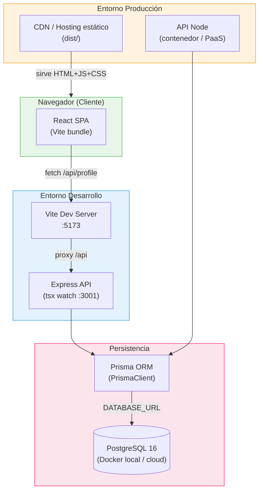


### 7.4 Flujos principales

**Flujo de carga inicial (desarrollo):**

1. El navegador solicita `http://localhost:5173`.
2. Vite sirve `frontend/index.html` + bundle JS.
3. React renderiza `App.tsx`, que monta `useHabitDashboard` y carga semana + recompensas desde la API.
4. `useUserProfile` llama a `fetch('/api/profile')`.
5. Vite hace proxy a `http://localhost:3001/api/profile`.
6. Express consulta `User id=1` en PostgreSQL vía Prisma y devuelve JSON.
7. `UserProfileCard` muestra nombre y email del usuario.

**Flujo de registro de hábito diario:**

1. Usuario hace clic en una celda del calendario.
2. El handler `handleToggleDay` llama a `toggleHabitDayCompletion`.
3. La función pura rota el estado: `pending` → `completed` → `failed` → `pending`.
4. Se recalculan las estadísticas con `calculateHabitStats`.
5. React re-renderiza los componentes afectados.

**Flujo de bloqueo semanal (futuro MVP+):**

1. Al detectar cambio de semana, el sistema llama a `POST /api/weeks/:id/lock`.
2. El backend persiste el snapshot de todos los hábitos y sus estados.
3. Se crea una nueva semana con los mismos hábitos en estado `pending`.
4. El frontend recarga la semana en curso.

---

## 8. Diagramas C4

> **Propósito de esta sección:** Profundizar en la arquitectura mediante el modelo C4 (Context, Containers, Components, Code), que permite a cualquier perfil técnico entender el sistema a distintos niveles de detalle, desde la vista de negocio hasta la implementación concreta.

---

### C1 — Nivel de Contexto

> Muestra ConRutina en relación con los actores externos y sistemas de soporte. Responde a la pregunta: ¿qué es el sistema y quién lo usa?

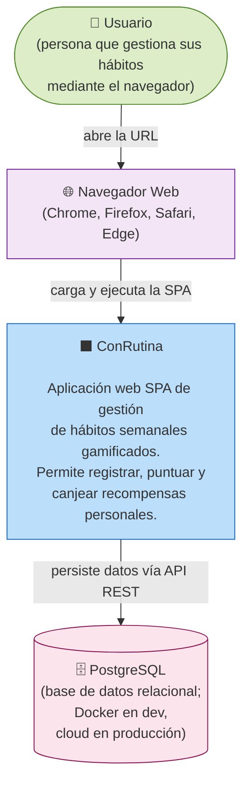


---

### C2 — Nivel de Contenedores

> Muestra los procesos ejecutables, almacenes de datos y cómo se comunican. Responde a: ¿en qué tecnologías está construido y cómo se despliegan las piezas?

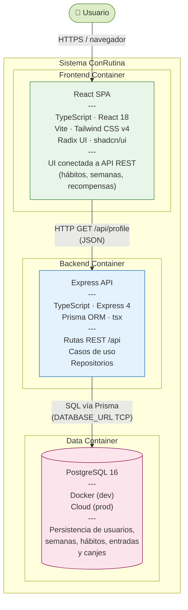


---

### C3 — Nivel de Componentes

> Desglosa el interior de los contenedores en módulos con responsabilidades claras. Responde a: ¿cuáles son los bloques internos y cómo se relacionan?

#### C3.1 — Componentes del Frontend

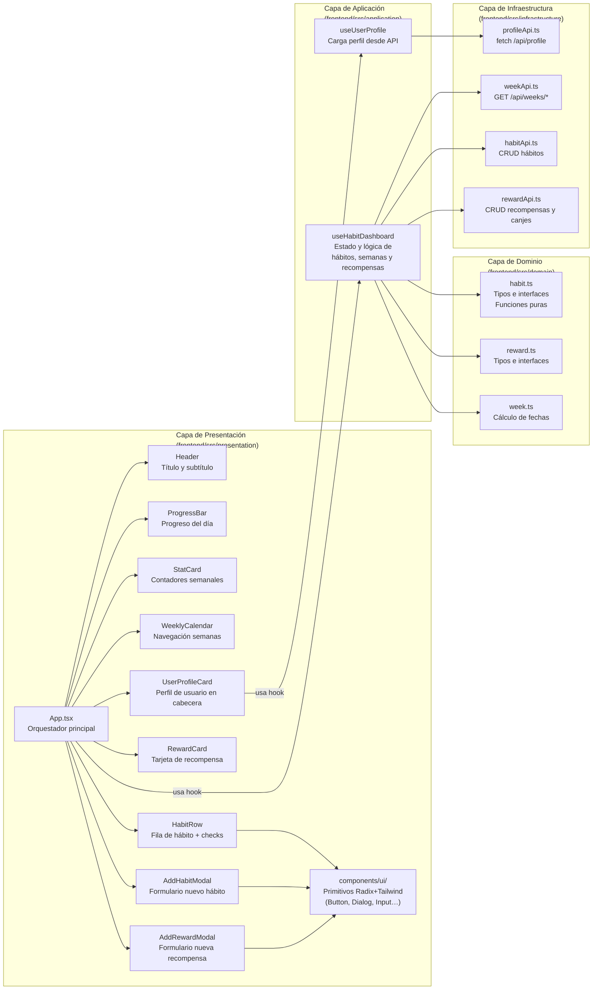


#### C3.2 — Componentes del Backend

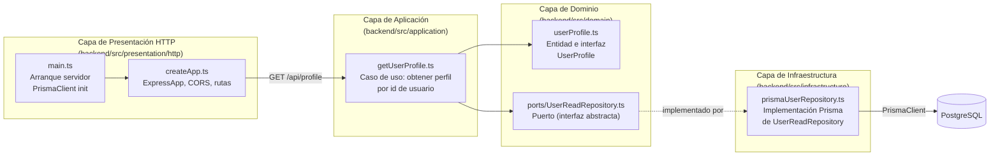


---

### C4 — Nivel de Código

> Muestra las clases / funciones más relevantes dentro de un componente concreto. Responde a: ¿cómo está implementado el caso de uso central del sistema?

#### C4 — Caso de uso: Registro de estado diario de un hábito (`useHabitDashboard`)

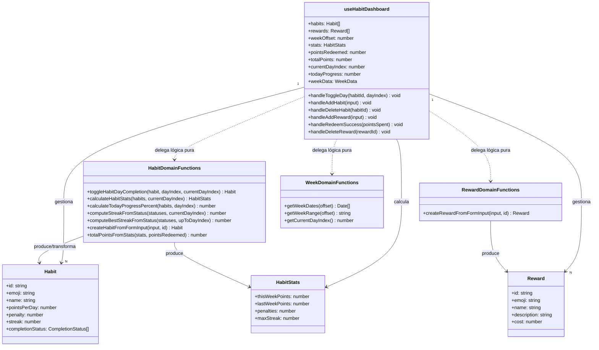


---

## 9. Out of Scope / Non-Goals

> **Propósito de esta sección:** Explicar que aspectos o funcionalidades quedan fuera del MVP de ConRutina.

- MVP pensado para uso personal.
- No se implementa un login de entrada.
- El propio usuario gestionará sus puntos, recompensas y penalizaciones. No se creará ningún otro perfil superior que lo supervise.
- Buscamos funcionalidad. No se implementarán sistemas de Márketing, publicidad o difusión.
- Tampoco se implementará ningún sistema de redes sociales para publicación de puntos o compartimiento de logros.
- El núcleo del dominio (hábitos, semanas, recompensas y canjes) persiste en PostgreSQL vía API REST; no usa `localStorage` ni fixtures en runtime.

---

*Documento generado a partir del estado del repositorio, las capturas de pantalla del prototipo y los requerimientos del producto. Actualizar cuando cambie la arquitectura, el modelo de datos o se publiquen nuevas funcionalidades.*