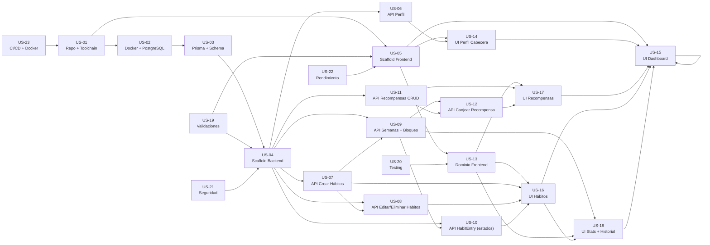
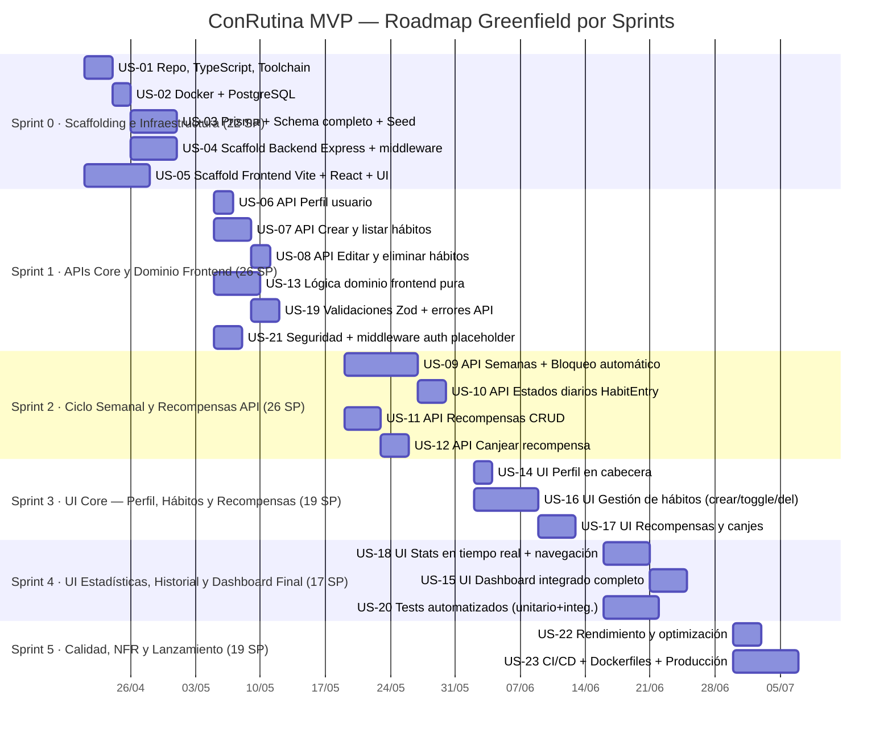

# ConRutina — Product Backlog (Greenfield)

> **Versión:** 1.0 · **Fecha:** Abril 2026 · **Estado:** MVP · **Metodología:** Scrum / MoSCoW
>
> **Nota de versión:** Este documento trata el proyecto como **greenfield** — punto de partida en cero. No existe código, base de datos, infraestructura ni configuración previa. Todas las historias están en estado ❌ Pendiente. Se incluyen User Stories de scaffolding, configuración de entorno, diseño de infraestructura y arquitectura que son prerequisitos de cualquier funcionalidad de negocio.

---

## Tabla de Contenidos

1. [User Stories](#1-user-stories)
2. [Validación de Consistencia](#2-validación-de-consistencia-entre-user-stories)
3. [Backlog Priorizado](#3-backlog-priorizado)
4. [Tickets de Desarrollo](#4-tickets-de-desarrollo)

---

## 1. User Stories

> **Estado de todas las historias:** ❌ Pendiente — proyecto greenfield, sin código existente.

---

### US-01 · Configurar repositorio, herramientas de desarrollo y estructura del proyecto

**Como** equipo de desarrollo, **quiero** tener el repositorio Git inicializado con estructura de monorepo, TypeScript configurado, linters, formateadores y scripts de arranque funcionales, **para** que cualquier desarrollador pueda clonar el proyecto y empezar a trabajar en menos de 10 minutos.

**Estado en código:** ❌ Pendiente

**INVEST:**
| Criterio | Evaluación |
|---|---|
| Independent | Fundacional; ninguna otra US puede comenzar sin esta. |
| Negotiable | La herramienta de linting (ESLint vs Biome) y el gestor de paquetes (npm/pnpm) son negociables. |
| Valuable | Sin repo y toolchain no hay proyecto; entregable imprescindible desde el día 1. |
| Estimable | Alcance completamente conocido; tareas estándar de setup. |
| Small | Acotada a configuración de proyecto sin lógica de negocio. |
| Testable | Se puede verificar que `npm install && npm run dev` arranca sin errores. |

**Complejidad:** `M` &nbsp;·&nbsp; **MoSCoW:** `Must Have` &nbsp;·&nbsp; **Story Points:** 5

**Acceptance Criteria (BDD):**

```gherkin
# Scenario 1 — Happy path: setup limpio
Given un desarrollador clona el repositorio por primera vez
When ejecuta "npm install"
Then todas las dependencias se instalan sin errores ni conflictos
And "npm run dev" arranca el frontend y el backend simultáneamente

# Scenario 2 — Estructura de proyecto
Given el repositorio está inicializado
Then existe un directorio "frontend/" con código React
And existe un directorio "backend/" con código Express
And existe "package.json" en la raíz con scripts "dev", "build", "test", "lint"
And existe "tsconfig.json" en la raíz con paths configurados
And existe ".gitignore" que excluye node_modules, dist, .env

# Scenario 3 — Linting funcional
Given el código contiene un error de sintaxis TypeScript
When se ejecuta "npm run lint"
Then el proceso termina con código de salida distinto de 0
And se muestra el error con ruta de archivo y número de línea

# Scenario 4 — Edge case: .env faltante
Given el desarrollador no ha creado el archivo .env
When arranca el backend
Then el proceso falla con un mensaje claro indicando qué variables son obligatorias
And no se lanza una excepción no controlada
```

---

### US-02 · Configurar entorno de base de datos con Docker y PostgreSQL

**Como** equipo de desarrollo, **quiero** disponer de un entorno de base de datos PostgreSQL 16 reproducible mediante Docker Compose, **para** que todos los desarrolladores trabajen contra la misma versión de BD sin instalarla manualmente y con datos reales en local.

**Estado en código:** ❌ Pendiente

**INVEST:**
| Criterio | Evaluación |
|---|---|
| Independent | Solo depende de US-01 (repositorio). |
| Negotiable | La versión de PostgreSQL y el puerto son negociables. |
| Valuable | Sin base de datos no puede desarrollarse ninguna funcionalidad persistente. |
| Estimable | Docker Compose para PostgreSQL es un patrón estándar y bien conocido. |
| Small | Una historia de infraestructura acotada a BD. |
| Testable | Se puede verificar que `docker compose up db` arranca y acepta conexiones. |

**Complejidad:** `S` &nbsp;·&nbsp; **MoSCoW:** `Must Have` &nbsp;·&nbsp; **Story Points:** 2

**Acceptance Criteria (BDD):**

```gherkin
# Scenario 1 — Happy path
Given el desarrollador tiene Docker instalado
When ejecuta "docker compose up -d db"
Then PostgreSQL 16 arranca en el puerto configurado (por defecto 5432)
And el comando "pg_isready -h localhost" devuelve "accepting connections"
And los datos persisten entre reinicios del contenedor gracias al volumen Docker

# Scenario 2 — Variables de entorno
Given existe el fichero .env con POSTGRES_USER, POSTGRES_PASSWORD, POSTGRES_DB
When arranca el contenedor
Then la base de datos usa exactamente esas credenciales
And docker-compose.yml lee esas variables, no valores hardcodeados

# Scenario 3 — Edge case: puerto ya ocupado
Given el puerto 5432 está en uso en la máquina del desarrollador
Then la variable POSTGRES_PORT en .env permite configurar un puerto alternativo
And el servicio arranca en ese puerto alternativo sin errores
```

---

### US-03 · Configurar Prisma ORM con esquema inicial y migraciones

**Como** equipo de desarrollo, **quiero** tener Prisma configurado con el datasource apuntando a PostgreSQL, el esquema inicial de todas las entidades del dominio y el flujo de migraciones establecido, **para** que la base de datos se pueda crear, migrar y resetear de forma reproducible y versionada en el repositorio.

**Estado en código:** ❌ Pendiente

**INVEST:**
| Criterio | Evaluación |
|---|---|
| Independent | Depende de US-02 (BD disponible). |
| Negotiable | La herramienta ORM (Prisma vs Drizzle) es negociable antes de empezar. |
| Valuable | Sin ORM y schema no puede implementarse ninguna capa de persistencia. |
| Estimable | El modelo de datos está definido en el PRD con todas sus entidades. |
| Small | Acotada a definición de schema y configuración del cliente Prisma. |
| Testable | `prisma migrate dev` crea las tablas sin errores; `prisma studio` las muestra. |

**Complejidad:** `M` &nbsp;·&nbsp; **MoSCoW:** `Must Have` &nbsp;·&nbsp; **Story Points:** 5

**Acceptance Criteria (BDD):**

```gherkin
# Scenario 1 — Happy path: primera migración
Given el fichero "backend/prisma/schema.prisma" contiene todos los modelos del PRD
When el desarrollador ejecuta "npx prisma migrate dev --name init"
Then se crea la migración en "backend/prisma/migrations/"
And PostgreSQL contiene todas las tablas: User, Week, Habit, WeekHabit, HabitEntry, Reward, RewardRedemption
And todas las claves foráneas y restricciones están definidas correctamente

# Scenario 2 — Seed de desarrollo
Given existe el fichero "backend/prisma/seed.ts"
When se ejecuta "npx prisma db seed"
Then se insertan datos de ejemplo: al menos 1 usuario, 3 hábitos, 2 recompensas
And los datos de seed son deterministas (mismos datos en cada ejecución)

# Scenario 3 — Reset de BD
Given el desarrollador quiere empezar con BD limpia
When ejecuta "npx prisma migrate reset"
Then todas las tablas se eliminan y recrean
And los datos de seed se vuelven a insertar automáticamente

# Scenario 4 — Edge case: schema incompleto
Given el schema no tiene definida la entidad HabitEntry
When se ejecuta "prisma validate"
Then Prisma muestra un error descriptivo sobre la entidad faltante
And la migración no se ejecuta hasta corregirlo

# Scenario 5 — Modelos a implementar (lista de verificación)
Given el schema está completo
Then existen los siguientes modelos con sus campos exactos del PRD:
  | Modelo | Campos clave |
  | User | id, email(unique), name?, avatarUrl?, createdAt |
  | Week | id, userId(FK), startDate, endDate, isLocked(default:false), totalPointsEarned(default:0), totalPenalties(default:0), createdAt |
  | Habit | id, userId(FK), emoji, name, pointsPerDay, penalty, isActive(default:true), createdAt |
  | WeekHabit | id, weekId(FK), habitId(FK), order, snapshotName, snapshotPoints, snapshotPenalty |
  | HabitEntry | id, weekHabitId(FK), dayIndex(0-6), status(enum:pending/completed/failed), updatedAt |
  | Reward | id, userId(FK), emoji, name, description, cost, isActive(default:true), createdAt |
  | RewardRedemption | id, weekId(FK), rewardId(FK), pointsSpent, redeemedAt |
```

---

### US-04 · Scaffold del backend: Express con arquitectura limpia

**Como** equipo de desarrollo, **quiero** un servidor Express estructurado en capas (presentación HTTP, aplicación, dominio e infraestructura) con middleware esencial configurado, **para** que todos los nuevos endpoints y casos de uso se implementen de forma consistente y testeable.

**Estado en código:** ❌ Pendiente

**INVEST:**
| Criterio | Evaluación |
|---|---|
| Independent | Depende de US-01 y US-03. |
| Negotiable | La arquitectura (Clean Architecture vs hexagonal) y el framework HTTP son negociables. |
| Valuable | Sin scaffold del servidor no puede implementarse ningún endpoint de negocio. |
| Estimable | Patrón conocido; estructura de capas bien definida en el PRD sección 7. |
| Small | Scaffold sin lógica de negocio; solo la estructura y middleware base. |
| Testable | `npm run api` arranca el servidor; health check responde 200. |

**Complejidad:** `M` &nbsp;·&nbsp; **MoSCoW:** `Must Have` &nbsp;·&nbsp; **Story Points:** 5

**Acceptance Criteria (BDD):**

```gherkin
# Scenario 1 — Servidor arranca
Given el fichero "backend/src/main.ts" está implementado
When se ejecuta "npm run api"
Then el servidor Express arranca en el puerto definido en API_PORT (default 3001)
And el log muestra "Server running on port 3001"
And GET http://localhost:3001/health responde 200 { status: "ok" }

# Scenario 2 — Estructura de capas
Given el proyecto backend está scaffoldeado
Then existen los directorios:
  - backend/src/domain/          (entidades, interfaces de puertos)
  - backend/src/application/     (casos de uso)
  - backend/src/infrastructure/  (repositorios Prisma)
  - backend/src/presentation/    (rutas HTTP, middleware)

# Scenario 3 — Middleware base configurado
Given el servidor está corriendo
Then CORS está habilitado para el origen configurado en CORS_ORIGIN
And el servidor parsea application/json en el body de las peticiones
And las respuestas incluyen los headers de seguridad básicos

# Scenario 4 — Manejo global de errores
Given cualquier endpoint lanza una excepción no controlada
When Express captura el error
Then responde con 500 { code: "INTERNAL_ERROR", message: "Error interno del servidor" }
And el stack trace NO se expone en la respuesta en producción

# Scenario 5 — Validación de variables de entorno al arranque
Given la variable DATABASE_URL no está definida en .env
When se intenta arrancar el servidor
Then el proceso termina inmediatamente con un mensaje: "Variable obligatoria DATABASE_URL no está definida"
And no llega a escuchar conexiones TCP
```

---

### US-05 · Scaffold del frontend: Vite + React + TypeScript + Tailwind + shadcn/ui

**Como** equipo de desarrollo, **quiero** un frontend React con TypeScript, Tailwind CSS v4 y la librería de componentes shadcn/ui (Radix primitives) configurado y arrancando, **para** que los desarrolladores de UI puedan empezar a construir componentes sin invertir tiempo en configuración de herramientas.

**Estado en código:** ❌ Pendiente

**INVEST:**
| Criterio | Evaluación |
|---|---|
| Independent | Depende de US-01; puede desarrollarse en paralelo con US-02 a US-04. |
| Negotiable | La versión de Tailwind (v3 vs v4) y el sistema de temas es negociable. |
| Valuable | Sin scaffold del frontend no puede comenzar el desarrollo de UI. |
| Estimable | Patrón estándar de Vite + React; bien documentado. |
| Small | Setup sin componentes de negocio; solo herramientas y estructura. |
| Testable | `npm run dev` sirve la SPA en localhost:5173; la página raíz renderiza sin errores. |

**Complejidad:** `M` &nbsp;·&nbsp; **MoSCoW:** `Must Have` &nbsp;·&nbsp; **Story Points:** 5

**Acceptance Criteria (BDD):**

```gherkin
# Scenario 1 — SPA arranca
Given el frontend está scaffoldeado
When se ejecuta "npm run dev"
Then Vite sirve la aplicación en http://localhost:5173
And el navegador muestra la SPA sin errores en la consola

# Scenario 2 — Proxy a la API
Given el servidor backend está corriendo en :3001
When el frontend hace fetch('/api/health')
Then Vite reenvía la petición a http://localhost:3001/health
And la respuesta llega correctamente al navegador (sin errores CORS)

# Scenario 3 — Tailwind y tema
Given un componente React usa clases de Tailwind (ej. "bg-primary text-white")
When se renderiza en el navegador
Then los estilos se aplican correctamente
And el tema de color (paleta principal de ConRutina) está definido como CSS variables

# Scenario 4 — Componentes shadcn/ui disponibles
Given el proyecto tiene shadcn/ui instalado
Then los primitivos básicos (Button, Dialog, Input, Card) están disponibles en "frontend/src/presentation/components/ui/"
And se pueden importar y renderizar sin errores adicionales de configuración

# Scenario 5 — Estructura de capas frontend
Given el proyecto frontend está scaffoldeado
Then existen los directorios:
  - frontend/src/domain/          (tipos puros, funciones de cálculo)
  - frontend/src/application/     (hooks de casos de uso)
  - frontend/src/infrastructure/  (clientes de API HTTP)
  - frontend/src/presentation/    (componentes React, App.tsx)
  - frontend/src/styles/          (CSS global, tema, fuentes)

# Scenario 6 — Build de producción
Given el frontend está scaffoldeado
When se ejecuta "npm run build"
Then Vite genera el bundle en "frontend/dist/" sin errores de compilación TypeScript
```

---

### US-06 · API y dominio: gestión de perfil de usuario

**Como** usuario, **quiero** que el sistema pueda leer mi información de perfil (nombre, email, avatar) desde la base de datos, **para** que la aplicación me identifique y muestre mis datos personales en la cabecera.

**Estado en código:** ❌ Pendiente

**INVEST:**
| Criterio | Evaluación |
|---|---|
| Independent | Depende de US-04 (servidor Express) y US-03 (Prisma + modelo User). |
| Negotiable | El campo `avatarUrl` puede ser opcional en la primera entrega. |
| Valuable | El reconocimiento del usuario es la base de la experiencia personalizada. |
| Estimable | Alcance muy acotado: un endpoint GET y un repositorio de lectura. |
| Small | Una entidad, un endpoint, un caso de uso. |
| Testable | GET /api/profile devuelve 200 con datos del usuario o 404 si no existe. |

**Complejidad:** `S` &nbsp;·&nbsp; **MoSCoW:** `Must Have` &nbsp;·&nbsp; **Story Points:** 3

**Acceptance Criteria (BDD):**

```gherkin
# Scenario 1 — Happy path
Given existe un usuario en BD con id=1, name="Ana", email="ana@ejemplo.com"
When se hace GET /api/profile
Then el servidor responde 200 { id: 1, name: "Ana", email: "ana@ejemplo.com", avatarUrl: null }

# Scenario 2 — Usuario sin nombre
Given el usuario tiene name=null en BD
When se hace GET /api/profile
Then la respuesta incluye name: null
And la aplicación no lanza error y usa el email como nombre de fallback

# Scenario 3 — Usuario no encontrado
Given no existe ningún usuario con el id resuelto
When se hace GET /api/profile
Then el servidor responde 404 { code: "USER_NOT_FOUND", message: "Usuario no encontrado" }

# Scenario 4 — Fallo de BD
Given la base de datos no está disponible
When se hace GET /api/profile
Then el servidor responde 500 con mensaje genérico (sin detalles de infraestructura)
```

---

### US-07 · API y dominio: creación y listado de hábitos

**Como** usuario, **quiero** poder crear hábitos con nombre, emoji, puntos por día completado y penalización, y que el sistema los liste correctamente, **para** que mis rutinas queden registradas y asociadas a mi cuenta.

**Estado en código:** ❌ Pendiente

**INVEST:**
| Criterio | Evaluación |
|---|---|
| Independent | Depende de US-03 (modelo Habit) y US-04 (servidor). |
| Negotiable | El límite máximo de hábitos por usuario es negociable. |
| Valuable | La creación de hábitos es la acción central de incorporación al producto. |
| Estimable | Endpoint POST + GET estándar con validación. |
| Small | Dos endpoints acotados a la entidad Habit. |
| Testable | POST crea en BD; GET devuelve solo los activos del usuario. |

**Complejidad:** `M` &nbsp;·&nbsp; **MoSCoW:** `Must Have` &nbsp;·&nbsp; **Story Points:** 5

**Acceptance Criteria (BDD):**

```gherkin
# Scenario 1 — Crear hábito (happy path)
Given el usuario está identificado (userId=1)
When hace POST /api/habits con body { emoji:"🏃", name:"Correr", pointsPerDay:10, penalty:5 }
Then el servidor responde 201 con el hábito creado incluyendo id, userId, isActive:true, createdAt
And el hábito queda persistido en la tabla Habit de PostgreSQL

# Scenario 2 — Listar hábitos
Given el usuario tiene 3 hábitos activos y 1 inactivo (isActive:false)
When hace GET /api/habits
Then la respuesta incluye los 3 hábitos activos
And el hábito inactivo NO aparece en la lista

# Scenario 3 — Validación: nombre vacío
Given el body de POST /api/habits no incluye el campo "name" o lo incluye vacío
When el servidor recibe la petición
Then responde 400 { code: "VALIDATION_ERROR", message: "...", details: [{ field: "name", message: "El nombre es obligatorio" }] }

# Scenario 4 — Validación: puntos no positivos
Given el body incluye pointsPerDay: 0
When el servidor recibe la petición
Then responde 400 con error de validación en el campo pointsPerDay

# Scenario 5 — Edge case: emoji no proporcionado
Given el body no incluye emoji
When el servidor valida el body
Then responde 400 con error en el campo emoji (campo obligatorio)
```

---

### US-08 · API: actualizar y desactivar hábitos

**Como** usuario, **quiero** poder editar los atributos de un hábito existente y eliminarlo (baja lógica) de la semana activa, **para** mantener mi lista de hábitos actualizada y relevante.

**Estado en código:** ❌ Pendiente

**INVEST:**
| Criterio | Evaluación |
|---|---|
| Independent | Depende de US-07 (hábitos creados). |
| Negotiable | Si la edición afecta a la semana en curso (requiere nuevo snapshot) o solo a futuras semanas es negociable. |
| Valuable | La gestión del catálogo de hábitos es necesaria para la usabilidad. |
| Estimable | Endpoints PATCH y DELETE estándar con reglas de integridad claras. |
| Small | Dos endpoints sobre la entidad Habit. |
| Testable | PATCH actualiza campos en BD; DELETE marca isActive=false sin borrar historial. |

**Complejidad:** `S` &nbsp;·&nbsp; **MoSCoW:** `Must Have` &nbsp;·&nbsp; **Story Points:** 3

**Acceptance Criteria (BDD):**

```gherkin
# Scenario 1 — Editar hábito (happy path)
Given existe el hábito id=5 con name="Correr", pointsPerDay=10
When hace PATCH /api/habits/5 con body { pointsPerDay: 15 }
Then el servidor responde 200 con el hábito actualizado (pointsPerDay:15)
And el cambio solo afecta a nuevas semanas; el snapshot de semanas bloqueadas queda intacto

# Scenario 2 — Eliminar hábito (baja lógica)
Given existe el hábito id=5 en la semana activa
When hace DELETE /api/habits/5
Then el servidor responde 204 No Content
And el hábito queda con isActive=false en BD
And la semana en curso deja de mostrar ese hábito
And las semanas anteriores bloqueadas conservan su snapshot (snapshotName intacto)

# Scenario 3 — Edge case: hábito de otro usuario
Given el hábito id=7 pertenece al usuario id=2
When el usuario id=1 hace DELETE /api/habits/7
Then el servidor responde 404 (no expone que el recurso existe pero pertenece a otro)

# Scenario 4 — PATCH en semana bloqueada
Given un hábito está incluido en una semana con isLocked=true
When se hace PATCH sobre ese hábito (cambio de nombre)
Then el hábito maestro (tabla Habit) se actualiza
And el snapshot en WeekHabit de la semana bloqueada NO cambia
```

---

### US-09 · API: gestión de semanas y bloqueo automático

**Como** sistema, **quiero** un endpoint que devuelva la semana activa del usuario y que, si ha cambiado de semana, bloquee la anterior y cree automáticamente la nueva con los hábitos heredados, **para** garantizar la integridad del historial y que cada semana comience con todas las celdas en blanco.

**Estado en código:** ❌ Pendiente

**INVEST:**
| Criterio | Evaluación |
|---|---|
| Independent | Depende de US-03 (modelos Week, WeekHabit, HabitEntry), US-07 (hábitos). |
| Negotiable | El momento del bloqueo (al cargar la app vs. cron job nocturno) es negociable. |
| Valuable | Es la mecánica que distingue ConRutina: historial inmutable semana a semana. |
| Estimable | Lógica de fechas + transacción BD bien especificada en el PRD. |
| Small | Un endpoint que encapsula la lógica de transición semanal. |
| Testable | Simular cambio de semana y verificar bloqueo de semana anterior y creación de nueva. |

**Complejidad:** `L` &nbsp;·&nbsp; **MoSCoW:** `Must Have` &nbsp;·&nbsp; **Story Points:** 13

**Acceptance Criteria (BDD):**

```gherkin
# Scenario 1 — Happy path: primera semana del usuario
Given el usuario no tiene ninguna semana en BD
When hace GET /api/weeks/current
Then el servidor crea la semana actual (lunes 00:00 UTC → domingo 23:59 UTC)
And crea WeekHabit para cada hábito activo del usuario (isActive=true)
And crea 7 HabitEntry con status=pending para cada WeekHabit
And devuelve la nueva semana con todos sus datos

# Scenario 2 — Happy path: misma semana
Given el usuario ya tiene la semana en curso en BD (isLocked=false)
When hace GET /api/weeks/current
Then el servidor devuelve la semana existente con sus WeekHabit y HabitEntry sin crear duplicados

# Scenario 3 — Happy path: cambio de semana (transición)
Given existe la semana anterior sin bloquear (isLocked=false)
And hoy es lunes de la semana siguiente
When hace GET /api/weeks/current
Then el servidor bloquea la semana anterior: isLocked=true, totalPointsEarned y totalPenalties calculados
And escribe los snapshots definitivos en WeekHabit (snapshotName, snapshotPoints, snapshotPenalty)
And crea la nueva semana con los hábitos activos del usuario (isActive=true)
And la nueva semana tiene todas sus HabitEntry con status=pending
And devuelve la nueva semana, no la bloqueada

# Scenario 4 — Idempotencia
Given la semana anterior ya está bloqueada (isLocked=true)
When GET /api/weeks/current se llama dos veces seguidas
Then no se crean semanas duplicadas ni se modifica la semana bloqueada
And se devuelve la semana en curso en ambas llamadas

# Scenario 5 — Snapshot inmutable
Given la semana W se bloqueó con el hábito "Yoga" a 10 pts/día
When más tarde el usuario edita "Yoga" a 15 pts/día
Then GET /api/weeks/current con offset=-1 sigue mostrando snapshotPoints=10 para "Yoga"

# Scenario 6 — GET /api/weeks?offset=n (historial)
Given el usuario tiene 3 semanas bloqueadas y 1 activa
When hace GET /api/weeks?offset=-1
Then devuelve la semana anterior bloqueada con isLocked=true
When hace GET /api/weeks?offset=-5
Then devuelve 404 (no existe semana tan antigua)
```

---

### US-10 · API: gestión de estados diarios de hábitos (HabitEntry)

**Como** usuario, **quiero** que cada clic sobre una celda del calendario actualice el estado de ese día en la base de datos, **para** que mi progreso diario quede registrado de forma permanente.

**Estado en código:** ❌ Pendiente

**INVEST:**
| Criterio | Evaluación |
|---|---|
| Independent | Depende de US-09 (HabitEntry creadas al iniciar semana). |
| Negotiable | Si se permite cambiar estado de días futuros en semana actual es negociable. |
| Valuable | Es la interacción principal del producto; sin persistencia no hay valor. |
| Estimable | Endpoint PATCH simple con validación de semana bloqueada. |
| Small | Un endpoint, una tabla, una validación clave. |
| Testable | PATCH persiste el estado; semana bloqueada rechaza la petición con 409. |

**Complejidad:** `M` &nbsp;·&nbsp; **MoSCoW:** `Must Have` &nbsp;·&nbsp; **Story Points:** 5

**Acceptance Criteria (BDD):**

```gherkin
# Scenario 1 — Happy path
Given existe HabitEntry con id=42, status=pending, en semana no bloqueada
When hace PATCH /api/habit-entries/42 con body { status: "completed" }
Then el servidor responde 200 { id: 42, status: "completed", updatedAt: "<now>" }
And el registro en BD tiene status=completed

# Scenario 2 — Semana bloqueada
Given la HabitEntry id=99 pertenece a una semana con isLocked=true
When hace PATCH /api/habit-entries/99 con body { status: "completed" }
Then el servidor responde 409 { code: "WEEK_LOCKED", message: "No se puede modificar una semana bloqueada" }
And el estado en BD no cambia

# Scenario 3 — Ciclo de estados válidos
Given una HabitEntry en status=completed
When hace PATCH con { status: "failed" }
Then el servidor acepta el cambio (todos los estados son mutuamente accesibles)
And responde 200

# Scenario 4 — Validación de status inválido
Given el body incluye { status: "done" } (valor no válido)
When el servidor recibe la petición
Then responde 400 { code: "VALIDATION_ERROR", details: [{ field: "status", message: "Debe ser pending, completed o failed" }] }

# Scenario 5 — Edge case: HabitEntry de otro usuario
Given HabitEntry id=200 pertenece al usuario id=2
When el usuario id=1 hace PATCH /api/habit-entries/200
Then el servidor responde 404 (no expone existencia del recurso)
```

---

### US-11 · API: gestión de recompensas (CRUD)

**Como** usuario, **quiero** crear, listar y eliminar recompensas personalizadas con nombre, emoji, descripción y coste en puntos, **para** definir los incentivos que hacen que mi esfuerzo semanal tenga un valor tangible y personal.

**Estado en código:** ❌ Pendiente

**INVEST:**
| Criterio | Evaluación |
|---|---|
| Independent | Depende de US-03 (modelo Reward) y US-04 (servidor). |
| Negotiable | Editar una recompensa (PATCH) puede posponerse a una versión posterior. |
| Valuable | Las recompensas personalizadas son el diferencial competitivo del producto. |
| Estimable | CRUD estándar; mismos patrones que hábitos. |
| Small | Tres endpoints sobre la entidad Reward. |
| Testable | POST crea en BD; DELETE hace baja lógica; canjes históricos no se eliminan. |

**Complejidad:** `M` &nbsp;·&nbsp; **MoSCoW:** `Must Have` &nbsp;·&nbsp; **Story Points:** 5

**Acceptance Criteria (BDD):**

```gherkin
# Scenario 1 — Crear recompensa (happy path)
Given el usuario está identificado
When hace POST /api/rewards con body { emoji:"🎬", name:"Ir al cine", description:"Tarde de peli", cost:50 }
Then el servidor responde 201 con la recompensa creada (id, isActive:true, createdAt)
And queda persistida en la tabla Reward

# Scenario 2 — Listar recompensas
Given el usuario tiene 3 recompensas activas y 1 eliminada (isActive:false)
When hace GET /api/rewards
Then la respuesta incluye las 3 activas únicamente

# Scenario 3 — Eliminar recompensa (baja lógica)
Given existe la recompensa id=3 con 2 canjes históricos
When hace DELETE /api/rewards/3
Then responde 204
And Reward queda con isActive=false
And los 2 RewardRedemption históricos permanecen en BD

# Scenario 4 — Validación: coste cero
Given el body de POST incluye cost: 0
Then el servidor responde 400 con error en el campo cost ("Debe ser mayor que 0")

# Scenario 5 — Edge case: recompensa de otro usuario
Given la recompensa id=10 pertenece al usuario id=2
When el usuario id=1 hace DELETE /api/rewards/10
Then el servidor responde 404
```

---

### US-12 · API: canjear recompensa con validación de saldo

**Como** usuario, **quiero** canjear una recompensa cuando tengo suficientes puntos en la semana activa, **para** disfrutar del incentivo que me he ganado y cerrar el ciclo motivacional del sistema de puntos.

**Estado en código:** ❌ Pendiente

**INVEST:**
| Criterio | Evaluación |
|---|---|
| Independent | Depende de US-09 (semana activa) y US-11 (recompensas). |
| Negotiable | Si una recompensa puede canjearse varias veces en la misma semana es negociable. |
| Valuable | Sin canje, el sistema de puntos carece de utilidad. Cierra el ciclo motivacional. |
| Estimable | Endpoint POST con transacción de validación de saldo bien definida. |
| Small | Un endpoint transaccional bien acotado. |
| Testable | Verificar deducción de puntos, registro de canje y rechazo si saldo insuficiente. |

**Complejidad:** `M` &nbsp;·&nbsp; **MoSCoW:** `Must Have` &nbsp;·&nbsp; **Story Points:** 5

**Acceptance Criteria (BDD):**

```gherkin
# Scenario 1 — Happy path
Given la semana actual tiene saldo disponible = 80 pts (puntos ganados - penalizaciones - canjes previos)
And la recompensa id=2 tiene cost=50
When hace POST /api/weeks/1/redemptions con body { rewardId: 2 }
Then el servidor responde 201 { id, weekId:1, rewardId:2, pointsSpent:50, redeemedAt:"<now>" }
And el nuevo saldo disponible de la semana es 30 pts

# Scenario 2 — Saldo insuficiente
Given el saldo disponible es 30 pts
And la recompensa tiene cost=50
When hace POST /api/weeks/1/redemptions con body { rewardId: 2 }
Then el servidor responde 422 { code: "INSUFFICIENT_POINTS", available: 30, required: 50 }
And no se crea ningún RewardRedemption

# Scenario 3 — Semana bloqueada
Given la semana id=1 tiene isLocked=true
When hace POST /api/weeks/1/redemptions
Then el servidor responde 409 { code: "WEEK_LOCKED" }

# Scenario 4 — Edge case: race condition (doble clic)
Given el saldo disponible es exactamente 50 pts
When dos peticiones de canje de 50 pts llegan simultáneamente
Then solo una petición tiene éxito (la primera que obtiene el lock de la transacción)
And la segunda responde 422 INSUFFICIENT_POINTS
And el saldo resultante es 0 (no negativo)

# Scenario 5 — Canjear múltiples veces
Given el saldo es 150 pts y la recompensa cuesta 50 pts
When el usuario canjea 3 veces la misma recompensa
Then se crean 3 RewardRedemption distintos
And el saldo final es 0 pts
```

---

### US-13 · Lógica de dominio frontend: cálculo de puntos, rachas y progreso

**Como** equipo de desarrollo, **quiero** implementar las funciones puras del dominio de hábitos en el frontend (toggle de estados, cálculo de puntos y penalizaciones, rachas, progreso diario), **para** que la UI pueda actualizar indicadores de forma reactiva e inmediata sin esperar a la API.

**Estado en código:** ❌ Pendiente

**INVEST:**
| Criterio | Evaluación |
|---|---|
| Independent | No depende de ninguna API; es lógica pura testeable. |
| Negotiable | La implementación exacta de la racha (días consecutivos vs. dentro de la semana) es negociable. |
| Valuable | Las funciones puras son el motor de la experiencia gamificada en tiempo real. |
| Estimable | Funciones puras simples; alcance completamente definido en el PRD (sección 8, C4). |
| Small | Módulo de dominio frontend sin efectos secundarios. |
| Testable | 100% testeable con tests unitarios sin montar UI ni servidor. |

**Complejidad:** `M` &nbsp;·&nbsp; **MoSCoW:** `Must Have` &nbsp;·&nbsp; **Story Points:** 5

**Acceptance Criteria (BDD):**

```gherkin
# Scenario 1 — Toggle de estado: ciclo completo
Given un Habit con completionStatus[2] = "pending"
When se llama a toggleHabitDayCompletion(habit, dayIndex=2) tres veces
Then tras el 1er clic: status[2] = "completed"
And tras el 2º clic: status[2] = "failed"
And tras el 3er clic: status[2] = "pending"

# Scenario 2 — Cálculo de puntos semanales
Given un Habit con pointsPerDay=10, penalty=5
And completionStatus = [completed, completed, failed, pending, pending, pending, pending]
When se llama a calculateHabitStats([habit])
Then thisWeekPoints = 20 (2 días × 10 pts)
And penalties = 5 (1 día fallado × 5 pts)

# Scenario 3 — Progreso del día
Given hoy es miércoles (dayIndex=2)
And de 3 hábitos, 2 tienen status[2]="completed" y 1 "pending"
When se llama a calculateTodayProgressPercent(habits, 2)
Then el resultado es 66.67 (2/3)

# Scenario 4 — Cálculo de racha
Given un Habit con completionStatus = [completed, completed, completed, failed, completed, pending, pending]
When se llama a computeStreakFromStatus(status, currentDayIndex=4)
Then la racha del hábito es 1 (el día 4 completado, el día 3 fue fallo → se reinicia)

# Scenario 5 — Edge case: sin hábitos
Given el array de hábitos está vacío
When se llama a calculateHabitStats([])
Then thisWeekPoints=0, penalties=0, maxStreak=0 sin lanzar excepción
```

---

### US-14 · UI: perfil de usuario en cabecera

**Como** usuario, **quiero** ver mi nombre, email y avatar en la cabecera de la aplicación, cargados desde la API, **para** tener confirmación visual de que el sistema me reconoce y que estoy viendo mis propios datos.

**Estado en código:** ❌ Pendiente

**INVEST:**
| Criterio | Evaluación |
|---|---|
| Independent | Depende de US-06 (API de perfil) y US-05 (scaffold frontend). |
| Negotiable | El diseño visual de la cabecera (logo, layout) es negociable. |
| Valuable | El usuario necesita confirmación de identidad para confiar en la aplicación. |
| Estimable | Componente de presentación con un hook y un endpoint GET. |
| Small | Un componente, un hook, un endpoint. |
| Testable | Verificar que el nombre y email aparecen correctamente y los estados de carga/error se gestionan. |

**Complejidad:** `S` &nbsp;·&nbsp; **MoSCoW:** `Must Have` &nbsp;·&nbsp; **Story Points:** 3

**Acceptance Criteria (BDD):**

```gherkin
# Scenario 1 — Happy path
Given la API devuelve { name: "Ana García", email: "ana@ejemplo.com", avatarUrl: null }
When el usuario abre la aplicación
Then la cabecera muestra "Ana García" y "ana@ejemplo.com"
And si avatarUrl es null, se muestra un avatar con las iniciales del nombre

# Scenario 2 — Estado de carga
Given la petición a /api/profile tarda más de 200ms
When el componente monta
Then se muestra un skeleton de carga en la cabecera durante la espera
And no se muestra ningún valor vacío ni "undefined"

# Scenario 3 — Error de API
Given la API responde con error (503, red caída)
When el hook recibe el error
Then la cabecera muestra "Usuario desconocido" de forma no intrusiva
And el resto del dashboard sigue siendo funcional

# Scenario 4 — Nombre nulo
Given el usuario tiene name=null en BD (perfil sin configurar)
When se carga el componente
Then se muestra el email como nombre visible
And no hay excepción JavaScript por acceder a name.split() o similar
```

---

### US-15 · UI: dashboard semanal unificado

**Como** usuario, **quiero** ver en una sola pantalla la barra de progreso del día, los contadores de estadísticas, el calendario semanal con mis hábitos y el bloque de recompensas, **para** tener una visión completa de mi situación en menos de 3 segundos.

**Estado en código:** ❌ Pendiente

**INVEST:**
| Criterio | Evaluación |
|---|---|
| Independent | Orquesta datos de todas las APIs; su layout es una historia de composición separada. |
| Negotiable | El orden y disposición de secciones en pantalla es negociable. |
| Valuable | Es la pantalla principal y el centro de la propuesta de valor del producto. |
| Estimable | Integración de hooks y componentes ya definidos; esfuerzo medible. |
| Small | Acotado a una sola pantalla sin subvistas. |
| Testable | Verificar que cada sección renderiza datos reales y los estados de carga/error son correctos. |

**Complejidad:** `M` &nbsp;·&nbsp; **MoSCoW:** `Must Have` &nbsp;·&nbsp; **Story Points:** 5

**Acceptance Criteria (BDD):**

```gherkin
# Scenario 1 — Happy path
Given el usuario tiene 3 hábitos y 2 recompensas en BD
When abre la aplicación
Then el dashboard carga en menos de 3 segundos
And se muestra la barra de progreso del día con el % correcto
And se muestran los 4 StatCards (puntos semana actual, semana anterior, penalizaciones, racha)
And se muestra el calendario semanal con los 3 hábitos y sus 7 celdas cada uno
And se muestra la sección de recompensas con las 2 recompensas del usuario

# Scenario 2 — Estado vacío: sin hábitos
Given el usuario no tiene ningún hábito creado
When abre la aplicación
Then se muestra un placeholder con mensaje "Añade tu primer hábito" y un CTA visible
And la barra de progreso muestra 0%
And los StatCards muestran 0 en todos sus valores

# Scenario 3 — Estado de carga
Given la API tarda en responder
When se está cargando el dashboard
Then se muestran skeletons en cada sección (no pantalla en blanco)
And el usuario no ve contenido parcialmente cargado de forma confusa

# Scenario 4 — Error parcial
Given el endpoint de recompensas falla pero el de hábitos funciona
When carga el dashboard
Then el calendario semanal con hábitos se muestra correctamente
And la sección de recompensas muestra un mensaje de error no intrusivo
And las demás secciones no se ven afectadas
```

---

### US-16 · UI: crear y gestionar hábitos desde el dashboard

**Como** usuario, **quiero** crear nuevos hábitos mediante un modal con formulario, marcar el estado diario de cada hábito en el calendario y eliminar hábitos de la semana activa, **para** gestionar mis rutinas directamente desde la pantalla principal.

**Estado en código:** ❌ Pendiente

**INVEST:**
| Criterio | Evaluación |
|---|---|
| Independent | Depende de US-07, US-08, US-10 (APIs) y US-13 (lógica de dominio). |
| Negotiable | La interacción de confirmación antes de eliminar (modal vs. directo) es negociable. |
| Valuable | La gestión de hábitos desde la UI es la función principal del producto. |
| Estimable | Tres interacciones claras: crear modal, toggle celda, eliminar. |
| Small | Podría dividirse en 3 US más pequeñas; se agrupa por cohesión funcional. |
| Testable | Verificar creación, toggle y eliminación con integración real de API. |

**Complejidad:** `L` &nbsp;·&nbsp; **MoSCoW:** `Must Have` &nbsp;·&nbsp; **Story Points:** 8

**Acceptance Criteria (BDD):**

```gherkin
# Scenario 1 — Crear hábito (happy path)
Given el usuario hace clic en "+ Nuevo hábito"
When rellena nombre="Meditar", emoji="🧘", puntos=10, penalización=5 y confirma
Then el modal se cierra
And el nuevo hábito aparece en el calendario con 7 celdas en estado pendiente
And el hábito queda guardado en BD (llamada a POST /api/habits)

# Scenario 2 — Toggle de celda (happy path)
Given el hábito "Correr" tiene la celda del martes en estado pendiente
When el usuario hace clic en esa celda
Then el estado cambia a completado (verde ✓) de forma inmediata (optimistic update)
And los puntos del día se suman al contador semanal en tiempo real
And se llama a PATCH /api/habit-entries/:id en segundo plano

# Scenario 3 — Rollback de optimistic update
Given el PATCH a la API falla (red caída)
When el servidor devuelve error
Then la celda revierte al estado anterior (pendiente)
And se muestra un toast de error no intrusivo
And los puntos vuelven al valor previo

# Scenario 4 — Eliminar hábito
Given el usuario hace clic en "×" del hábito "Yoga"
When confirma la acción
Then el hábito desaparece del calendario inmediatamente (optimistic)
And sus puntos se eliminan del marcador semanal
And se llama a DELETE /api/habits/:id

# Scenario 5 — Semana bloqueada: sin edición
Given el usuario navega a una semana anterior bloqueada
Then el botón "× eliminar" no aparece en ningún hábito
And las celdas del calendario no responden al clic
And se muestra el badge "Semana bloqueada 🔒"

# Scenario 6 — Validación en formulario
Given el usuario intenta crear un hábito con nombre vacío
When hace clic en "Añadir hábito"
Then el formulario muestra el error "El nombre es obligatorio"
And no se realiza ninguna llamada a la API
```

---

### US-17 · UI: sistema de recompensas en el dashboard

**Como** usuario, **quiero** crear recompensas personalizadas, ver cuántos puntos me faltan para cada una y canjearlas cuando tengo saldo suficiente, **para** que el sistema de puntos tenga un valor tangible que me motive a completar mis hábitos.

**Estado en código:** ❌ Pendiente

**INVEST:**
| Criterio | Evaluación |
|---|---|
| Independent | Depende de US-11, US-12 (APIs de recompensas y canjes) y US-13 (puntos reales). |
| Negotiable | La visualización del historial de canjes de la semana es negociable. |
| Valuable | Las recompensas cierran el ciclo motivacional; sin esta US el producto pierde su diferencial. |
| Estimable | Modal de creación + tarjeta de recompensa + llamada a API de canje. |
| Small | Podría dividirse; se agrupa por cohesión de la sección de recompensas. |
| Testable | Verificar creación, visualización de puntos restantes, canje exitoso y rechazo por saldo. |

**Complejidad:** `L` &nbsp;·&nbsp; **MoSCoW:** `Must Have` &nbsp;·&nbsp; **Story Points:** 8

**Acceptance Criteria (BDD):**

```gherkin
# Scenario 1 — Crear recompensa (happy path)
Given el usuario abre el modal "Nueva recompensa"
When rellena nombre="Cena especial", emoji="🍝", descripción="Restaurante favorito", coste=80 y confirma
Then la nueva recompensa aparece en el catálogo
And muestra que le faltan N puntos para poder canjearla
And queda guardada en BD

# Scenario 2 — Canjear con saldo suficiente
Given el usuario tiene 100 pts y la recompensa "Cena especial" cuesta 80 pts
When hace clic en "Canjear"
Then el saldo visible se actualiza a 20 pts de forma inmediata (optimistic)
And la recompensa muestra feedback visual de canje ("¡Canjeada!")
And se llama a POST /api/weeks/:id/redemptions

# Scenario 3 — Botón deshabilitado por saldo insuficiente
Given el usuario tiene 30 pts y la recompensa cuesta 80 pts
Then el botón "Canjear" aparece deshabilitado (visualmente bloqueado)
And se muestra cuántos puntos le faltan: "Faltan 50 pts"
And el botón no puede ser activado por el usuario

# Scenario 4 — Eliminar recompensa
Given el usuario hace clic en el botón de eliminar de "Cena especial"
Then la recompensa desaparece del catálogo con optimistic update
And se llama a DELETE /api/rewards/:id
And los canjes históricos de esa recompensa no se eliminan

# Scenario 5 — Rollback de canje fallido
Given la llamada a la API de canje devuelve error 422 INSUFFICIENT_POINTS
When el frontend recibe el error
Then el saldo revierte al valor anterior
And se muestra un toast de error descriptivo
```

---

### US-18 · UI: estadísticas en tiempo real y navegación histórica

**Como** usuario, **quiero** ver mis puntos, penalizaciones y racha actualizarse instantáneamente al interactuar con el calendario, y poder navegar a semanas anteriores para consultar mi historial, **para** tener feedback inmediato de mi progreso y perspectiva de mi evolución.

**Estado en código:** ❌ Pendiente

**INVEST:**
| Criterio | Evaluación |
|---|---|
| Independent | Depende de US-09 (API de semanas con stats reales) y US-16 (toggle de celdas). |
| Negotiable | El número máximo de semanas navegables en historial es negociable. |
| Valuable | Las estadísticas y el historial son el motor motivacional y diferencial del producto. |
| Estimable | Lógica reactiva (ya existe en dominio US-13) + integración con API de semanas históricas. |
| Small | Dos funcionalidades relacionadas; se unifican por cohesión de la barra estadística. |
| Testable | Verificar recálculo inmediato y carga correcta de semanas históricas. |

**Complejidad:** `M` &nbsp;·&nbsp; **MoSCoW:** `Must Have` &nbsp;·&nbsp; **Story Points:** 5

**Acceptance Criteria (BDD):**

```gherkin
# Scenario 1 — Actualización en tiempo real
Given el usuario tiene 20 pts y marca completado un hábito de 10 pts
When hace clic en la celda
Then el StatCard "Puntos esta semana" pasa a 30 en menos de 100ms (optimistic update)
And la barra de progreso del día se actualiza al mismo tiempo

# Scenario 2 — Estadísticas correctas (4 contadores)
Given la semana tiene hábitos con días completados y fallados
Then "Puntos esta semana" = suma de pointsPerDay × días completados
And "Semana anterior" = totalPointsEarned de la última semana bloqueada (0 si no existe)
And "Penalizaciones" = suma de penalty × días fallados
And "Mejor racha" = máximo de rachas actuales entre los hábitos activos

# Scenario 3 — Navegar al historial (happy path)
Given el usuario está en la semana actual y hace clic en "‹"
When se carga la semana anterior
Then el calendario muestra los hábitos y estados de esa semana (modo lectura)
And las estadísticas reflejan los valores de esa semana (totalPointsEarned, totalPenalties)
And se muestra el badge "Semana bloqueada 🔒"

# Scenario 4 — Edge case: no hay semana anterior
Given el usuario está en su primera semana
When hace clic en "‹"
Then el botón "‹" está deshabilitado o no responde
And no se produce ningún error ni llamada a la API innecesaria

# Scenario 5 — Volver a la semana actual
Given el usuario navega a una semana anterior
When hace clic en "›" hasta llegar a la semana actual
Then las celdas vuelven a ser interactivas
And el badge de bloqueo desaparece
And los botones de añadir hábito y recompensa vuelven a aparecer
```

---

### US-19 · [NFR] Validaciones en formularios y manejo de errores

**Como** usuario, **quiero** recibir mensajes de error claros y contextuales cuando cometo errores en los formularios o cuando la API no está disponible, **para** saber qué ha fallado y cómo corregirlo sin frustración ni pérdida de mis datos.

**Estado en código:** ❌ Pendiente

**INVEST:**
| Criterio | Evaluación |
|---|---|
| Independent | Puede desarrollarse en paralelo; aplica a todos los formularios. |
| Negotiable | La librería de validación (React Hook Form + Zod vs. nativa) es negociable. |
| Valuable | Reduce la frustración y los errores silenciosos que afectan a la retención. |
| Estimable | Alcance conocido: 2 formularios + middleware de validación backend. |
| Small | Historia horizontal acotada a los formularios existentes. |
| Testable | Mensajes verificables ante inputs inválidos y errores de API. |

**Complejidad:** `M` &nbsp;·&nbsp; **MoSCoW:** `Must Have` &nbsp;·&nbsp; **Story Points:** 5

**Acceptance Criteria (BDD):**

```gherkin
# Scenario 1 — Validación frontend: campo obligatorio
Given el usuario abre el modal "Nuevo hábito"
When hace clic en "Añadir" con el nombre vacío
Then aparece el mensaje "El nombre del hábito es obligatorio" junto al campo nombre
And el formulario no se envía ni llama a la API

# Scenario 2 — Validación backend: body inválido
Given se envía POST /api/habits con body { emoji:"🏃" } (sin name ni pointsPerDay)
Then el servidor responde 400 { code: "VALIDATION_ERROR", details: [{ field: "name", message: "..." }, { field: "pointsPerDay", message: "..." }] }

# Scenario 3 — Error de API: servidor no disponible
Given el backend está caído
When el usuario intenta crear un hábito
Then aparece un toast de error: "No se pudo guardar. Inténtalo de nuevo."
And el modal permanece abierto con los datos introducidos intactos

# Scenario 4 — Error de API: datos de error del servidor
Given el servidor devuelve 422 con body { code: "INSUFFICIENT_POINTS", available: 30, required: 50 }
When el frontend recibe el error de canje
Then el toast de error muestra "Puntos insuficientes: tienes 30 pts, necesitas 50 pts"
And el saldo visible revierte al valor correcto
```

---

### US-20 · [NFR] Testing automatizado: unitario e integración

**Como** equipo de desarrollo, **quiero** tener tests unitarios para la lógica de dominio del frontend y tests de integración para los endpoints principales del backend, **para** detectar regresiones automáticamente y garantizar la corrección de los cálculos críticos.

**Estado en código:** ❌ Pendiente

**INVEST:**
| Criterio | Evaluación |
|---|---|
| Independent | Los tests de dominio son independientes; los de integración necesitan las APIs estables. |
| Negotiable | El porcentaje de cobertura objetivo y las herramientas son negociables. |
| Valuable | Reduce el riesgo de regresiones en cálculos de puntos, canjes y bloqueos. |
| Estimable | Alcance bien definido: funciones puras del dominio + endpoints críticos. |
| Small | Puede dividirse en unitario y de integración como tareas separadas. |
| Testable | La propia cobertura es la medida. |

**Complejidad:** `M` &nbsp;·&nbsp; **MoSCoW:** `Should Have` &nbsp;·&nbsp; **Story Points:** 8

**Acceptance Criteria (BDD):**

```gherkin
# Scenario 1 — Tests unitarios configurados y pasando
Given Vitest está configurado con @vitest/coverage-v8
When se ejecuta "npm run test"
Then todos los tests pasan sin error
And la cobertura de frontend/src/domain/ es >= 80%

# Scenario 2 — Funciones de dominio cubiertas
Given los tests unitarios se ejecutan
Then existen tests para: toggleHabitDayCompletion, calculateHabitStats, calculateTodayProgressPercent, computeStreakFromStatus, totalPointsFromStats, buildWeekData
And cada función tiene al menos un test de happy path y uno de edge case

# Scenario 3 — Tests de integración de API
Given el backend corre contra BD de test (Docker PostgreSQL efímero)
When se ejecutan los tests de integración
Then GET /api/profile → 200 con datos correctos
And POST /api/habits → 201 con hábito creado; 400 si body inválido
And PATCH /api/habit-entries/:id → 409 si semana bloqueada
And POST /api/weeks/:id/redemptions → 422 si saldo insuficiente
```

---

### US-21 · [NFR] Seguridad y preparación para autenticación real

**Como** equipo de desarrollo, **quiero** implementar headers de seguridad HTTP, CORS estricto, rate limiting y un middleware de autenticación placeholder, **para** proteger los datos del usuario y poder añadir autenticación real en el futuro sin reescribir la arquitectura.

**Estado en código:** ❌ Pendiente

**INVEST:**
| Criterio | Evaluación |
|---|---|
| Independent | Puede implementarse en paralelo con las rutas de negocio. |
| Negotiable | El mecanismo concreto de autenticación (JWT vs sesión) para el MVP es negociable. |
| Valuable | Protege datos y reduce deuda técnica futura. |
| Estimable | Librerías estándar; alcance medible. |
| Small | Historia de infraestructura transversal acotada. |
| Testable | Headers verificables con curl; rate limit con test de carga básico. |

**Complejidad:** `M` &nbsp;·&nbsp; **MoSCoW:** `Should Have` &nbsp;·&nbsp; **Story Points:** 5

**Acceptance Criteria (BDD):**

```gherkin
# Scenario 1 — Headers de seguridad
Given el servidor está corriendo
When se hace cualquier petición HTTP
Then la respuesta incluye: X-Content-Type-Options: nosniff, X-Frame-Options: DENY, Strict-Transport-Security (en prod)
And el header Server no expone la versión de Express ni Node

# Scenario 2 — CORS estricto
Given el servidor está en producción
When un dominio no autorizado hace una petición
Then el servidor bloquea la petición con CORS (403 o respuesta sin el header Access-Control-Allow-Origin)
And solo los orígenes en CORS_ORIGIN (variable de entorno) tienen acceso

# Scenario 3 — Rate limiting
Given un cliente hace más de 100 peticiones por minuto
When supera el límite
Then responde 429 Too Many Requests con header Retry-After
And el límite se aplica por IP

# Scenario 4 — Middleware de autenticación placeholder
Given todas las rutas protegidas tienen el middleware authenticate
When una petición llega con cabecera X-User-Id: 1 (modo MVP)
Then req.userId queda establecido a 1 en todos los handlers
When se añada autenticación real, solo este middleware cambia
```

---

### US-22 · [NFR] Rendimiento y optimización

**Como** usuario, **quiero** que el dashboard cargue en menos de 3 segundos y que cualquier interacción responda en menos de 200ms, **para** una experiencia fluida sin esperas que desmotiven el uso diario.

**Estado en código:** ❌ Pendiente

**INVEST:**
| Criterio | Evaluación |
|---|---|
| Independent | Aplica cuando existe código que optimizar (final del proyecto). |
| Negotiable | Los umbrales exactos son negociables según medición real en producción. |
| Valuable | Una app lenta tiene alta tasa de abandono; crítico para retención. |
| Estimable | Técnicas estándar de optimización de bundle y BD. |
| Small | Acotada a métricas claras y mejoras técnicas concretas. |
| Testable | Medible con Lighthouse, Chrome DevTools y `EXPLAIN ANALYZE` en PostgreSQL. |

**Complejidad:** `S` &nbsp;·&nbsp; **MoSCoW:** `Should Have` &nbsp;·&nbsp; **Story Points:** 3

**Acceptance Criteria (BDD):**

```gherkin
# Scenario 1 — Performance frontend
Given la app está desplegada en producción
When se ejecuta Lighthouse en desktop
Then Performance Score >= 85
And First Contentful Paint <= 1.5s
And Time to Interactive <= 3s

# Scenario 2 — Bundle size
Given se ejecuta "npm run build"
Then el bundle JS principal (vendor + app) pesa menos de 300KB gzip
And los módulos de shadcn/ui no usados no se incluyen en el bundle (tree-shaking)

# Scenario 3 — Tiempos de respuesta API
Given la base de datos tiene 50 semanas y 10 hábitos por usuario (carga realista MVP)
When se hace GET /api/weeks/current
Then la respuesta llega en menos de 200ms (p95)
And el query plan de PostgreSQL no contiene Sequential Scans en tablas principales
```

---

### US-23 · [NFR] Entorno de producción y pipeline CI/CD

**Como** equipo de desarrollo, **quiero** tener Dockerfiles multi-stage para frontend y backend, docker-compose de producción y un pipeline de GitHub Actions, **para** poder desplegar ConRutina de forma reproducible y detectar errores antes de llegar a producción.

**Estado en código:** ❌ Pendiente

**INVEST:**
| Criterio | Evaluación |
|---|---|
| Independent | Puede construirse en paralelo con el desarrollo, refinarse en el último sprint. |
| Negotiable | El proveedor de hosting (Railway, Render, VPS) es negociable. |
| Valuable | Sin pipeline de CI/CD no hay entrega continua ni lanzamiento del MVP. |
| Estimable | Dockerfiles + GitHub Actions: patrón bien conocido y documentado. |
| Small | Historia de infraestructura acotada. |
| Testable | El pipeline falla si los tests fallan; el stack de Docker arranca y es accesible. |

**Complejidad:** `M` &nbsp;·&nbsp; **MoSCoW:** `Should Have` &nbsp;·&nbsp; **Story Points:** 8

**Acceptance Criteria (BDD):**

```gherkin
# Scenario 1 — Docker backend
Given existe "backend/Dockerfile" multi-stage
When se construye la imagen: "docker build -f backend/Dockerfile ."
Then la imagen se construye sin errores
And arranca el servidor y ejecuta "prisma migrate deploy" antes de escuchar peticiones
And la imagen usa node:20-alpine (imagen mínima)

# Scenario 2 — Docker frontend
Given existe "frontend/Dockerfile" multi-stage
When se construye la imagen
Then el stage builder genera el bundle con "vite build"
And el stage runner sirve los archivos estáticos con nginx:alpine
And el nginx tiene configurado proxy_pass /api → servicio api

# Scenario 3 — Stack completo de producción
Given existe "docker-compose.prod.yml"
When se ejecuta "docker compose -f docker-compose.prod.yml up"
Then los tres servicios arrancan: db (PostgreSQL), api (Express), web (nginx)
And "api" espera a que "db" esté healthy antes de arrancar
And la aplicación es accesible en el puerto 80

# Scenario 4 — Pipeline de CI
Given se hace un push a la rama develop
When el workflow de GitHub Actions se ejecuta
Then se completan en orden: lint → typecheck → test → build
And el pipeline falla si cualquier job falla
And el tiempo total del pipeline es menor de 5 minutos
```

---

## 2. Validación de Consistencia entre User Stories

### 2.1 Mapa de dependencias (greenfield)



### 2.2 Análisis de consistencia y riesgos

| Par de US | Relación | Observación / Riesgo |
|---|---|---|
| **US-01 → todo** | Fundacional | US-01 es el día 1. Sin repositorio y toolchain funcionando no puede comenzar ninguna otra US. Riesgo: si la configuración de TypeScript paths o Vite proxy no es correcta, bloquea el desarrollo paralelo de frontend y backend. |
| **US-03 ↔ US-04 ↔ US-09** | Schema + servidor + lógica de semanas | El schema de US-03 debe incluir todos los modelos antes de que US-09 pueda implementarse. La lógica de bloqueo (US-09) es la más compleja del backend; debe planificarse con margen suficiente. |
| **US-09 → US-10, US-12, US-18** | Bloqueo semanal es prerequisito estricto | Sin semanas persistidas (US-09), no puede implementarse el toggle de estados (US-10), el canje (US-12) ni las estadísticas históricas reales (US-18). US-09 es el cuello de botella del backend. |
| **US-13 ↔ US-16 ↔ US-18** | Dominio frontend + UI + estadísticas | La lógica pura de US-13 alimenta tanto la UI de hábitos (US-16) como las estadísticas en tiempo real (US-18). US-13 debe completarse antes que US-16 y US-18. Ventaja: US-13 es independiente de APIs y puede desarrollarse en paralelo con el backend. |
| **US-07 ↔ US-09** | Crear hábitos + semanas | Al crear la primera semana (US-09), se copian los hábitos activos del usuario (US-07). El campo `isActive` en Habit es crítico para este flujo. Ambas US deben coordinarse en el mismo sprint. |
| **US-12 ↔ US-09** | Canje + semana activa | El canje calcula el saldo como `puntos ganados - penalizaciones - canjes previos` de la semana activa. US-12 no puede implementarse hasta que US-09 devuelva el weekId y las estadísticas de la semana. |
| **US-19 (validaciones) ↔ US-07/US-11** | Validaciones transversales | Las validaciones Zod del backend (US-19) aplican a los endpoints de US-07, US-08, US-10 y US-11. Recomendación: implementar el middleware de validación como parte de US-04 (scaffold) en lugar de posponerlo. |
| **US-20 (tests) ↔ US-13** | Tests unitarios + dominio | Los tests unitarios de US-20 cubren las funciones de US-13. Recomendación: escribir los tests de US-13 en el mismo sprint en que se implementan las funciones (test-driven o al menos mismo sprint). |
| **US-22 (rendimiento) ↔ US-09** | Índices de BD + queries de semana | La query de GET /api/weeks/current es la más costosa (joins de Week, WeekHabit, HabitEntry). Los índices de US-22 deben planificarse desde el schema de US-03 y no añadirse en el último momento. |
| **US-21 (seguridad) ↔ US-04** | Middleware placeholder desde el principio | El middleware `authenticate` (US-21) debe instalarse en US-04 (scaffold backend) aunque en MVP solo resuelva userId=1. Si se pospone, cada handler tendrá el userId hardcodeado y habrá una refactorización dolorosa después. |

---

## 3. Backlog Priorizado

### 3.1 Criterios de priorización aplicados

| Criterio | Peso | Descripción |
|---|---|---|
| **Valor para el negocio** | Alto | ¿Cuánto contribuye al MVP funcional y a la propuesta de valor de ConRutina? |
| **Urgencia** | Alto | ¿Bloquea a otras US? ¿Es prerequisito del siguiente sprint? |
| **Dependencias** | Crítico | Orden forzado por el grafo de dependencias. |
| **Coste de implementación** | Medio | Esfuerzo × complejidad; historias más baratas y desbloqueadoras primero. |
| **Riesgos y obstáculos** | Medio | Incertidumbre técnica; atacar cuanto antes las partes más arriesgadas. |
| **Madurez tecnológica** | Medio | Tecnologías estándar (Prisma, Express, React) → bajo riesgo técnico. |

### 3.2 Matriz resumen del Backlog

| # | Item | Impacto Usuario/Negocio | Urgencia | Complejidad | Riesgos / Dependencias | MoSCoW | SP |
|---|---|---|---|---|---|---|---|
| 1 | **US-01** Repo + Toolchain | 🔴 Fundacional | 🔴 Crítica | M | Prerequisito absoluto de todo | **Must Have** | 5 |
| 2 | **US-02** Docker + PostgreSQL | 🔴 Fundacional | 🔴 Crítica | S | Requiere US-01 | **Must Have** | 2 |
| 3 | **US-03** Prisma + Schema completo | 🔴 Fundacional | 🔴 Crítica | M | Requiere US-02; todas las APIs dependen de este | **Must Have** | 5 |
| 4 | **US-04** Scaffold Backend Express | 🔴 Fundacional | 🔴 Crítica | M | Requiere US-03; prerequisito de todas las APIs | **Must Have** | 5 |
| 5 | **US-05** Scaffold Frontend Vite+React | 🔴 Fundacional | 🔴 Crítica | M | Requiere US-01; paralelo a US-02–04 | **Must Have** | 5 |
| 6 | **US-13** Dominio Frontend (lógica pura) | 🔴 Alto | 🟠 Alta | M | Requiere US-05; independiente de APIs | **Must Have** | 5 |
| 7 | **US-06** API Perfil usuario | 🟠 Alto | 🟠 Alta | S | Requiere US-04 | **Must Have** | 3 |
| 8 | **US-07** API Crear/Listar hábitos | 🔴 Crítico | 🔴 Alta | M | Requiere US-04, US-03 | **Must Have** | 5 |
| 9 | **US-08** API Editar/Eliminar hábitos | 🟠 Alto | 🟠 Alta | S | Requiere US-07 | **Must Have** | 3 |
| 10 | **US-09** API Semanas + Bloqueo | 🔴 Crítico | 🔴 Alta | L | Requiere US-07; cuello de botella del backend | **Must Have** | 13 |
| 11 | **US-10** API Estados diarios | 🔴 Crítico | 🔴 Alta | M | Requiere US-09 | **Must Have** | 5 |
| 12 | **US-11** API Recompensas CRUD | 🔴 Crítico | 🟠 Media | M | Requiere US-04, US-03 | **Must Have** | 5 |
| 13 | **US-12** API Canjear recompensa | 🔴 Crítico | 🟠 Media | M | Requiere US-09, US-11 | **Must Have** | 5 |
| 14 | **US-14** UI Perfil cabecera | 🟠 Alto | 🟠 Media | S | Requiere US-05, US-06 | **Must Have** | 3 |
| 15 | **US-19** Validaciones y errores | 🟠 Alto | 🟠 Media | M | Transversal; mejor en Sprint 2 | **Must Have** | 5 |
| 16 | **US-21** Seguridad + middleware auth | 🟠 Alto | 🟠 Media | M | Transversal; instalar en US-04 | **Must Have** | 5 |
| 17 | **US-16** UI Hábitos (crear/toggle/eliminar) | 🔴 Crítico | 🟠 Media | L | Requiere US-07,08,10,13 | **Must Have** | 8 |
| 18 | **US-17** UI Recompensas y canjes | 🔴 Crítico | 🟠 Media | L | Requiere US-11,12,13 | **Must Have** | 8 |
| 19 | **US-18** UI Stats + Historial | 🔴 Crítico | 🟡 Baja-Media | M | Requiere US-09,13,16 | **Must Have** | 5 |
| 20 | **US-15** UI Dashboard integrado | 🔴 Crítico | 🟡 Baja | M | Requiere US-14,16,17,18 | **Must Have** | 5 |
| 21 | **US-20** Testing automatizado | 🟠 Alto (calidad) | 🟡 Baja | M | Requiere dominio estable (US-13) | **Should Have** | 8 |
| 22 | **US-22** Rendimiento y optimización | 🟡 Medio | 🟡 Baja | S | Requiere todo el stack | **Should Have** | 3 |
| 23 | **US-23** CI/CD + Docker producción | 🔴 Crítico (lanzamiento) | 🟡 Baja | M | Requiere código estable | **Should Have** | 8 |

**Total Story Points estimados: 143 SP**
- Must Have: 112 SP (20 historias)
- Should Have: 19 SP (3 historias)

---

### 3.3 Roadmap por Sprints

> Cada sprint de 2 semanas entrega un incremento funcional y coherente.



---

## 4. Tickets de Desarrollo

> **Formato de ID:** `T-[US]-[secuencial]`
>
> **Estado en código:** cada ticket incluye `❌ Pendiente` / `🟡 Parcial` / `✅ Implementado`. Al archivar el change (`/opsx:archive`), el flujo intenta `npm run openspec:mark-ticket` para pasar el ticket a **✅ Implementado**; si ese paso falla, el archivado OpenSpec sigue siendo válido y el backlog puede corregirse después.
>
> **v2 — Tests:** La sección **Tests unitarios sugeridos** aparece solo en tickets cuya lógica es imprescindible para el MVP (perfil, hábitos, semanas, entradas, recompensas, canjes, dominio frontend, validación/errores). Tickets Infra, Tooling, Docker, Tailwind/shadcn scaffold y build no incluyen tests unitarios (se verifican con `npm run dev`, migraciones o CI).

---

### Sprint 0 · Scaffolding e Infraestructura

---

#### T-01-01 · Inicializar repositorio Git con estructura monorepo

- **User Story:** US-01 — Configurar repositorio, herramientas de desarrollo y estructura del proyecto
- **Tipo:** Infra
- **Complejidad:** `S` &nbsp;·&nbsp; **Story Points:** 1

**Estado en código:** ✅ Implementado

**Descripción:** Crear el repositorio Git, inicializar con `.gitignore` estándar (node_modules, dist, .env, coverage), estructura de directorios `frontend/` y `backend/`, fichero `LICENSE` (MIT), `README.md` con instrucciones básicas y `package.json` raíz con scripts `dev`, `build`, `test`, `lint`.

**Alcance / Definición de hecho:**
- [ ] `git init` + primer commit con estructura vacía.
- [ ] `.gitignore` cubre: `node_modules/`, `dist/`, `.env`, `coverage/`, `*.local`.
- [ ] `package.json` raíz con scripts: `dev` (concurrently frontend+backend), `build`, `test`, `lint`.
- [ ] `README.md` con secciones: descripción, requisitos, instalación, arranque.
- [ ] `pnpm-workspace.yaml` o configuración de workspace equivalente.

**Happy path:** `git clone → npm install → npm run dev` levanta frontend y backend.

**Edge cases:** Si `npm run dev` falla por puertos ocupados, el error debe ser claro (no silencioso).

---

#### T-01-02 · Configurar TypeScript con paths y tsconfig estricto

- **User Story:** US-01 — Configurar repositorio, herramientas de desarrollo y estructura del proyecto
- **Tipo:** Infra
- **Complejidad:** `S` &nbsp;·&nbsp; **Story Points:** 1

**Estado en código:** ✅ Implementado

**Descripción:** Crear `tsconfig.json` en la raíz con `strict: true`, paths `@/*` mapeados a `frontend/src/*`, y referencias a `frontend/tsconfig.json` y `backend/tsconfig.json`. Cada subproyecto tiene su propio tsconfig que extiende el raíz.

**Alcance / Definición de hecho:**
- [ ] `tsconfig.json` raíz con `strict`, `esModuleInterop`, `moduleResolution: bundler`.
- [ ] `frontend/tsconfig.json` extiende raíz; incluye JSX react-jsx.
- [ ] `backend/tsconfig.json` extiende raíz; target ES2022, module CommonJS o ESNext según runtime.
- [ ] `tsc --noEmit` pasa sin errores con los scaffolds vacíos.

---

#### T-01-03 · Configurar ESLint y Prettier

- **User Story:** US-01 — Configurar repositorio, herramientas de desarrollo y estructura del proyecto
- **Tipo:** Infra
- **Complejidad:** `S` &nbsp;·&nbsp; **Story Points:** 1

**Estado en código:** ✅ Implementado

**Descripción:** Instalar ESLint con plugin de TypeScript y React, configurar reglas base. Instalar Prettier con configuración coherente con el estilo del equipo. Añadir script `lint` y `format` en `package.json` raíz.

**Alcance / Definición de hecho:**
- [ ] `eslint.config.mjs` con reglas TS + React.
- [ ] `.prettierrc` con opciones acordadas (ej: `singleQuote: true, semi: false, tabWidth: 2`).
- [ ] `npm run lint` pasa sobre el scaffold vacío.
- [ ] `.editorconfig` añadido para consistencia entre IDEs.

---

#### T-01-04 · Crear .env.example con todas las variables documentadas

- **User Story:** US-01, US-23
- **Tipo:** Infra + Docs
- **Complejidad:** `S` &nbsp;·&nbsp; **Story Points:** 1

**Estado en código:** ✅ Implementado

**Descripción:** Crear `.env.example` con todas las variables de entorno necesarias para el proyecto, con comentarios explicativos y valores de ejemplo seguros.

**Alcance / Definición de hecho:**
- [ ] Variables: `DATABASE_URL`, `API_PORT`, `CORS_ORIGIN`, `POSTGRES_USER`, `POSTGRES_PASSWORD`, `POSTGRES_DB`, `POSTGRES_PORT`, `NODE_ENV`.
- [ ] Cada variable tiene un comentario de una línea explicando su propósito.
- [ ] El fichero `.env` (valores reales) está en `.gitignore`.
- [ ] `README.md` referencia `.env.example` en la sección de instalación.

---

#### T-02-01 · Docker Compose para PostgreSQL 16 con volumen persistente

- **User Story:** US-02 — Configurar entorno de base de datos con Docker y PostgreSQL
- **Tipo:** Infra
- **Complejidad:** `S` &nbsp;·&nbsp; **Story Points:** 2

**Estado en código:** ✅ Implementado

**Descripción:** Crear `docker-compose.yml` de desarrollo con el servicio `db` (PostgreSQL 16 Alpine), volumen nombrado para datos persistentes, health check y variables de entorno desde `.env`.

**Alcance / Definición de hecho:**
- [ ] Servicio `db`: imagen `postgres:16-alpine`, variables `POSTGRES_USER/PASSWORD/DB` desde env.
- [ ] Volumen nombrado `ConRutina_postgres_data` para persistencia entre reinicios.
- [ ] Health check: `pg_isready -U ${POSTGRES_USER}`.
- [ ] Puerto configurable via `POSTGRES_PORT` (default `5432`).
- [ ] Script `npm run db:up` (alias de `docker compose up -d db`).
- [ ] Script `npm run db:down` para detener el contenedor.

**Happy path:** `npm run db:up` → 15 segundos → `pg_isready` responde "accepting connections".

**Edge cases:** Si el puerto está ocupado, el mensaje de error de Docker debe ser visible.

---

#### T-03-01 · Instalar Prisma y definir esquema completo (todos los modelos del PRD)

- **User Story:** US-03 — Configurar Prisma ORM con esquema inicial y migraciones
- **Tipo:** Backend — Base de datos
- **Complejidad:** `M` &nbsp;·&nbsp; **Story Points:** 3

**Estado en código:** ✅ Implementado

**Descripción:** Instalar `prisma` y `@prisma/client`. Crear `backend/prisma/schema.prisma` con el datasource PostgreSQL y todos los modelos del PRD: `User`, `Week`, `Habit`, `WeekHabit`, `HabitEntry`, `Reward`, `RewardRedemption` con sus campos, relaciones, índices y enums.

**Alcance / Definición de hecho:**
- [ ] `prisma init` en `backend/` con `datasource db { provider = "postgresql" }`.
- [ ] Todos los modelos con tipos exactos del PRD (sección 5.1).
- [ ] Enum `CompletionStatus { pending completed failed }` para `HabitEntry.status`.
- [ ] Campos con valores por defecto: `isLocked @default(false)`, `isActive @default(true)`, `totalPointsEarned @default(0)`, `totalPenalties @default(0)`.
- [ ] Índices: `@@index([userId, startDate])` en Week, `@@index([weekId])` en WeekHabit, `@@index([weekHabitId])` en HabitEntry, `@@index([weekId])` en RewardRedemption.
- [ ] `prisma validate` pasa sin errores.

**Edge cases:**
- El campo `WeekHabit.habitId` junto a `weekId` debe tener índice compuesto `@@unique([weekId, habitId])` para evitar duplicados de hábito en la misma semana.

*Sin tests unitarios:* validar con `prisma validate` y revisión del schema (US-03 escenarios 1 y 4).

---

#### T-03-02 · Generar y aplicar primera migración Prisma

- **User Story:** US-03 — Configurar Prisma ORM
- **Tipo:** Backend — Base de datos
- **Complejidad:** `S` &nbsp;·&nbsp; **Story Points:** 1

**Estado en código:** ✅ Implementado

**Descripción:** Ejecutar la primera migración con nombre `init` sobre la BD de desarrollo. Añadir script `db:migrate` en `package.json`.

**Alcance / Definición de hecho:**
- [ ] `npx prisma migrate dev --name init` crea el fichero en `backend/prisma/migrations/`.
- [ ] La BD tiene todas las tablas correctamente creadas.
- [ ] `npx prisma studio` muestra todos los modelos.
- [ ] Script `npm run db:migrate` en `package.json`.

*Sin tests unitarios:* verificación manual o de integración con BD (US-03 escenario 1).

---

#### T-03-03 · Implementar seed de datos de desarrollo

- **User Story:** US-03 — Configurar Prisma ORM
- **Tipo:** Backend — Base de datos
- **Complejidad:** `S` &nbsp;·&nbsp; **Story Points:** 1

**Estado en código:** ✅ Implementado

**Descripción:** Crear `backend/prisma/seed.ts` con datos de desarrollo deterministas: 1 usuario, 3 hábitos, 1 semana activa con WeekHabits y HabitEntries, 2 recompensas.

**Alcance / Definición de hecho:**
- [ ] Seed inserta User `{ id:1, email:"demo@ConRutina.app", name:"Demo User" }`.
- [ ] 3 hábitos: "Correr", "Meditar", "Leer" con distintos puntos/penalización.
- [ ] Semana actual con `startDate = lunes de la semana en curso`.
- [ ] 3 WeekHabits + 21 HabitEntries (7 por hábito) con `status: pending`.
- [ ] 2 recompensas: "Tarde libre" (50 pts) y "Cena especial" (80 pts).
- [ ] `npx prisma db seed` es idempotente (puede ejecutarse varias veces sin duplicar datos).
- [ ] Script `npm run db:seed` en `package.json`.

*Sin tests unitarios:* idempotencia y datos del seed se validan en integración o al arrancar entorno local (US-03 escenario 2).

---

#### T-04-01 · Inicializar servidor Express con estructura de capas

- **User Story:** US-04 — Scaffold del backend: Express con arquitectura limpia
- **Tipo:** Backend — Presentación + Aplicación + Infraestructura
- **Complejidad:** `M` &nbsp;·&nbsp; **Story Points:** 3

**Estado en código:** ✅ Implementado

**Descripción:** Crear el scaffold del backend Express siguiendo Clean Architecture: directorios domain/, application/, infrastructure/, presentation/. Crear `main.ts` que inicializa PrismaClient y arranca el servidor. Crear `createApp.ts` con Express y middleware base.

**Alcance / Definición de hecho:**
- [ ] `backend/src/main.ts`: inicializa PrismaClient, llama a `createApp(prisma)`, escucha en `API_PORT`.
- [ ] `backend/src/presentation/http/createApp.ts`: crea Express app, aplica CORS, body parser JSON.
- [ ] `GET /health` responde `200 { status: "ok", timestamp: "<ISO>" }`.
- [ ] Directorios creados: `domain/`, `application/`, `application/ports/`, `infrastructure/`, `presentation/http/middleware/`.
- [ ] `npm run api` arranca el servidor con `tsx watch backend/src/main.ts`.

*Sin tests unitarios:* health check cubierto en smoke manual (US-04 escenario 1) o en T-20-03 (integración).

---

#### T-04-02 · Implementar middleware de manejo global de errores

- **User Story:** US-04 — Scaffold del backend
- **Tipo:** Backend — Presentación
- **Complejidad:** `S` &nbsp;·&nbsp; **Story Points:** 1

**Estado en código:** ✅ Implementado

**Descripción:** Crear el middleware de error global de Express que captura todas las excepciones no controladas y las convierte en respuestas JSON estándar `{ code, message, details? }`.

**Alcance / Definición de hecho:**
- [ ] Middleware `errorHandler` registrado como último middleware en `createApp.ts`.
- [ ] Clasifica errores: `ValidationError → 400`, `NotFoundError → 404`, `ConflictError → 409`, `UnprocessableError → 422`, resto → 500.
- [ ] En `NODE_ENV=production`, el stack trace no se incluye en la respuesta.
- [ ] En desarrollo, el stack trace sí se incluye para facilitar el debug.

**Tests unitarios sugeridos** (`errorHandler.test.ts`) · **Alineación AC:** US-04 esc. 3; US-06 esc. 4; US-19.

| Caso | Happy path | Edge cases |
|---|---|---|
| Mapeo | `ValidationError`→400, `NotFoundError`→404, `ConflictError`→409, `UnprocessableError`→422 | Error genérico → 500 sin stack ni detalles de BD en producción (US-06 S4) |
| Entornos | `NODE_ENV=production` sin `stack`; development con `stack` | — |
| Formato | Respuesta `{ code, message, details? }` | — |

---

#### T-04-03 · Configurar validación de variables de entorno con Zod al arranque

- **User Story:** US-04 — Scaffold del backend
- **Tipo:** Backend — Infraestructura
- **Complejidad:** `S` &nbsp;·&nbsp; **Story Points:** 1

**Estado en código:** ✅ Implementado

**Descripción:** Crear `backend/src/config.ts` que valida con Zod las variables de entorno requeridas al arrancar. Si alguna falta, el proceso termina con mensaje claro.

**Alcance / Definición de hecho:**
- [ ] Schema Zod valida: `DATABASE_URL` (string non-empty), `API_PORT` (default "3001"), `CORS_ORIGIN` (default "http://localhost:5173"), `NODE_ENV` (enum: development/production/test, default "development").
- [ ] Si `DATABASE_URL` falta → `process.exit(1)` con mensaje: "Variable obligatoria DATABASE_URL no definida. Ver .env.example".
- [ ] `config.ts` se importa en `main.ts` antes de cualquier otra cosa.

**Tests unitarios sugeridos** (`backend/src/config.test.ts`) · **Alineación AC:** US-01 esc. 4; US-04.

| Caso | Happy path | Edge cases |
|---|---|---|
| Variables válidas | `DATABASE_URL` presente; defaults aplicados | — |
| Obligatorias | Sin `DATABASE_URL` → error con texto que cite `.env.example` (sin excepción no controlada) | `DATABASE_URL` vacío |
| Enum | `NODE_ENV` en `development|production|test` | Valor desconocido rechazado |

---

#### T-05-01 · Inicializar proyecto Vite con React y TypeScript

- **User Story:** US-05 — Scaffold del frontend
- **Tipo:** Frontend — Infra
- **Complejidad:** `S` &nbsp;·&nbsp; **Story Points:** 1

**Estado en código:** ✅ Implementado

**Descripción:** Crear el scaffold Vite en `frontend/` con template React+TypeScript. Configurar `vite.config.ts` en la raíz con `root: "frontend"`, alias `@` → `frontend/src` y proxy `/api` → `http://localhost:3001`.

**Alcance / Definición de hecho:**
- [ ] `frontend/index.html` como entry point de la SPA (lang="es").
- [ ] `frontend/src/main.tsx` renderiza `<App />` en `#root`.
- [ ] `vite.config.ts` en raíz con plugin React, alias y proxy.
- [ ] `npm run dev` arranca Vite en `:5173`.
- [ ] `npm run build` genera `frontend/dist/` sin errores.

*Sin tests unitarios:* verificación con `npm run dev` / `npm run build` (US-05 escenario 1).

---

#### T-05-02 · Instalar y configurar Tailwind CSS v4 con tema ConRutina

- **User Story:** US-05 — Scaffold del frontend
- **Tipo:** Frontend — Estilos
- **Complejidad:** `M` &nbsp;·&nbsp; **Story Points:** 2

**Estado en código:** ✅ Implementado

**Descripción:** Instalar Tailwind CSS v4 como plugin de Vite (sin `tailwind.config.js`). Definir el tema de color de ConRutina como CSS variables en `frontend/src/styles/theme.css`: colores primario, secundario, estados (completed=verde, failed=rojo, pending=gris), fondo, superficies.

**Alcance / Definición de hecho:**
- [ ] Tailwind CSS v4 instalado via plugin de Vite (`@tailwindcss/vite`).
- [ ] `frontend/src/styles/theme.css` define variables CSS: `--color-primary`, `--color-completed`, `--color-failed`, `--color-pending`, `--color-background`, `--color-surface`.
- [ ] `frontend/src/styles/index.css` importa Tailwind y el tema.
- [ ] Un componente de prueba con clases de Tailwind renderiza correctamente en el navegador.

*Sin tests unitarios:* verificación visual en navegador (US-05 escenario 2).

---

#### T-05-03 · Instalar y configurar shadcn/ui (Radix primitives)

- **User Story:** US-05 — Scaffold del frontend
- **Tipo:** Frontend — Componentes UI
- **Complejidad:** `M` &nbsp;·&nbsp; **Story Points:** 2

**Estado en código:** ✅ Implementado

**Descripción:** Añadir los primitivos de shadcn/ui necesarios para el proyecto. Crear el directorio `frontend/src/presentation/components/ui/` con los componentes: Button, Dialog, Input, Label, Card, Progress, Badge, Sonner (toast). Añadir la función utilitaria `cn()` con clsx + tailwind-merge.

**Alcance / Definición de hecho:**
- [ ] `frontend/src/presentation/components/ui/utils.ts` exporta `cn()`.
- [ ] Componentes añadidos: `button.tsx`, `dialog.tsx`, `input.tsx`, `label.tsx`, `card.tsx`, `progress.tsx`, `badge.tsx`, `sonner.tsx`.
- [ ] Los componentes son importables sin errores adicionales de configuración.
- [ ] `Toaster` de Sonner añadido en `App.tsx` para toasts globales.

*Sin tests unitarios:* primitivos shadcn; el valor se valida en componentes de negocio (T-16-04, T-17-03).

---

#### T-05-04 · Crear estructura de capas del frontend y App.tsx base

- **User Story:** US-05 — Scaffold del frontend
- **Tipo:** Frontend — Arquitectura
- **Complejidad:** `S` &nbsp;·&nbsp; **Story Points:** 1

**Estado en código:** ✅ Implementado

**Descripción:** Crear los directorios de capas del frontend y un `App.tsx` base con el layout de la SPA. Añadir `frontend/src/infrastructure/` para clientes HTTP, `frontend/src/application/` para hooks, `frontend/src/domain/` para tipos y lógica pura.

**Alcance / Definición de hecho:**
- [ ] Directorios creados: `domain/`, `application/`, `infrastructure/`, `presentation/components/`, `styles/`.
- [ ] `App.tsx` base con el layout HTML de ConRutina (header, secciones: stats, calendar, rewards).
- [ ] Fuentes importadas en `frontend/src/styles/fonts.css`.
- [ ] La SPA compila y muestra el layout vacío sin errores.

*Sin tests unitarios:* layout base; cobertura en T-15-01 vía build e integración manual (US-15).

---

### Sprint 1 · APIs Core y Dominio Frontend

---

#### T-06-01 · Implementar repositorio y caso de uso: obtener perfil de usuario

- **User Story:** US-06 — API y dominio: gestión de perfil de usuario
- **Tipo:** Backend — Dominio + Aplicación + Infraestructura
- **Complejidad:** `S` &nbsp;·&nbsp; **Story Points:** 2

**Estado en código:** ✅ Implementado

**Descripción:** Implementar el puerto `UserReadRepository` (interfaz), el repositorio `PrismaUserRepository`, el caso de uso `getUserProfile(userId)` y la entidad `UserProfile`. Seguir el patrón de Clean Architecture del scaffold.

**Alcance / Definición de hecho:**
- [ ] `domain/userProfile.ts`: tipo `UserProfile { id, name, email, avatarUrl }`.
- [ ] `application/ports/UserReadRepository.ts`: interfaz con `findById(id): Promise<UserProfile | null>`.
- [ ] `infrastructure/prismaUserRepository.ts`: implementa la interfaz con `prisma.user.findUnique`.
- [ ] `application/getUserProfile.ts`: caso de uso que lanza `NotFoundError` si el usuario no existe.

**Tests unitarios sugeridos** (`getUserProfile.test.ts`) · **Alineación AC:** US-06 esc. 1, 2, 3.

| Caso | Happy path | Edge cases |
|---|---|---|
| Caso de uso | Repo devuelve perfil → mismo DTO al caller | `findById` → `null` lanza `NotFoundError` (US-06 S3) |
| Mapeo | `name`, `email`, `avatarUrl: null` preservados | — |

---

#### T-06-02 · Endpoint GET /api/profile

- **User Story:** US-06 — API y dominio: gestión de perfil de usuario
- **Tipo:** Backend — Presentación HTTP
- **Complejidad:** `S` &nbsp;·&nbsp; **Story Points:** 1

**Estado en código:** ✅ Implementado

**Descripción:** Registrar la ruta `GET /api/profile` en `createApp.ts`. Usar el caso de uso `getUserProfile(1)` (userId hardcodeado para MVP; el middleware de auth placeholder resolverá el userId real cuando esté implementado).

**Alcance / Definición de hecho:**
- [ ] `GET /api/profile` → 200 `{ id, name, email, avatarUrl }`.
- [ ] Si el usuario no existe → 404 `{ code: "USER_NOT_FOUND" }`.
- [ ] Test manual: `curl http://localhost:3001/api/profile` devuelve datos del seed.

**Tests unitarios sugeridos** (supertest + mock caso de uso) · **Alineación AC:** US-06 esc. 1, 3.

| Caso | Happy path | Edge cases |
|---|---|---|
| `GET /api/profile` | 200 con `{ id, name, email, avatarUrl }` (US-06 S1) | 404 `{ code: "USER_NOT_FOUND" }` (US-06 S3) |
| `name: null` | 200 con `name: null` (fallback en UI, no en API) | — |

---

#### T-07-01 · Dominio y repositorio de hábitos (crear, listar, desactivar)

- **User Story:** US-07 — API y dominio: creación y listado de hábitos
- **Tipo:** Backend — Dominio + Aplicación + Infraestructura
- **Complejidad:** `M` &nbsp;·&nbsp; **Story Points:** 3

**Estado en código:** ✅ Implementado

**Descripción:** Implementar `HabitRepository` (puerto), `PrismaHabitRepository`, casos de uso `createHabit(userId, input)` y `getActiveHabits(userId)`. Validar `name` no vacío, `pointsPerDay > 0`, `penalty >= 0`, `emoji` presente.

**Alcance / Definición de hecho:**
- [ ] Puerto `HabitRepository`: `create`, `findActiveByUserId`, `findById`, `update`, `softDelete`.
- [ ] `createHabit` valida con Zod y lanza `ValidationError` si los datos son inválidos.
- [ ] `getActiveHabits` devuelve solo hábitos con `isActive=true` del usuario.
- [ ] Tests unitarios del caso de uso `createHabit` con repositorio mock (happy path + validaciones).

**Tests unitarios sugeridos** (`createHabit.test.ts`, `getActiveHabits.test.ts`) · **Alineación AC:** US-07 esc. 1–5.

| Caso | Happy path | Edge cases |
|---|---|---|
| `createHabit` | Input válido → `repo.create` con `isActive: true` (US-07 S1) | `name` vacío, `pointsPerDay <= 0`, sin `emoji` → `ValidationError` (US-07 S3–5) |
| `getActiveHabits` | Solo hábitos `isActive=true` del userId (US-07 S2) | `[]` si no hay activos |

---

#### T-07-02 · Endpoints GET y POST /api/habits

- **User Story:** US-07 — API y dominio: creación y listado de hábitos
- **Tipo:** Backend — Presentación HTTP
- **Complejidad:** `M` &nbsp;·&nbsp; **Story Points:** 2

**Estado en código:** ✅ Implementado

**Descripción:** Registrar `GET /api/habits` y `POST /api/habits` en `createApp.ts`. Aplicar middleware de validación Zod sobre el body del POST.

**Alcance / Definición de hecho:**
- [ ] `GET /api/habits` → 200 `[{ id, emoji, name, pointsPerDay, penalty, isActive, createdAt }]`.
- [ ] `POST /api/habits` → 201 con el hábito creado.
- [ ] Body validado con schema Zod: `{ emoji: string, name: string(min:1), pointsPerDay: number(>0), penalty: number(>=0) }`.
- [ ] Error 400 con detalles de campos inválidos.

**Tests unitarios sugeridos** (supertest + mocks) · **Alineación AC:** US-07 esc. 1–5.

| Caso | Happy path | Edge cases |
|---|---|---|
| `GET /api/habits` | 200 solo activos; inactivos excluidos (US-07 S2) | `[]` |
| `POST /api/habits` | 201 con hábito creado (US-07 S1) | 400 `VALIDATION_ERROR` + `details` en `name` / `pointsPerDay` / `emoji` (US-07 S3–5) |

---

#### T-08-01 · Endpoints PATCH y DELETE /api/habits/:id

- **User Story:** US-08 — API: actualizar y desactivar hábitos
- **Tipo:** Backend — Presentación HTTP + Aplicación
- **Complejidad:** `S` &nbsp;·&nbsp; **Story Points:** 2

**Estado en código:** ✅ Implementado

**Descripción:** Implementar `PATCH /api/habits/:id` (actualizar campos mutables: emoji, name, pointsPerDay, penalty) y `DELETE /api/habits/:id` (baja lógica: `isActive=false`). Verificar que el hábito pertenece al usuario actual.

**Alcance / Definición de hecho:**
- [ ] `PATCH /api/habits/:id` → 200 con hábito actualizado; 404 si no existe o no pertenece al usuario.
- [ ] `DELETE /api/habits/:id` → 204; no elimina físicamente, solo `isActive=false`.
- [ ] Las semanas bloqueadas que contienen snapshots del hábito no se modifican.
- [ ] Test: DELETE de hábito con semanas históricas → snapshots intactos en WeekHabit.

**Tests unitarios sugeridos** (supertest + mock aplicación) · **Alineación AC:** US-08 esc. 1–4.

| Caso | Happy path | Edge cases |
|---|---|---|
| `PATCH /api/habits/:id` | 200 actualiza tabla `Habit` (US-08 S1) | 404 si id ajeno (US-08 S3); snapshots `WeekHabit` no mutados en semana bloqueada (US-08 S4, verificar en caso de uso) |
| `DELETE /api/habits/:id` | 204; `isActive=false` (US-08 S2) | 404 recurso ajeno (US-08 S3) |

---

#### T-13-01 · Implementar funciones puras del dominio: hábitos y estadísticas

- **User Story:** US-13 — Lógica de dominio frontend
- **Tipo:** Frontend — Dominio
- **Complejidad:** `M` &nbsp;·&nbsp; **Story Points:** 3

**Estado en código:** ✅ Implementado

**Descripción:** Crear `frontend/src/domain/habit.ts` con los tipos `CompletionStatus`, `Habit`, `HabitStats`, `HabitFormInput` y todas las funciones puras del dominio.

**Funciones a implementar:**
- `toggleHabitDayCompletion(habit, dayIndex): Habit`
- `calculateHabitStats(habits): HabitStats`
- `calculateTodayProgressPercent(habits, dayIndex): number`
- `computeStreakFromStatus(statuses, currentDayIndex): number`
- `createHabitFromFormInput(input, id): Habit`
- `totalPointsFromStats(stats): number`

**Alcance / Definición de hecho:**
- [ ] Todas las funciones son puras (sin efectos secundarios, sin llamadas HTTP).
- [ ] Tipos exportados e importables desde otros módulos del frontend.
- [ ] Sin dependencias externas (solo TypeScript nativo).

**Tests unitarios sugeridos** (`frontend/src/domain/habit.test.ts`) · **Alineación AC:** US-13 esc. 1–5.

| Caso | Happy path | Edge cases |
|---|---|---|
| `toggleHabitDayCompletion` | Tres toggles: pending→completed→failed→pending (US-13 S1) | `dayIndex` fuera de 0–6 |
| `calculateHabitStats` | 2×completed, 1×failed → `thisWeekPoints=20`, `penalties=5` con pts/pen del PRD (US-13 S2) | `habits=[]` → ceros sin throw (US-13 S5) |
| `calculateTodayProgressPercent` | 2/3 hábitos completados → ~66.67 (US-13 S3) | 0 hábitos → 0% |
| `computeStreakFromStatus` | Racha reinicia tras `failed` (US-13 S4) | Todos `pending` → 0 |

---

#### T-13-02 · Implementar funciones puras del dominio: recompensas y semanas

- **User Story:** US-13 — Lógica de dominio frontend
- **Tipo:** Frontend — Dominio
- **Complejidad:** `S` &nbsp;·&nbsp; **Story Points:** 1

**Estado en código:** ✅ Implementado

**Descripción:** Crear `frontend/src/domain/reward.ts` con `Reward`, `RewardFormInput` y `createRewardFromFormInput`. Crear `frontend/src/domain/week.ts` con `WeekDayLabel`, `WeekData`, `buildWeekData(offset)`, `getCurrentDayIndexForWeek()`.

**Alcance / Definición de hecho:**
- [ ] `buildWeekData(0)` devuelve etiquetas Lu-Do para la semana actual con fechas correctas.
- [ ] `getCurrentDayIndexForWeek()` devuelve 0 (Lunes) a 6 (Domingo) según la fecha actual.
- [ ] `createRewardFromFormInput` mapea `RewardFormInput → Reward`.

**Tests unitarios sugeridos** (`reward.test.ts`, `week.test.ts`) · **Alineación AC:** US-13 (semanas); US-17 (formulario recompensa).

| Caso | Happy path | Edge cases |
|---|---|---|
| `buildWeekData(0)` | 7 etiquetas Lu–Do con fechas coherentes | `offset=-1` semana anterior |
| `getCurrentDayIndexForWeek` | Índice 0–6 según fecha mockeada | — |
| `createRewardFromFormInput` | Mapeo `RewardFormInput` → `Reward` | — |

---

#### T-19-01 · Middleware de validación Zod reutilizable

- **User Story:** US-19 — Validaciones y manejo de errores
- **Tipo:** Backend — Presentación
- **Complejidad:** `S` &nbsp;·&nbsp; **Story Points:** 1

**Estado en código:** ✅ Implementado

**Descripción:** Crear `backend/src/presentation/http/middleware/validateBody.ts`: factory de middleware `validateBody(schema)` que valida `req.body` contra un schema Zod. Si falla, lanza `ValidationError` con los detalles de cada campo para que el error handler lo convierta en 400.

**Alcance / Definición de hecho:**
- [ ] `validateBody(schema)` retorna un middleware Express.
- [ ] Los errores de Zod se mapean a `[{ field: string, message: string }]`.
- [ ] Aplicado en los endpoints POST/PATCH de hábitos (T-07-02) y recompensas.

**Tests unitarios sugeridos** (`validateBody.test.ts`) · **Alineación AC:** US-07 S3; US-10 S4; US-19.

| Caso | Happy path | Edge cases |
|---|---|---|
| Body válido | `next()` sin error | — |
| Zod inválido | `ValidationError` con `[{ field, message }]` (US-07 S3) | Varios campos inválidos a la vez |

---

#### T-21-01 · Añadir Helmet, CORS estricto y Rate Limiting

- **User Story:** US-21 — Seguridad
- **Tipo:** Backend — Middleware
- **Complejidad:** `S` &nbsp;·&nbsp; **Story Points:** 2

**Estado en código:** ❌ Pendiente

**Descripción:** Instalar `helmet`, `express-rate-limit`. Aplicar `helmet()` y `rateLimit({ windowMs: 60000, max: 100 })` como primeros middlewares en `createApp.ts`. Configurar CORS con origen desde `CORS_ORIGIN` env.

**Alcance / Definición de hecho:**
- [ ] `helmet()` aplicado antes de todas las rutas.
- [ ] `rateLimit` con límite de 100 req/min por IP; responde 429 con Retry-After.
- [ ] CORS origin lee `process.env.CORS_ORIGIN` (no hardcodeado).
- [ ] Test: cabecera `X-Frame-Options: DENY` presente en cualquier respuesta.

*Sin tests unitarios:* Helmet, CORS y rate limit se validan en integración o e2e (US-21).

---

#### T-21-02 · Middleware placeholder de autenticación (userId de header)

- **User Story:** US-21 — Seguridad
- **Tipo:** Backend — Middleware
- **Complejidad:** `S` &nbsp;·&nbsp; **Story Points:** 1

**Estado en código:** ❌ Pendiente

**Descripción:** Crear `backend/src/presentation/http/middleware/authenticate.ts`. En MVP: extrae `X-User-Id` del header o usa `1` por defecto. Añade `req.userId` a la request. Aplicarlo a todas las rutas protegidas (todos los endpoints /api/* excepto /health).

**Alcance / Definición de hecho:**
- [ ] `req.userId` disponible en todos los handlers de rutas protegidas.
- [ ] Todos los handlers usan `req.userId` en lugar del valor hardcodeado `1`.
- [ ] Preparado para ser reemplazado por validación JWT cuando se implemente auth real.

**Tests unitarios sugeridos** (`authenticate.test.ts`) · **Alineación AC:** US-21 (placeholder MVP).

| Caso | Happy path | Edge cases |
|---|---|---|
| Header | `X-User-Id: 5` → `req.userId = 5` | Sin header → `req.userId = 1` (MVP) |
| Rutas | `/health` sin middleware; `/api/*` con `req.userId` | — |

---

### Sprint 2 · Ciclo Semanal y Recompensas API

---

#### T-09-01 · Caso de uso: detectar semana actual y crear si no existe

- **User Story:** US-09 — API: gestión de semanas y bloqueo automático
- **Tipo:** Backend — Aplicación + Dominio
- **Complejidad:** `M` &nbsp;·&nbsp; **Story Points:** 4

**Estado en código:** ❌ Pendiente

**Descripción:** Implementar el caso de uso `getCurrentWeek(userId)`. Calcula el lunes de la semana actual (00:00 UTC). Busca en BD si existe la semana para ese startDate. Si no existe, la crea con sus WeekHabits y HabitEntries iniciales (status=pending).

**Alcance / Definición de hecho:**
- [ ] Función utilitaria `getWeekBoundaries(date): { startDate, endDate }` en dominio.
- [ ] `WeekRepository`: `findCurrentWeek(userId)`, `createWeek(userId, startDate, endDate)`.
- [ ] `WeekHabitRepository`: `createWeekHabits(weekId, activeHabits[])`.
- [ ] Al crear WeekHabits, crear también 7 HabitEntries por cada uno con `status: pending`.
- [ ] Todo en una transacción Prisma para garantizar atomicidad.

**Tests unitarios sugeridos** (`getCurrentWeek.test.ts`, `getWeekBoundaries.test.ts`) · **Alineación AC:** US-09 esc. 1–2.

| Caso | Happy path | Edge cases |
|---|---|---|
| Primera semana | Sin week en BD → crea Week, WeekHabits y 7×`pending` por hábito activo (US-09 S1) | Sin hábitos activos → week sin WeekHabits |
| Semana existente | Devuelve la misma week sin duplicar (US-09 S2) | `getWeekBoundaries` en cambio de mes/año |
| Atomicidad | Fallo al crear entries → rollback (mock tx) | — |

---

#### T-09-02 · Caso de uso: bloquear semana anterior y transición semanal

- **User Story:** US-09 — API: gestión de semanas y bloqueo automático
- **Tipo:** Backend — Aplicación
- **Complejidad:** `L` &nbsp;·&nbsp; **Story Points:** 5

**Estado en código:** ❌ Pendiente

**Descripción:** Implementar el caso de uso `lockWeekAndTransition(userId)`. Si existe una semana anterior no bloqueada, la bloquea calculando `totalPointsEarned`, `totalPenalties` y guardando snapshots en WeekHabit. Luego crea la nueva semana.

**Alcance / Definición de hecho:**
- [ ] `lockWeek(weekId)`: transacción que: calcula totales (JOIN HabitEntry), escribe snapshots en WeekHabit, actualiza Week con `isLocked=true`, `totalPointsEarned`, `totalPenalties`.
- [ ] La operación es idempotente: si la semana ya está bloqueada, no modifica nada y no da error.
- [ ] Test: semana bloqueada → snapshots inmutables ante cambios posteriores del hábito maestro.

**Tests unitarios sugeridos** (`lockWeekAndTransition.test.ts`) · **Alineación AC:** US-09 esc. 3–5.

| Caso | Happy path | Edge cases |
|---|---|---|
| Transición | Bloquea semana anterior (`isLocked`, totales, snapshots) y crea nueva con entries `pending` (US-09 S3) | — |
| Idempotencia | Segunda ejecución no duplica ni re-bloquea (US-09 S4) | — |
| Snapshots | `snapshotPoints` no cambia si se edita `Habit` después (US-09 S5) | Totales 0 si no hay entries |

---

#### T-09-03 · Endpoint GET /api/weeks/current y GET /api/weeks?offset=n

- **User Story:** US-09 — API: gestión de semanas
- **Tipo:** Backend — Presentación HTTP
- **Complejidad:** `M` &nbsp;·&nbsp; **Story Points:** 3

**Estado en código:** ❌ Pendiente

**Descripción:** Registrar `GET /api/weeks/current` y `GET /api/weeks?offset=n` en `createApp.ts`. El endpoint `current` orquesta la detección de cambio de semana y devuelve la semana activa con sus datos completos.

**Alcance / Definición de hecho:**
- [ ] `GET /api/weeks/current`: ejecuta `lockWeekAndTransition` si es necesario, luego `getCurrentWeek`; devuelve `{ week, habits: [{ weekHabit, entries }], stats: { thisWeekPoints, penalties, lastWeekPoints, maxStreak }, redemptions: [] }`.
- [ ] `GET /api/weeks?offset=n`: `n=0` = semana actual, `n<0` = semanas pasadas; 404 si no existe.
- [ ] Los cálculos de stats se hacen en la capa de aplicación (no en el endpoint).

**Tests unitarios sugeridos** (supertest + mocks) · **Alineación AC:** US-09 esc. 3–6.

| Caso | Happy path | Edge cases |
|---|---|---|
| `GET /api/weeks/current` | 200 con payload completo tras orquestar lock+get (US-09 S3) | Dos GET seguidos sin duplicar week (US-09 S4, mock) |
| `GET /api/weeks?offset=-1` | 200 semana bloqueada con snapshots históricos (US-09 S5–6) | `offset=-5` → 404 (US-09 S6) |

---

#### T-10-01 · Endpoint PATCH /api/habit-entries/:id

- **User Story:** US-10 — API: actualización de estados diarios
- **Tipo:** Backend — Presentación HTTP + Aplicación
- **Complejidad:** `M` &nbsp;·&nbsp; **Story Points:** 3

**Estado en código:** ❌ Pendiente

**Descripción:** Implementar `PATCH /api/habit-entries/:id`. Validar que la semana no está bloqueada antes de actualizar. Responder con la entrada actualizada.

**Alcance / Definición de hecho:**
- [ ] `PATCH /api/habit-entries/:id` body `{ status: "pending" | "completed" | "failed" }`.
- [ ] Verifica semana no bloqueada: `HabitEntry → WeekHabit → Week.isLocked`. Si bloqueada → 409.
- [ ] Actualiza `status` y `updatedAt`; responde 200 `{ id, status, updatedAt }`.
- [ ] 404 si la entrada no existe o no pertenece al usuario.
- [ ] 400 si `status` no es un valor del enum válido.

**Tests unitarios sugeridos** (supertest + mock) · **Alineación AC:** US-10 esc. 1–5.

| Caso | Happy path | Edge cases |
|---|---|---|
| `PATCH /api/habit-entries/:id` | `status: completed` en semana activa → 200 (US-10 S1) | `isLocked` → 409 `WEEK_LOCKED` (US-10 S2) |
| Ciclo estados | `completed` → `failed` aceptado (US-10 S3) | `status: "done"` → 400 (US-10 S4) |
| Ownership | — | Entry ajena → 404 (US-10 S5) |

---

#### T-11-01 · Dominio, repositorio y casos de uso de recompensas

- **User Story:** US-11 — API: gestión de recompensas
- **Tipo:** Backend — Dominio + Aplicación + Infraestructura
- **Complejidad:** `M` &nbsp;·&nbsp; **Story Points:** 2

**Estado en código:** ❌ Pendiente

**Descripción:** Implementar `RewardRepository` (puerto), `PrismaRewardRepository`, casos de uso `createReward`, `getActiveRewards`, `softDeleteReward`. Mismos patrones que hábitos.

**Alcance / Definición de hecho:**
- [ ] Puerto con métodos: `create`, `findActiveByUserId`, `findById`, `softDelete`.
- [ ] `createReward` valida: `name` no vacío, `cost > 0`, `emoji` presente.
- [ ] `softDelete` marca `isActive=false` (no borrado físico).
- [ ] RewardRedemptions no se eliminan al desactivar una recompensa.

**Tests unitarios sugeridos** (`createReward.test.ts`, `getActiveRewards.test.ts`) · **Alineación AC:** US-11 esc. 1–5.

| Caso | Happy path | Edge cases |
|---|---|---|
| `createReward` | Input válido → persistido (US-11 S1) | `cost: 0` → `ValidationError` (US-11 S4) |
| `getActiveRewards` | Solo `isActive=true` (US-11 S2) | `[]` |
| `softDelete` | `isActive=false`; redemptions no borradas (US-11 S3) | Reward ajeno → NotFound (US-11 S5) |

---

#### T-11-02 · Endpoints GET, POST, DELETE /api/rewards

- **User Story:** US-11 — API: gestión de recompensas
- **Tipo:** Backend — Presentación HTTP
- **Complejidad:** `S` &nbsp;·&nbsp; **Story Points:** 2

**Estado en código:** ❌ Pendiente

**Descripción:** Registrar `GET /api/rewards`, `POST /api/rewards` y `DELETE /api/rewards/:id`.

**Alcance / Definición de hecho:**
- [ ] `GET /api/rewards` → 200 array de recompensas activas del usuario.
- [ ] `POST /api/rewards` → 201 con body validado por Zod `{ emoji, name, description, cost(>0) }`.
- [ ] `DELETE /api/rewards/:id` → 204 baja lógica; 404 si no existe/no pertenece al usuario.

**Tests unitarios sugeridos** (supertest + mocks) · **Alineación AC:** US-11 esc. 1–5.

| Caso | Happy path | Edge cases |
|---|---|---|
| `GET /api/rewards` | 200 solo activas (US-11 S2) | `[]` |
| `POST /api/rewards` | 201 (US-11 S1) | `cost: 0` → 400 (US-11 S4) |
| `DELETE /api/rewards/:id` | 204 baja lógica (US-11 S3) | 404 ajeno (US-11 S5) |

---

#### T-12-01 · Caso de uso: canjear recompensa con validación transaccional de saldo

- **User Story:** US-12 — API: canjear recompensa
- **Tipo:** Backend — Aplicación
- **Complejidad:** `M` &nbsp;·&nbsp; **Story Points:** 3

**Estado en código:** ❌ Pendiente

**Descripción:** Implementar `redeemReward(userId, weekId, rewardId)`. Calcular el saldo disponible de la semana: `sum(completados × pointsPerDay) - sum(fallados × penalty) - sum(redemptions.pointsSpent)`. Verificar saldo >= coste y crear RewardRedemption en transacción.

**Alcance / Definición de hecho:**
- [ ] El saldo se calcula dentro de la misma transacción que crea el RewardRedemption (snapshot de saldo consistente).
- [ ] Si `saldo < reward.cost` → lanza `UnprocessableError { code: "INSUFFICIENT_POINTS", available, required }`.
- [ ] Si semana bloqueada → lanza `ConflictError { code: "WEEK_LOCKED" }`.
- [ ] Test: dos llamadas concurrentes con saldo exactamente suficiente para una → solo una tiene éxito.

**Tests unitarios sugeridos** (`redeemReward.test.ts`) · **Alineación AC:** US-12 esc. 1–4.

| Caso | Happy path | Edge cases |
|---|---|---|
| Canje | Saldo ≥ cost → crea `RewardRedemption` en tx (US-12 S1) | Saldo exacto al límite |
| Insuficiente | `UnprocessableError` `INSUFFICIENT_POINTS` con `available`/`required` (US-12 S2) | — |
| Semana bloqueada | `ConflictError` `WEEK_LOCKED` (US-12 S3) | — |
| Concurrencia | Dos redeem con saldo=50 y cost=50 → uno 201, otro 422 (US-12 S4) | — |

---

#### T-12-02 · Endpoint POST /api/weeks/:weekId/redemptions

- **User Story:** US-12 — API: canjear recompensa
- **Tipo:** Backend — Presentación HTTP
- **Complejidad:** `S` &nbsp;·&nbsp; **Story Points:** 1

**Estado en código:** ❌ Pendiente

**Descripción:** Registrar `POST /api/weeks/:weekId/redemptions`. Body: `{ rewardId }`. Delega en el caso de uso de T-12-01.

**Alcance / Definición de hecho:**
- [ ] `POST /api/weeks/:weekId/redemptions` → 201 `{ id, weekId, rewardId, pointsSpent, redeemedAt }`.
- [ ] 422 con `{ code: "INSUFFICIENT_POINTS", available, required }` si saldo insuficiente.
- [ ] 409 `{ code: "WEEK_LOCKED" }` si la semana está bloqueada.
- [ ] 404 si la semana o la recompensa no existen o no pertenecen al usuario.

**Tests unitarios sugeridos** (supertest + mock `redeemReward`) · **Alineación AC:** US-12 esc. 1–3.

| Caso | Happy path | Edge cases |
|---|---|---|
| `POST .../redemptions` | 201 con body `{ rewardId }` (US-12 S1) | 422 / 409 según caso de uso (US-12 S2–3) |
| Ownership | — | 404 week o reward ajeno |

---

### Sprint 3 · UI Core — Perfil, Hábitos y Recompensas

---

#### T-14-01 · Hook useUserProfile y componente UserProfileCard

- **User Story:** US-14 — UI: perfil de usuario en cabecera
- **Tipo:** Frontend — Aplicación + Presentación
- **Complejidad:** `S` &nbsp;·&nbsp; **Story Points:** 2

**Estado en código:** ❌ Pendiente

**Descripción:** Crear `frontend/src/infrastructure/profileApi.ts` con `fetchUserProfile()`. Crear hook `frontend/src/application/useUserProfile.ts`. Crear componente `UserProfileCard.tsx` que muestra nombre, email, avatar (con fallback a iniciales).

**Alcance / Definición de hecho:**
- [ ] `profileApi.fetchUserProfile()` → `fetch('/api/profile')` con manejo de errores HTTP.
- [ ] `useUserProfile` gestiona estados: `loading`, `data`, `error`.
- [ ] `UserProfileCard` muestra skeleton durante carga, "Usuario desconocido" en error, datos reales en éxito.
- [ ] Si `name` es null, se muestra `email` como nombre.
- [ ] Si `avatarUrl` es null, se renderiza avatar con iniciales del nombre.

**Tests unitarios sugeridos** (RTL + `renderHook`, mock fetch) · **Alineación AC:** US-14 esc. 1–3.

| Caso | Happy path | Edge cases |
|---|---|---|
| `useUserProfile` | API 200 → `data` con nombre y email (US-14 S1) | Error → estado `error` (US-14 S3) |
| `UserProfileCard` | Muestra nombre y email | `name=null` → muestra email; `avatarUrl=null` → iniciales (US-14 S1–2) |
| Carga | Skeleton mientras `loading` (US-14 S2) | — |

---

#### T-16-01 · Infraestructura frontend: clientes HTTP para hábitos y entradas

- **User Story:** US-16 — UI: crear y gestionar hábitos
- **Tipo:** Frontend — Infraestructura
- **Complejidad:** `S` &nbsp;·&nbsp; **Story Points:** 2

**Estado en código:** ❌ Pendiente

**Descripción:** Crear `frontend/src/infrastructure/habitApi.ts` con funciones: `fetchHabits()`, `createHabit(input)`, `deleteHabit(id)` y `frontend/src/infrastructure/habitEntryApi.ts` con `updateHabitEntry(entryId, status)`.

**Alcance / Definición de hecho:**
- [ ] Todas las funciones lanzan errores tipados `ApiError { status, code, message, details? }`.
- [ ] `fetchHabits()` → `GET /api/habits` → `Habit[]`.
- [ ] `createHabit(input)` → `POST /api/habits` → `Habit`.
- [ ] `deleteHabit(id)` → `DELETE /api/habits/:id` → `void`.
- [ ] `updateHabitEntry(entryId, status)` → `PATCH /api/habit-entries/:id` → `HabitEntry`.

**Tests unitarios sugeridos** (`habitApi.test.ts`, `habitEntryApi.test.ts`) · **Alineación AC:** US-10 S2; US-16.

| Caso | Happy path | Edge cases |
|---|---|---|
| `updateHabitEntry` | 200 parsea entrada | 409 → `ApiError` con `code: WEEK_LOCKED` (US-10 S2) |
| `createHabit` | 201 | 400 con `details` (US-07 S3) |

---

#### T-16-02 · Hook useHabitDashboard con carga desde API

- **User Story:** US-16 — UI: crear y gestionar hábitos
- **Tipo:** Frontend — Aplicación
- **Complejidad:** `L` &nbsp;·&nbsp; **Story Points:** 5

**Estado en código:** ❌ Pendiente

**Descripción:** Crear `frontend/src/application/useHabitDashboard.ts`. Carga la semana actual desde `GET /api/weeks/current` al montar. Gestiona el estado de hábitos, entradas, stats y semana. Expone handlers: `handleAddHabit`, `handleDeleteHabit`, `handleToggleDay`, `handleAddReward`, `handleRedeemReward`, `handleDeleteReward`, `handleWeekNav(offset)`.

**Alcance / Definición de hecho:**
- [ ] Al montar, llama a `weekApi.fetchCurrentWeek()` y carga hábitos, entradas y stats.
- [ ] `handleToggleDay(habitId, dayIndex)`: optimistic update del estado local → llama a `habitEntryApi.updateHabitEntry` → en error revierte y muestra toast.
- [ ] `handleAddHabit(input)`: llama a `habitApi.createHabit` → añade al estado local → recarga semana.
- [ ] `handleDeleteHabit(habitId)`: optimistic delete → llama a `habitApi.deleteHabit` → en error restaura.
- [ ] `handleWeekNav(offset)`: cambia el `weekOffset` y carga la semana correspondiente de la API.
- [ ] El hook expone `isCurrentWeek: boolean` y `isWeekLocked: boolean` para que los componentes activen el modo lectura.

**Tests unitarios sugeridos** (`useHabitDashboard.test.ts`, `renderHook`) · **Alineación AC:** US-16; US-10 S2.

| Caso | Happy path | Edge cases |
|---|---|---|
| `handleToggleDay` | Actualiza estado local y llama API | Error API → revierte estado + toast (US-16) |
| `handleDeleteHabit` | Optimistic delete | Error → restaura hábito |
| Flags | `isWeekLocked=true` → no llama `updateHabitEntry` | `handleWeekNav` recarga semana |

---

#### T-16-03 · Componente HabitRow con toggle de estados y modo lectura

- **User Story:** US-16 — UI: crear y gestionar hábitos
- **Tipo:** Frontend — Presentación
- **Complejidad:** `M` &nbsp;·&nbsp; **Story Points:** 2

**Estado en código:** ❌ Pendiente

**Descripción:** Crear `HabitRow.tsx`. Muestra emoji, nombre del hábito, contador de racha, 7 botones de día (ciclo pending/completed/failed con colores), y botón de eliminar. Acepta prop `isReadOnly` para modo lectura.

**Alcance / Definición de hecho:**
- [ ] Celda completado: fondo verde, icono ✓.
- [ ] Celda fallado: fondo rojo, icono ✗.
- [ ] Celda pendiente: fondo neutro, vacía.
- [ ] `isReadOnly=true`: celdas son `<div>` no interactivos, botón × no aparece.
- [ ] La celda del día actual (hoy) tiene un indicador visual de "hoy" cuando `weekOffset=0`.
- [ ] Prop `onToggle(dayIndex)` y `onDelete()` recibidos del padre.

**Tests unitarios sugeridos** (`HabitRow.test.tsx`, RTL) · **Alineación AC:** US-16; US-10 (ciclo visual).

| Caso | Happy path | Edge cases |
|---|---|---|
| Toggle | Click celda → `onToggle(dayIndex)` | `isReadOnly=true` → celdas no clicables, sin botón × (US-16) |
| Estados | Clases verde/rojo/neutro según status | Indicador "hoy" solo con `weekOffset=0` |

---

#### T-16-04 · Componente AddHabitModal con validaciones

- **User Story:** US-16 — UI: crear y gestionar hábitos
- **Tipo:** Frontend — Presentación
- **Complejidad:** `S` &nbsp;·&nbsp; **Story Points:** 2

**Estado en código:** ❌ Pendiente

**Descripción:** Crear `AddHabitModal.tsx` usando el componente `Dialog` de shadcn/ui. Formulario con campos: emoji (selector o text), nombre, puntos por día (number), penalización (number). Validaciones inline antes de llamar a la API.

**Alcance / Definición de hecho:**
- [ ] Validaciones: `nombre` no vacío, `puntos > 0`, `penalización >= 0`.
- [ ] Errores inline junto a cada campo inválido.
- [ ] Botón "Añadir" deshabilitado mientras la petición está en vuelo (spinner).
- [ ] Si la API falla, el modal permanece abierto con los datos intactos y se muestra el error vía toast.
- [ ] Al confirmar con éxito, el modal se cierra y los campos se resetean.

**Tests unitarios sugeridos** (`AddHabitModal.test.tsx`) · **Alineación AC:** US-16; US-07 S3–5.

| Caso | Happy path | Edge cases |
|---|---|---|
| Validación | Bloquea submit si nombre vacío o puntos ≤ 0 | Errores inline por campo |
| Submit | Éxito → cierra y resetea | Error API → modal abierto + toast |

---

#### T-16-05 · Componente WeeklyCalendar y navegación de semanas

- **User Story:** US-16, US-18 — UI hábitos + estadísticas
- **Tipo:** Frontend — Presentación
- **Complejidad:** `S` &nbsp;·&nbsp; **Story Points:** 2

**Estado en código:** ❌ Pendiente

**Descripción:** Crear `WeeklyCalendar.tsx` que muestra el rango de fechas de la semana, los días de la semana como columnas (Lu-Do) y los botones "‹" y "›" de navegación. Destaca el día actual cuando `weekOffset=0`.

**Alcance / Definición de hecho:**
- [ ] Botón "‹" llama a `handleWeekNav(offset-1)`; se deshabilita si no existe semana anterior.
- [ ] Botón "›" se deshabilita cuando `weekOffset=0` (no hay semana futura).
- [ ] Badge "Semana bloqueada 🔒" visible cuando `isWeekLocked=true`.
- [ ] El día actual tiene estilos destacados (fondo, borde) cuando se visualiza la semana actual.

**Tests unitarios sugeridos** (`WeeklyCalendar.test.tsx`) · **Alineación AC:** US-18 esc. navegación; US-09 (semana bloqueada).

| Caso | Happy path | Edge cases |
|---|---|---|
| Nav | ‹/› invocan `handleWeekNav` | › deshabilitado si `weekOffset=0` |
| Bloqueada | Badge visible si `isWeekLocked` | — |

---

#### T-17-01 · Infraestructura frontend: clientes HTTP para recompensas y canjes

- **User Story:** US-17 — UI: sistema de recompensas
- **Tipo:** Frontend — Infraestructura
- **Complejidad:** `S` &nbsp;·&nbsp; **Story Points:** 1

**Estado en código:** ❌ Pendiente

**Descripción:** Crear `frontend/src/infrastructure/rewardApi.ts` con: `fetchRewards()`, `createReward(input)`, `deleteReward(id)`, `redeemReward(weekId, rewardId)`.

**Alcance / Definición de hecho:**
- [ ] `redeemReward` maneja específicamente el error 422 `INSUFFICIENT_POINTS` y lo propaga tipado.
- [ ] Mismas convenciones de errores que `habitApi.ts`.

**Tests unitarios sugeridos** (`rewardApi.test.ts`) · **Alineación AC:** US-12 S2.

| Caso | Happy path | Edge cases |
|---|---|---|
| `redeemReward` | 201 | 422 → `ApiError` con `code: INSUFFICIENT_POINTS` y `available`/`required` |

---

#### T-17-02 · Componente RewardCard con canje y eliminación

- **User Story:** US-17 — UI: sistema de recompensas
- **Tipo:** Frontend — Presentación
- **Complejidad:** `M` &nbsp;·&nbsp; **Story Points:** 3

**Estado en código:** ❌ Pendiente

**Descripción:** Crear `RewardCard.tsx`. Muestra emoji, nombre, descripción, coste y puntos actuales del usuario. El botón "Canjear" está habilitado solo si `currentPoints >= reward.cost`; de lo contrario, muestra cuántos puntos faltan.

**Alcance / Definición de hecho:**
- [ ] `currentPoints >= cost`: botón "Canjear" activo en color primario.
- [ ] `currentPoints < cost`: botón deshabilitado con texto "Faltan X pts".
- [ ] Al canjear: spinner en el botón mientras la API responde; toast de éxito.
- [ ] Si la API falla con 422: toast de error "Puntos insuficientes"; saldo revierte.
- [ ] Botón de eliminar (baja lógica) visible y funcional.

**Tests unitarios sugeridos** (`RewardCard.test.tsx`) · **Alineación AC:** US-17; US-12 S2.

| Caso | Happy path | Edge cases |
|---|---|---|
| Canje | `currentPoints >= cost` → botón activo, éxito | `points < cost` → deshabilitado + "Faltan X pts" |
| Error 422 | Toast error; no muta saldo local optimista (US-12 S2) | — |

---

#### T-17-03 · Componente AddRewardModal con validaciones

- **User Story:** US-17 — UI: sistema de recompensas
- **Tipo:** Frontend — Presentación
- **Complejidad:** `S` &nbsp;·&nbsp; **Story Points:** 1

**Estado en código:** ❌ Pendiente

**Descripción:** Crear `AddRewardModal.tsx` con campos: emoji, nombre, descripción, coste. Validaciones inline y gestión de errores de API igual que `AddHabitModal`.

**Alcance / Definición de hecho:**
- [ ] Validaciones: `nombre` no vacío, `coste > 0`.
- [ ] Mismos patrones de UX que `AddHabitModal` (botón en vuelo, toast en error, reset en éxito).

**Tests unitarios sugeridos** (`AddRewardModal.test.tsx`) · **Alineación AC:** US-17; US-11 S4.

| Caso | Happy path | Edge cases |
|---|---|---|
| Validación | nombre y `coste > 0` | `coste <= 0` → error inline (US-11 S4) |
| Submit | éxito cierra formulario | error API mantiene datos |

---

### Sprint 4 · UI Estadísticas, Historial y Dashboard Final

---

#### T-18-01 · Componentes StatCard y ProgressBar con datos reales de API

- **User Story:** US-18 — UI: estadísticas en tiempo real
- **Tipo:** Frontend — Presentación
- **Complejidad:** `M` &nbsp;·&nbsp; **Story Points:** 3

**Estado en código:** ❌ Pendiente

**Descripción:** Crear `StatCard.tsx` (genérico: icono, valor, etiqueta, color de fondo) y `ProgressBar.tsx` (porcentaje de hábitos completados hoy). Conectarlos a los valores reales de `useHabitDashboard`.

**Alcance / Definición de hecho:**
- [ ] 4 StatCards con valores: `thisWeekPoints`, `lastWeekPoints` (de semana bloqueada anterior), `penalties`, `maxStreak`.
- [ ] `lastWeekPoints = 0` si no hay semana anterior (sin error).
- [ ] `ProgressBar` actualiza su porcentaje en tiempo real con cada toggle de celda (optimistic).
- [ ] Los StatCards se actualizan en menos de 100ms tras cada interacción.

**Tests unitarios sugeridos** (`ProgressBar.test.tsx`, `StatCard.test.tsx`) · **Alineación AC:** US-18; US-13 S3.

| Caso | Happy path | Edge cases |
|---|---|---|
| `ProgressBar` | Porcentaje acorde a props (p. ej. 2/3) (US-13 S3) | 0 hábitos → 0% sin `NaN` |
| `StatCard` | Muestra `lastWeekPoints=0` sin error | — |

---

#### T-18-02 · Integrar historial: cargar semanas previas desde API en WeeklyCalendar

- **User Story:** US-18 — UI: estadísticas y navegación histórica
- **Tipo:** Frontend — Aplicación + Presentación
- **Complejidad:** `M` &nbsp;·&nbsp; **Story Points:** 3

**Estado en código:** ❌ Pendiente

**Descripción:** Modificar `useHabitDashboard` para que al cambiar `weekOffset` llame a `weekApi.fetchWeek(offset)` y actualice el estado con los datos históricos. Crear `frontend/src/infrastructure/weekApi.ts` con `fetchCurrentWeek()` y `fetchWeek(offset)`.

**Alcance / Definición de hecho:**
- [ ] Al navegar a semana anterior, se carga la semana de la API (no del estado local).
- [ ] Estado de carga durante la transición de semana (skeleton en calendario).
- [ ] Si `GET /api/weeks?offset=n` devuelve 404, el botón "‹" se deshabilita.
- [ ] Los stats del historial muestran los `totalPointsEarned` y `totalPenalties` de la semana bloqueada.

**Tests unitarios sugeridos** (`weekApi.test.ts`, ampliar `useHabitDashboard.test.ts`) · **Alineación AC:** US-18; US-09 S6.

| Caso | Happy path | Edge cases |
|---|---|---|
| `fetchWeek(-1)` | Devuelve semana histórica con totales bloqueados | 404 → deshabilitar navegación ‹ (US-09 S6) |
| Hook | Cambio `weekOffset` dispara fetch | — |

---

#### T-15-01 · Integración final del Dashboard: App.tsx completo

- **User Story:** US-15 — UI: dashboard semanal unificado
- **Tipo:** Frontend — Presentación
- **Complejidad:** `M` &nbsp;·&nbsp; **Story Points:** 3

**Estado en código:** ❌ Pendiente

**Descripción:** Completar `App.tsx` integrando todos los componentes: `UserProfileCard`, `ProgressBar`, los 4 `StatCard`, `WeeklyCalendar`, lista de `HabitRow` y sección de `RewardCard`. Gestionar correctamente los estados vacíos, de carga y de error de cada sección.

**Alcance / Definición de hecho:**
- [ ] Layout completo de la SPA con todas las secciones visibles.
- [ ] Estado vacío de hábitos: placeholder "Añade tu primer hábito" + botón "+ Nuevo hábito".
- [ ] Estado vacío de recompensas: placeholder "Crea tu primera recompensa".
- [ ] Skeletons en secciones mientras la API no ha respondido.
- [ ] Toaster de Sonner activo para todos los mensajes de error/éxito de la app.
- [ ] `npm run build` compila sin errores TypeScript.

*Sin tests unitarios:* integración visual del dashboard; validar con `npm run build` y prueba manual (US-15). Los contratos críticos ya están en hooks y componentes hijos.

---

#### T-20-01 · Configurar Vitest con cobertura de código

- **User Story:** US-20 — Testing automatizado
- **Tipo:** Tooling — Calidad
- **Complejidad:** `S` &nbsp;·&nbsp; **Story Points:** 1

**Estado en código:** ❌ Pendiente

**Descripción:** Instalar y configurar Vitest + `@vitest/coverage-v8`. Crear `vitest.config.ts`. Scripts: `test` (vitest run), `test:watch` (vitest), `test:coverage` (vitest run --coverage).

**Alcance / Definición de hecho:**
- [ ] `npm run test` ejecuta todos los tests y pasa.
- [ ] `npm run test:coverage` genera reporte en `coverage/`.
- [ ] Umbral de cobertura configurado: 80% en `frontend/src/domain/` y `backend/src/domain/`.
- [ ] Los tests `*.test.ts` se descubren automáticamente.

---

#### T-20-02 · Tests unitarios de funciones de dominio frontend

- **User Story:** US-20 — Testing automatizado
- **Tipo:** Testing — Dominio Frontend
- **Complejidad:** `M` &nbsp;·&nbsp; **Story Points:** 3

**Estado en código:** ❌ Pendiente

**Descripción:** Crear `frontend/src/domain/habit.test.ts`, `reward.test.ts` y `week.test.ts` con tests unitarios de todas las funciones puras implementadas en US-13.

**Alcance / Definición de hecho:**
- [ ] `toggleHabitDayCompletion`: ciclo completo + toggle en día del pasado.
- [ ] `calculateHabitStats`: hábitos mixtos, array vacío, todos fallados.
- [ ] `calculateTodayProgressPercent`: 0 hábitos, 1/3, todos completados.
- [ ] `computeStreakFromStatus`: racha 0, racha 3, interrupción en medio, todos pending.
- [ ] `totalPointsFromStats`: positivos, con penalizaciones mayores, resultado negativo.
- [ ] `buildWeekData`: genera 7 días, dayIndex correcto para hoy.
- [ ] Cada función: mínimo 1 happy path + 1 edge case.

**Tests unitarios sugeridos:** consolidación de T-13-01 y T-13-02 (mismas tablas y **Alineación AC** US-13). Criterio: cobertura ≥80% en `frontend/src/domain/`.

---

#### T-20-03 · Tests de integración de endpoints principales del backend

- **User Story:** US-20 — Testing automatizado
- **Tipo:** Testing — Backend Integración
- **Complejidad:** `M` &nbsp;·&nbsp; **Story Points:** 3

**Estado en código:** ❌ Pendiente

**Descripción:** Configurar `supertest` y una BD de test (PostgreSQL efímero en Docker o SQLite via Prisma). Crear tests de integración para los endpoints más críticos.

**Alcance / Definición de hecho:**
- [ ] `GET /api/profile` → 200 con datos del usuario de test; 404 si no existe.
- [ ] `POST /api/habits` → 201 con hábito; 400 si body inválido.
- [ ] `PATCH /api/habit-entries/:id` → 200 si semana activa; 409 si semana bloqueada.
- [ ] `POST /api/weeks/:id/redemptions` → 201 si saldo suficiente; 422 si insuficiente.
- [ ] BD de test limpiada entre tests (`beforeEach` con `prisma.$transaction([ deleteMany... ])`).
- [ ] El seed de test crea exactamente los datos necesarios para cada test.

**Tests de integración** (no unitarios; supertest + BD test) · **Alineación AC:** US-06–12 escenarios HTTP end-to-end.

| Endpoint | Happy path | Edge cases |
|---|---|---|
| `GET /api/profile` | 200 (US-06 S1) | 404 (US-06 S3) |
| `POST /api/habits` | 201 (US-07 S1) | 400 (US-07 S3) |
| `PATCH /api/habit-entries/:id` | 200 (US-10 S1) | 409 (US-10 S2) |
| `POST .../redemptions` | 201 (US-12 S1) | 422 (US-12 S2) |

**Helpers unitarios reutilizables:** `createTestApp()`, `resetDb()`, mock de fecha para transición semanal (US-09).

---

### Sprint 5 · Calidad, NFR y Lanzamiento

---

#### T-22-01 · Auditoría y optimización del bundle frontend

- **User Story:** US-22 — Rendimiento
- **Tipo:** Frontend — Build
- **Complejidad:** `S` &nbsp;·&nbsp; **Story Points:** 1

**Estado en código:** ❌ Pendiente

**Descripción:** Analizar el bundle de producción con `rollup-plugin-visualizer`. Configurar `manualChunks` en `vite.config.ts` para separar vendor chunk. Eliminar componentes de shadcn/ui no usados.

**Alcance / Definición de hecho:**
- [ ] `build.rollupOptions.output.manualChunks` separa `react`, `react-dom` y `@radix-ui/*` en vendor chunk.
- [ ] Bundle JS principal < 300KB gzip.
- [ ] Componentes UI importados pero no usados en ningún componente → eliminados del proyecto.
- [ ] Lighthouse Performance Score >= 85 en desktop.

*Sin tests unitarios:* bundle size y Lighthouse (US-22) — verificación en CI/build.

---

#### T-22-02 · Añadir índices PostgreSQL para queries de producción

- **User Story:** US-22 — Rendimiento
- **Tipo:** Backend — Base de datos
- **Complejidad:** `S` &nbsp;·&nbsp; **Story Points:** 1

**Estado en código:** ❌ Pendiente

**Descripción:** Verificar los índices del schema Prisma para las queries más frecuentes. Añadir los que falten vía migración.

**Alcance / Definición de hecho:**
- [ ] `Week(userId, startDate)` para `getCurrentWeek`.
- [ ] `WeekHabit(weekId)` para carga de hábitos de la semana.
- [ ] `HabitEntry(weekHabitId)` para carga de estados.
- [ ] `RewardRedemption(weekId)` para cálculo de saldo.
- [ ] `EXPLAIN ANALYZE` en `GET /api/weeks/current` no muestra Seq Scans en tablas principales.
- [ ] Migración `add_performance_indexes` aplicada.

*Sin tests unitarios:* índices y `EXPLAIN ANALYZE` (US-22) — validación en migración y revisión de rendimiento.

---

#### T-23-01 · Dockerfile multi-stage para el backend

- **User Story:** US-23 — CI/CD y despliegue
- **Tipo:** Infra — Docker
- **Complejidad:** `S` &nbsp;·&nbsp; **Story Points:** 2

**Estado en código:** ❌ Pendiente

**Descripción:** Crear `backend/Dockerfile` multi-stage: stage `builder` (compilación TS), stage `runner` (node:20-alpine, solo runtime deps). El entrypoint ejecuta `prisma migrate deploy` antes de arrancar.

**Alcance / Definición de hecho:**
- [ ] Stage `builder`: instala deps dev, compila TS con `tsc`.
- [ ] Stage `runner`: copia `dist/`, `node_modules` producción, `prisma/schema.prisma`.
- [ ] Entrypoint: `sh -c "npx prisma migrate deploy && node dist/main.js"`.
- [ ] `docker build -f backend/Dockerfile . -t ConRutina-api` → éxito.
- [ ] Imagen final < 200MB.

---

#### T-23-02 · Dockerfile multi-stage para el frontend (nginx)

- **User Story:** US-23 — CI/CD y despliegue
- **Tipo:** Infra — Docker
- **Complejidad:** `S` &nbsp;·&nbsp; **Story Points:** 2

**Estado en código:** ❌ Pendiente

**Descripción:** Crear `frontend/Dockerfile` multi-stage: stage `builder` (genera el bundle Vite), stage `runner` (nginx:alpine sirve los estáticos y hace proxy de `/api`).

**Alcance / Definición de hecho:**
- [ ] Stage `builder`: `npm ci && npm run build` genera `frontend/dist/`.
- [ ] Stage `runner`: copia `dist/` a `/usr/share/nginx/html`.
- [ ] `nginx.conf` incluye: `try_files` para SPA (rutas del lado del cliente), `location /api { proxy_pass http://api:3001; }`.
- [ ] `docker build -f frontend/Dockerfile . -t ConRutina-web` → éxito.

---

#### T-23-03 · docker-compose.prod.yml para stack completo de producción

- **User Story:** US-23 — CI/CD y despliegue
- **Tipo:** Infra — Docker
- **Complejidad:** `S` &nbsp;·&nbsp; **Story Points:** 2

**Estado en código:** ❌ Pendiente

**Descripción:** Crear `docker-compose.prod.yml` que orqueste los tres servicios: `db`, `api`, `web`. Con health checks y dependencias declaradas correctamente.

**Alcance / Definición de hecho:**
- [ ] Servicio `db`: PostgreSQL 16, volumen persistente, health check.
- [ ] Servicio `api`: imagen `ConRutina-api`, `depends_on: { db: { condition: service_healthy } }`.
- [ ] Servicio `web`: imagen `ConRutina-web`, puerto 80, `depends_on: api`.
- [ ] `docker compose -f docker-compose.prod.yml up` levanta el stack completo funcional.

---

#### T-23-04 · Pipeline CI/CD con GitHub Actions

- **User Story:** US-23 — CI/CD y despliegue
- **Tipo:** Infra — CI/CD
- **Complejidad:** `M` &nbsp;·&nbsp; **Story Points:** 3

**Estado en código:** ❌ Pendiente

**Descripción:** Crear `.github/workflows/ci.yml`. Pipeline en dos jobs: `quality` (lint + typecheck + test) y `build` (vite build + docker build). Se ejecuta en push a `develop` y en Pull Requests hacia `develop`.

**Alcance / Definición de hecho:**
- [ ] Trigger: `push` a `develop` + `pull_request` a `develop`.
- [ ] Job `quality`: `npm ci → lint → tsc --noEmit → test`.
- [ ] Job `build`: `npm run build → docker build backend → docker build frontend`.
- [ ] Caché de `node_modules` entre ejecuciones del mismo branch.
- [ ] Tiempo total del pipeline < 5 minutos.
- [ ] Badge de estado del CI añadido al `README.md`.

---

## Resumen Final

| Métrica | Valor |
|---|---|
| **Total User Stories** | 23 |
| **Must Have** | 20 US · 112 SP |
| **Should Have** | 3 US · 19 SP |
| **Won't Have (MVP)** | 0 |
| **Total Story Points** | 131 SP |
| **Total Tickets** | 55 tickets |
| **Sprints planificados** | 6 sprints × 2 semanas = 12 semanas (incluye Sprint 0) |
| **Fecha estimada de MVP (desde cero)** | Semana del 14 de Julio 2026 |
| **Supuesto de equipo** | 1 desarrollador full-stack; ajustar dividiendo sprints en paralelo con más desarrolladores |


---

*Documento generado a partir del PRD v1.0 de ConRutina (Abril 2026) como escenario **greenfield** (proyecto desde cero).

---

## Anexo v2 · Resumen de suites unitarias prioritarias

| Archivo / suite | Tickets | US relacionadas |
|---|---|---|
| `backend/src/config.test.ts` | T-04-03 | US-01, US-04 |
| `errorHandler.test.ts` | T-04-02 | US-04, US-06, US-19 |
| `validateBody.test.ts` | T-19-01 | US-07, US-10, US-19 |
| `authenticate.test.ts` | T-21-02 | US-21 |
| `getUserProfile.test.ts` | T-06-01 | US-06 |
| Handlers `GET /api/profile`, habits, weeks, entries, rewards | T-06-02, T-07-02, T-08-01, T-09-03, T-10-01, T-11-02, T-12-02 | US-06–12 |
| `createHabit.test.ts`, `getCurrentWeek.test.ts`, `lockWeekAndTransition.test.ts`, `redeemReward.test.ts` | T-07-01, T-09-01/02, T-11-01, T-12-01 | US-07, US-09–12 |
| `frontend/src/domain/*.test.ts` | T-13-01/02, T-20-02 | US-13 |
| `habitApi.test.ts`, `rewardApi.test.ts`, `weekApi.test.ts` | T-16-01, T-17-01, T-18-02 | US-10, US-16–18 |
| `useHabitDashboard.test.ts`, `useUserProfile` + componentes clave | T-14-01, T-16-02–05, T-17-02/03, T-18-01 | US-14–18 |

**Total tickets con tests unitarios sugeridos:** ~30 de 55 (solo lógica de negocio y contratos HTTP críticos; 12 tickets explícitamente sin unitarios; el resto es infra/CI).