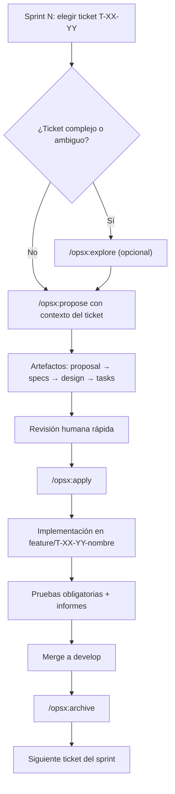

# Integración de OpenSpec con documentación
_Exported on 5/29/2026 at 18:22:44 UTC from Cursor (3.5.38)_

---

**User**

Tengo configurado en este proyecto OpenSpec pero no lo he utilizado aún.
En el fichero @docs/product-backlog.md están todos los tickets (que pertenecen a una US) y su priorización en Sprints.
Me gustaría crear las especificaciones de OpenSpec (change) de cada ticket para posteriormente desarrollarlos en el orden que se indica en los Sprints del documento.
Quiero que revises como está integrado OpenSpec con la documentación y me des instrucciones de cómo debería de invocar todo este proceso y cuales serían los pasos para que los agentes comprendan lo mejor posible el flujo.
La idea es que al crear cada "change" con OpenSpec, este automáticamente se alimente de la documentación y contexto del proyecto para que los ficheros de design.md, proposal.md y tasks.md lleguen lo más refinadas posible y listas para implementarse automáticamente.

---

**Cursor**

Revisando la integración de OpenSpec con la documentación del proyecto y el flujo de skills para darte instrucciones concretas.


En el repo, **OpenSpec está configurado pero aún no tiene ningún change creado**. Solo existe `openspec/config.yaml`; no hay carpeta `openspec/changes/` ni artefactos generados. La integración con la documentación y los agentes está bien encaminada, pero **falta conectar explícitamente el backlog de tickets** para que cada `proposal.md`, `design.md` y `tasks.md` salga lo más refinado posible.

---

## Cómo está integrado OpenSpec hoy

### 1. Configuración central (`openspec/config.yaml`)

Usa el esquema **`spec-driven`**. El bloque `context` es lo que el CLI inyecta automáticamente al generar artefactos:

```12:22:openspec/config.yaml
context: |
  Single source of truth: follow docs/base-standards.md for all project rules, workflow, and quality expectations. Do not treat other rule sources as authoritative if they conflict with base-standards.

  Standards and references (read as needed for the work):
  - docs/openspec-tasks-mandatory-steps.md — mandatory steps for openspec.
  - docs/base-standards.md — primary rulebook; links to detailed standards below.
  - docs/backend-standards.md — backend conventions.
  - docs/frontend-standards.md — frontend conventions.
  - docs/documentation-standards.md — documentation structure and maintenance.
  - docs/api-spec.yml — API contract and behavior.
  - docs/data-model.md — domain and data definitions.
```

**Qué implica:** cada artefacto hereda estándares de backend/frontend, pasos obligatorios de pruebas y convenciones Git. **No incluye** todavía `docs/product-backlog.md` ni `docs/prd.md`, que son la fuente de verdad de tickets y criterios de aceptación.

### 2. Reglas always-on para agentes

| Fuente | Rol |
|--------|-----|
| `docs/base-standards.md` | Reglas globales (TDD, idioma, flujo Git, integridad OpenSpec) |
| `docs/openspec-tasks-mandatory-steps.md` | Checklist obligatorio en `tasks.md`: rama `feature/[ticket-id]-[nombre]`, pruebas ejecutadas por el agente, merge a `develop`, informes en `specs/<change>/reports/` |

### 3. Comandos y skills en Cursor

| Comando | Skill | Fase |
|---------|-------|------|
| `/opsx:propose` | `openspec-propose` | Crear change + artefactos |
| `/opsx:apply` | `openspec-apply-change` | Implementar `tasks.md` |
| `/opsx:explore` | `openspec-explore` | Explorar/clarificar (sin código) |
| `/opsx:archive` | `openspec-archive-change` | Archivar change completado |

El esquema `spec-driven` produce **4 artefactos** (no solo 3):

1. `proposal.md` — qué y por qué  
2. `specs/` — especificaciones delta por capacidad  
3. `design.md` — cómo  
4. `tasks.md` — pasos de implementación  

El CLI define el orden vía dependencias (`openspec status --change "<name>" --json`).

### 4. Backlog como fuente de tickets

En `docs/product-backlog.md` hay **54 tickets** (`T-XX-YY`) repartidos en **6 sprints** (0–5). Cada ticket incluye:

- User Story asociada (con AC en Gherkin en la sección 1)  
- Descripción, alcance/DoD, happy path, edge cases  
- Tipo (Infra / Backend / Frontend), complejidad y story points  

Ejemplo de convención de rama que ya documentáis:

```
feature/T-13-01-habit-domain-types
```

---

## Flujo recomendado (ticket → change → implementación → archivo)



**Principio clave:** **un change activo por ticket**, en orden de sprint. No conviene crear los 54 changes de golpe.

---

## Cómo invocar cada fase (prompts concretos)

### Prerrequisito (una vez)

Comprobar que el CLI está instalado:

```bash
openspec --version
```

Si no está, instálalo según la documentación de OpenSpec (la skill lo marca como requisito).

---

### Paso A — Proponer un change desde un ticket

Usa **`/opsx:propose`** con un prompt estructurado. El nombre del change en **kebab-case** debe alinearse con el ticket:

```
/opsx:propose t-01-01-init-monorepo

Crear el change OpenSpec para el ticket T-01-01 del Sprint 0.

Fuentes obligatorias (leer antes de generar artefactos):
1. docs/product-backlog.md — sección #### T-01-01
2. docs/product-backlog.md — sección US-01 (Acceptance Criteria Gherkin)
3. docs/prd.md — contexto de producto si aplica
4. docs/development_guide.md — setup actual del repo
5. Código existente — el backlog dice greenfield pero hay código parcial; reflejar el estado real

Metadatos del ticket:
- Ticket ID: T-01-01
- User Story: US-01
- Sprint: 0
- Rama prevista: feature/T-01-01-init-monorepo
- Tipo: Infra

Requisitos para los artefactos:
- proposal.md: vincular explícitamente a US-01 y T-01-01; incluir Non-goals
- specs/: traducir los AC Gherkin del ticket/US a escenarios verificables
- design.md: decisiones técnicas alineadas con backend-standards / frontend-standards según aplique
- tasks.md: incluir TODOS los pasos obligatorios de docs/openspec-tasks-mandatory-steps.md (Paso 0 rama, pruebas, docs, merge final)

Idioma: español en documentación; identificadores de código en inglés.
```

**Convención de nombres sugerida:**

| Ticket | Change name | Rama Git |
|--------|-------------|----------|
| T-01-01 | `t-01-01-init-monorepo` | `feature/T-01-01-init-monorepo` |
| T-13-01 | `t-13-01-habit-domain-types` | `feature/T-13-01-habit-domain-types` |
| T-06-02 | `t-06-02-get-profile-endpoint` | `feature/T-06-02-get-profile-endpoint` |

---

### Paso B — Revisión humana (recomendada)

Antes de implementar, revisa:

- `proposal.md` — alcance acotado al ticket, sin scope creep  
- `design.md` — coherencia con arquitectura existente  
- `tasks.md` — Paso 0 presente, pasos obligatorios numerados, rama correcta  
- `specs/` — escenarios alineados con AC Gherkin  

Si algo falta, pide al agente que **actualice el artefacto** (no empieces a codificar fuera de OpenSpec; `base-standards.md` §7 lo exige).

---

### Paso C — Implementar

```
/opsx:apply t-01-01-init-monorepo
```

El agente debe:

1. Leer `contextFiles` del CLI (`proposal`, `specs`, `design`, `tasks`)  
2. Crear rama `feature/T-01-01-init-monorepo` desde `develop` (Paso 0)  
3. Implementar tareas en orden, marcando checkboxes  
4. Ejecutar pruebas (unitarias, curl, E2E si aplica) — **nunca delegarlas al usuario**  
5. Generar informes en `specs/<change-name>/reports/`  

---

### Paso D — Archivar

```
/opsx:archive t-01-01-init-monorepo
```

Solo cuando:

- Todas las tareas en `[x]`  
- Pruebas PASS  
- Merge a `develop` hecho  
- Documentación actualizada  

El change pasa a `openspec/changes/archive/YYYY-MM-DD-<name>/`.

---

### Paso E — Siguiente ticket

Repite A→D con el **siguiente ticket del mismo sprint** (orden del backlog):

**Sprint 0:** T-01-01 → T-01-02 → T-01-03 → T-01-04 → T-02-01 → T-03-01 → …  
**Sprint 1:** T-06-01 → T-06-02 → T-07-01 → …  

No avances de sprint hasta cerrar dependencias del anterior (el propio backlog ya respeta el grafo).

---

## Orden de Sprints y tickets (referencia rápida)

| Sprint | Tickets (orden) | Foco |
|--------|-----------------|------|
| **0** | T-01-01…T-05-04 | Scaffolding e infraestructura |
| **1** | T-06-01…T-21-02 | APIs core + dominio frontend |
| **2** | T-09-01…T-12-02 | Ciclo semanal + recompensas API |
| **3** | T-14-01…T-17-03 | UI core |
| **4** | T-18-01…T-20-03 | Stats, dashboard, tests |
| **5** | T-22-01…T-23-04 | Calidad, NFR, CI/CD |

---

## Cómo maximizar la calidad automática de los artefactos

Hoy el contexto automático **no incluye el backlog ni el PRD**. Para que los artefactos salgan más refinados sin depender solo del prompt manual, conviene (cuando pases a Agent mode):

### 1. Ampliar `openspec/config.yaml`

Añadir al bloque `context`:

```yaml
  - docs/product-backlog.md — tickets T-XX-YY, sprints, DoD por ticket
  - docs/prd.md — requisitos de producto, modelo de dominio
```

Y una sección `rules` por artefacto, por ejemplo:

```yaml
rules:
  proposal:
    - Siempre referenciar Ticket ID (T-XX-YY) y User Story (US-XX)
    - Incluir sección Non-goals
    - No ampliar scope más allá del ticket
  design:
    - Leer código existente antes de proponer estructura nueva
    - Backend: seguir Clean Architecture de backend-standards.md
    - Frontend: seguir capas de frontend-standards.md
  tasks:
    - Seguir docs/openspec-tasks-mandatory-steps.md al pie de la letra
    - Rama: feature/[ticket-id]-[ticket-name-kebab]
    - Incluir pasos de verificación con comandos concretos del proyecto
```

### 2. Crear una skill `propose-from-ticket` (recomendación fuerte)

Un wrapper sobre `openspec-propose` que:

1. Recibe `T-XX-YY`  
2. Extrae automáticamente la sección del ticket + US + AC Gherkin  
3. Inspecciona el código existente  
4. Deriva el change name y la rama  
5. Invoca el flujo estándar de propose  

Así evitas copiar el prompt largo en cada ticket.

### 3. Plantilla de prompt reutilizable

Guarda esto como snippet y solo cambia el ID del ticket:

```
/opsx:propose t-[US]-[SEQ]-[nombre-corto-kebab]

Ticket: T-[US]-[SEQ] (Sprint [N])
US: US-[US]
Rama: feature/T-[US]-[SEQ]-[nombre-corto-kebab]

Leer: product-backlog (ticket + US), prd.md, data-model.md, api-spec.yml (si backend), estándares según tipo, código existente.
Generar artefactos completos spec-driven con pasos obligatorios en tasks.md.
```

### 4. Tener en cuenta el estado real del código

El backlog dice **greenfield**, pero el repo ya tiene frontend, backend parcial, Prisma con `User`/`Calendar`, etc. En cada propose, pide explícitamente **“reflejar el estado actual del código, no asumir repo vacío”** para evitar diseños que dupliquen o contradigan lo existente.

---

## Qué NO hacer

| Anti-patrón | Por qué |
|-------------|---------|
| Crear 54 changes de una vez | Contexto diluido, difícil revisar y aplicar |
| Implementar sin `/opsx:propose` | Pierdes trazabilidad ticket ↔ spec ↔ código |
| Saltarse la revisión de `tasks.md` | Faltan pasos obligatorios (rama, pruebas, merge) |
| Codificar correcciones post-apply sin actualizar artefactos | Viola `base-standards.md` §7 |
| Confiar en `/opsx:continue` o `/opsx:ff` | Referenciados en docs pero **no hay comandos** en `.cursor/commands/`; usa `/opsx:propose` |

---

## Ejemplo completo: primer ticket del proyecto

**Ticket:** T-01-01 · Inicializar repositorio Git con estructura monorepo (Sprint 0)

```
/opsx:propose t-01-01-init-monorepo

[Prompt estructurado como en Paso A]
```

Tras generación → revisar artefactos → `/opsx:apply t-01-01-init-monorepo` → pruebas → merge → `/opsx:archive t-01-01-init-monorepo`.

Luego:

```
/opsx:propose t-01-02-typescript-strict-config
```

Y así sucesivamente.

---

## Resumen operativo

| Fase | Comando | Input mínimo |
|------|---------|--------------|
| Explorar (opcional) | `/opsx:explore` | Idea o ticket ambiguo |
| Especificar | `/opsx:propose t-XX-YY-nombre` | Ticket ID + prompt con fuentes |
| Implementar | `/opsx:apply t-XX-YY-nombre` | Change name |
| Cerrar | `/opsx:archive t-XX-YY-nombre` | Change completado + merge |

**Para que los agentes entiendan el flujo de forma consistente:** un ticket = un change = una rama feature = un ciclo propose → apply → archive, en orden de sprint del backlog, con el prompt estructurado que incluya siempre ticket, US, fuentes a leer y convención de rama.

Si quieres, en **Agent mode** puedo ayudarte a: (1) ampliar `openspec/config.yaml` con backlog/PRD y reglas por artefacto, (2) crear la skill `propose-from-ticket`, o (3) generar el primer change `t-01-01-init-monorepo` como plantilla para el resto.

---

**User**

Ok, aplica estas mejoras.

---

**Cursor**

Aplicando las mejoras acordadas: ampliar `openspec/config.yaml` y crear la skill `propose-from-ticket`.


Mejoras aplicadas. Resumen:

## Cambios realizados

### 1. `openspec/config.yaml` ampliado
- **Contexto:** añadidos `docs/product-backlog.md`, `docs/prd.md`, `docs/development_guide.md` y convenciones de workflow (1 change = 1 ticket, nombres de change/rama, idioma, estado real del código).
- **Reglas por artefacto:** `proposal`, `specs`, `design` y `tasks` con criterios concretos alineados al backlog y a los estándares del proyecto.

### 2. Nueva skill `propose-from-ticket`
- Ruta: `.cursor/skills/propose-from-ticket/SKILL.md`
- Extrae ticket + US + AC Gherkin del backlog, lee docs según tipo (Infra/Backend/Frontend), inspecciona código existente y delega en el flujo `openspec-propose`.

### 3. Nuevo comando Cursor `/opsx-propose-ticket`
- Ruta: `.cursor/commands/opsx-propose-ticket.md`
- Punto de entrada para invocar la skill desde el chat.

### 4. Documentación actualizada
- `docs/base-standards.md` — tabla del flujo OpenSpec con comandos/skills.
- `docs/development_guide.md` — sección “Flujo OpenSpec (desde el product backlog)” con ejemplo Sprint 0.
- `docs/openspec-tasks-mandatory-steps.md` — referencia a `propose-from-ticket`.
- `docs/infrastructure.md` — guía rápida actualizada.

---

## Cómo usarlo a partir de ahora

**Por ticket (recomendado):**
```
/opsx-propose-ticket T-01-01
/opsx:apply t-01-01-init-monorepo
/opsx:archive t-01-01-init-monorepo
```

**Siguiente ticket del Sprint 0:** `T-01-02`, luego `T-01-03`, etc.

El CLI OpenSpec está disponible (v1.3.1). Cuando quieras, podemos generar el primer change con `/opsx-propose-ticket T-01-01`.

---

**User**

<system_notification>
The following task has finished. If you were already aware, ignore this notification and do not restate prior responses.

<task>
kind: shell
status: success
task_id: 673571
title: Verify openspec CLI is installed
output_path: C:\Users\IsaacMani\.cursor\projects\c-Users-IsaacMani-Cursor-AI4DEVS-LIDR-ConRutina\terminals\673571.txt
</task>
</system_notification>
<user_query>Briefly inform the user about the task result and perform any follow-up actions (if needed). If there's no follow-ups needed, don't explicitly say that.</user_query>

---

**Cursor**

La verificación del CLI de OpenSpec terminó correctamente: está instalado y responde **v1.1.3.1**, así que el flujo `/opsx-propose-ticket` → `/opsx:apply` → `/opsx:archive` puede usarse ya.

Para arrancar con el Sprint 0:

```
/opsx-propose-ticket T-01-01
```

