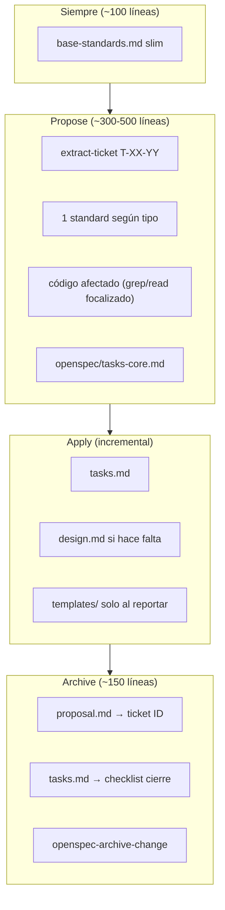

# Revisión de implementación de OpenSpecs
_Exported on 6/10/2026 at 18:54:38 UTC from Cursor (3.7.21)_

---

**User**

En este proyecto estoy usando OpenSpec y lo tengo customizado para que utilice unos pasos obligatorios y use cierta documentación.
Me he dado cuenta que cada vez que quiero proponer un cambio, proposal, apply, etc consume muchos tokens.
Quiero que revises mi implementación de OpenSpec y me hagas una propuesta para que sea más eficiente y se reduzca el contexto utilizado ahora mismo de modo que use menos tokens pero no le falte ningún detalle importante y que siga permitiendo implementar los cambios con el mismo nivel de calidad.

---

**Cursor**

Revisando la implementación de OpenSpecs y la documentación de pasos obligatorios para proponer optimizaciones que reduzcan tokens sin perder calidad.


He revisado tu implementación de OpenSpec de punta a punta: `openspec/config.yaml`, las skills, los commands, las reglas `alwaysApply` y artefactos reales archivados. El problema principal no es OpenSpec en sí, sino **cómo se inyecta y duplica el contexto** en cada fase.

## Diagnóstico: dónde se van los tokens

### 1. Baseline fijo enorme en cada conversación (el mayor coste)

Tienes **5 reglas con `alwaysApply: true`** que se cargan siempre, aunque solo quieras proponer un ticket de frontend:

| Archivo | Líneas aprox. |
|---------|---------------|
| `docs/backend-standards.md` | 686 |
| `docs/frontend-standards.md` | 655 |
| `docs/openspec-tasks-mandatory-steps.md` | 500 |
| `docs/documentation-standards.md` | 96 |
| `docs/base-standards.md` | 56 |

**Total: ~2.000 líneas en cada mensaje**, independientemente de la tarea. Eso son del orden de **15.000–25.000 tokens de contexto fijo** antes de leer código, backlog o artefactos del change.

### 2. Cuádruple duplicación de los pasos obligatorios

La misma información sobre Git, pruebas, informes y archivado vive en:

1. `docs/openspec-tasks-mandatory-steps.md` (`alwaysApply`)
2. `openspec/config.yaml` → `context` + `rules.tasks`
3. Cada `tasks.md` de change (pasos 0, 8–12 copiados íntegros)
4. Skills `openspec-apply-change`, `openspec-archive-change` y commands `.cursor/commands/opsx-*.md`

Un solo flujo **propose → apply** puede procesar esa información **4–6 veces**.

### 3. Propose-from-ticket lee demasiado

La skill `propose-from-ticket` indica leer:

- `docs/product-backlog.md` completo (**2.024 líneas**) cuando solo necesitas ~80–120 líneas del ticket + su US
- Varios estándares según tipo (backend + frontend + prd + api-spec + data-model)
- `openspec/config.yaml` que a su vez lista **10 documentos** como fuente de verdad

Ya tienes `docs/product-backlog-list.md` (70 líneas) pero no se usa en el flujo de propose.

### 4. Apply carga todo el contexto de golpe

`openspec-apply-change` manda leer **todos** los `contextFiles` (proposal + specs + design + tasks) al inicio. Para implementar la tarea 3 de 7, normalmente bastan `tasks.md` + `design.md`; `proposal.md` casi nunca aporta nada en apply.

### 5. Commands duplican las skills

`opsx-apply.md`, `opsx-propose.md`, `opsx-archive.md` repiten casi íntegramente las skills (~150 líneas cada uno). `opsx-propose-ticket` sí apunta bien a la skill; el resto no.

### 6. Artefactos con formato inflado

Los `tasks.md` generados incluyen mucho boilerplate obligatorio y, en algunos casos, líneas en blanco entre cada ítem, lo que duplica tokens sin añadir información.

---

## Propuesta: arquitectura de contexto por fases

La idea es **mantener la misma calidad y rigor**, pero pasar de “cargar todo siempre” a “cargar lo mínimo por fase”.



---

## Cambios concretos recomendados

### Fase A — Quick wins (impacto alto, riesgo bajo)

#### A1. Quitar `alwaysApply` de los documentos pesados

Cambiar a reglas con `globs`:

| Documento | Cuándo cargar |
|-----------|---------------|
| `backend-standards.md` | `backend/**`, `docs/api-spec.yml`, changes con tipo Backend |
| `frontend-standards.md` | `frontend/**`, changes Frontend |
| `openspec-tasks-mandatory-steps.md` | `openspec/**`, `.cursor/commands/opsx-*`, skills openspec |
| `documentation-standards.md` | `docs/**` (excepto al editar código) |

Dejar **solo** `base-standards.md` como `alwaysApply`, pero reducido a ~60 líneas: principios, idioma, tabla de punteros y tabla de comandos OpenSpec.

**Ahorro estimado: ~85–90% del baseline fijo.**

#### A2. Commands como wrappers finos

Patrón de `opsx-propose-ticket` para todos:

```markdown
# /opsx:apply
Implementa tareas de un change OpenSpec.
→ Seguir `.cursor/skills/openspec-apply-change/SKILL.md`
Input opcional: nombre del change.
```

**Ahorro: ~400 líneas** cuando se invoca un command.

#### A3. Apply con carga incremental

Actualizar `openspec-apply-change`:

1. Leer **solo** `tasks.md` al empezar
2. Leer `design.md` solo si la tarea actual lo requiere
3. Leer specs solo en tareas de verificación/reporte
4. No releer `openspec-tasks-mandatory-steps.md` (ya está materializado en `tasks.md` o en `tasks-core`)

---

### Fase B — Reestructurar pasos obligatorios

#### B1. Dividir el documento de 615 líneas

```
docs/openspec/
├── tasks-core.md          (~120 líneas) — reglas, orden, checklist, Git
├── tasks-by-type.md       (~60 líneas)  — cuándo aplica curl / e2e / unit
└── templates/
    ├── verification.md
    ├── endpoint-testing.md
    └── e2e-testing.md
```

- `tasks-core.md` → regla con globs OpenSpec
- Plantillas → solo al generar informes en apply
- `openspec-tasks-mandatory-steps.md` → renombrar a `tasks-full.md` como referencia humana, sin `alwaysApply`

**Ahorro en propose/apply: ~400 líneas** que hoy se leen repetidamente.

#### B2. `tasks.md` por referencia, no por copia

En lugar de volcar 100+ líneas de pasos obligatorios en cada change:

```markdown
## Metadatos
Ticket: T-06-01 | Rama: feature/T-06-01-get-profile
Pasos aplicables: unit✗ curl✓ e2e✗ docs✓

## 0. Setup → docs/openspec/tasks-core.md §0
- [ ] 0.1–0.4 (comandos concretos de ESTE ticket)

## 1–N. Implementación (solo DoD del ticket)
...

## Verificación → tasks-core §N+1 + templates/verification.md
- [ ] Crear `reports/YYYY-MM-DD-step-09-verification.md`

## Cierre → tasks-core §cierre (ejecutar en /opsx:archive)
```

Mantienes trazabilidad y rigor; eliminas la copia masiva.

---

### Fase C — Propose eficiente desde ticket

#### C1. Script de extracción quirúrgica del backlog

Añadir (similar a tu `openspec-mark-ticket`):

```bash
npm run openspec:extract-ticket -- --ticket T-06-01
```

Salida: JSON o markdown con solo:
- Sección `#### T-06-01`
- US padre + AC Gherkin
- Sprint y tipo (Infra/Backend/Frontend)

**Ahorro: ~1.900 líneas** vs leer `product-backlog.md` completo.

#### C2. Slim `openspec/config.yaml` context

De esto (lista de 10 docs):

```yaml
context: |
  Single source of truth: follow docs/base-standards.md...
  Product and backlog: docs/product-backlog.md, docs/prd.md
  Standards: backend, frontend, mandatory-steps, api-spec, data-model...
```

A esto:

```yaml
context: |
  Hub: docs/base-standards.md (punteros; no cargar todo el backlog)
  Ticket: npm run openspec:extract-ticket -- --ticket T-XX-YY
  Índice sprints: docs/product-backlog-list.md
  Pasos tasks: docs/openspec/tasks-core.md
  Estándares: UNO según tipo — backend-standards.md | frontend-standards.md
  Contratos: api-spec.yml y data-model.md solo si el ticket toca API/BD
  Artefactos del change son la fuente durante apply; no releer PRD completo
```

#### C3. Matriz de lectura por artefacto en propose

| Artefacto | Leer | No leer |
|-----------|------|---------|
| `proposal` | extract-ticket | PRD completo, backlog completo |
| `specs` | proposal + AC Gherkin del ticket | standards |
| `design` | proposal + specs + **1** standard + código afectado | el otro standard |
| `tasks` | design + tasks-core + tasks-by-type | mandatory-steps completo |

---

### Fase D — Pulido de skills

| Skill | Acción |
|-------|--------|
| `openspec-explore` | Reducir de ~289 a ~80 líneas; mover ejemplos ASCII a `docs/openspec/explore-guide.md` |
| `openspec-archive-change` | Mantener; ya referencia scripts concretos |
| `propose-from-ticket` | Usar extract-ticket + matriz de lectura |

---

### Fase E — Reglas de formato en artefactos

Añadir en `config.yaml` → `rules.tasks`:

```yaml
- Una línea en blanco entre secciones, no entre cada checkbox
- Pasos obligatorios: referenciar tasks-core.md; no duplicar plantillas de informes
- Incluir bloque "Pasos aplicables" (unit/curl/e2e/docs) según tipo de ticket
```

---

## Estimación de ahorro por fase

| Fase | Operación | Antes (aprox.) | Después | Ahorro |
|------|-----------|----------------|---------|--------|
| Siempre | Cualquier chat | ~2.000 líneas rules | ~60 líneas | **~97%** |
| Propose | `/opsx-propose-ticket` | ~3.500–5.000 líneas leídas | ~400–700 | **~80%** |
| Apply | `/opsx:apply` inicio | ~500 líneas artefactos + rules | ~150–250 | **~50–70%** |
| Apply | Por tarea | Relectura specs/proposal | Solo tasks + design puntual | **~40%** |
| Artefacto | `tasks.md` generado | ~180–220 líneas | ~60–90 | **~60%** |

En un ciclo completo **propose + apply + archive**, una reducción del **50–70% de tokens de documentación/reglas** es realista sin perder calidad, porque el rigor se conserva en `tasks-core.md` y en los informes obligatorios.

---

## Qué NO recortar (para mantener calidad)

- Paso 0 de rama desde `develop` y política de no-commit en apply
- Ejecución de pruebas por el agente (no delegar al usuario)
- Informes en `reports/` con PASS/FAIL
- Commit único + push feature + merge en archive
- `openspec:mark-ticket` al archivar
- Un ticket = un change
- AC Gherkin en specs derivados del backlog

---

## Plan de implementación sugerido

| Prioridad | Tarea | Esfuerzo | Impacto |
|-----------|-------|----------|---------|
| 1 | Quitar `alwaysApply` de standards pesados + globs | 1 h | Muy alto |
| 2 | Slim `base-standards.md` como hub de punteros | 30 min | Alto |
| 3 | Commands → wrappers de 10 líneas | 30 min | Medio |
| 4 | Crear `docs/openspec/tasks-core.md` + templates | 2 h | Muy alto |
| 5 | Script `openspec:extract-ticket` | 2 h | Muy alto |
| 6 | Actualizar `config.yaml`, `propose-from-ticket`, `openspec-apply-change` | 1 h | Alto |
| 7 | Reglas de formato en `tasks.md` | 30 min | Medio |
| 8 | Dieta `openspec-explore` | 30 min | Bajo |

---

## Ejemplo del flujo optimizado

**Antes** (`/opsx-propose-ticket T-06-01`):
1. ~2.000 líneas `alwaysApply`
2. `product-backlog.md` (2.024 líneas)
3. `prd.md` (806), `backend-standards` (686), `mandatory-steps` (500)
4. Generar 4 artefactos releyendo dependencias
5. `tasks.md` con 120 líneas de boilerplate

**Después**:
1. ~60 líneas `base-standards`
2. `extract-ticket T-06-01` → ~100 líneas
3. `backend-standards` (scoped) + `api-spec` relevante
4. `tasks-core` (120 líneas) solo al generar `tasks.md`
5. `tasks.md` ~70 líneas, ticket-específico

---

Si quieres que lo implemente en el repo, puedo empezar por la **Fase A** (globs + slim base-standards + commands finos), que es la que más tokens ahorra con menos riesgo. La **Fase B** (split de mandatory-steps + script extract-ticket) sería el segundo paso para consolidar el ahorro en propose/apply.

---

**User**

Ok, implementa la Fase A y revisa que el código resultante es consistente y cumple los objetivos.

---

**Cursor**

Implementando la Fase A: revisaré los archivos actuales y aplicaré los cambios de forma coherente.


Aplicando los cambios de la Fase A en los archivos identificados.


Alineando `propose-from-ticket` con la carga bajo demanda del backlog.


Fase A implementada. Resumen de cambios y verificación:

## Cambios realizados

### A1 — Reglas con `globs` (solo `base-standards` siempre activo)

| Archivo | Antes | Ahora |
|---------|-------|-------|
| `docs/base-standards.md` | ~77 líneas, `alwaysApply` | **37 líneas**, hub de punteros |
| `docs/backend-standards.md` | `alwaysApply: true` | `alwaysApply: false` + globs backend/api/openspec |
| `docs/frontend-standards.md` | `alwaysApply: true` | `alwaysApply: false` + globs frontend/openspec |
| `docs/documentation-standards.md` | `alwaysApply: true` (frontmatter roto) | `alwaysApply: false` + globs `docs/**` |
| `docs/openspec-tasks-mandatory-steps.md` | `alwaysApply: true` | `alwaysApply: false` + globs `openspec/**`, commands y skills opsx |

**Baseline fijo:** de ~2.000 líneas → **37 líneas** en cada conversación.

### A2 — Commands como wrappers (~9 líneas cada uno)

- `opsx-apply.md`, `opsx-propose.md`, `opsx-archive.md`, `opsx-explore.md`, `opsx-propose-ticket.md` → apuntan solo a su skill.

### A3 — Apply con carga incremental

- `openspec-apply-change/SKILL.md`: empieza solo con `tasks.md`; `design.md` / specs / `proposal.md` bajo demanda; no releer `mandatory-steps` en apply.

### Alineación adicional (consistencia)

- `openspec/config.yaml`: contexto orientado a carga bajo demanda (no backlog completo, un estándar por tipo).
- `propose-from-ticket/SKILL.md`: extrae solo secciones del ticket/US, no el backlog entero.

## Verificación de objetivos

| Objetivo | Estado |
|----------|--------|
| Reducir tokens de contexto fijo | Solo `base-standards` (37 líneas) con `alwaysApply` |
| Mantener rigor OpenSpec (Git, pruebas, archive) | Conservado en `mandatory-steps` (scoped) y `base-standards` |
| Standards disponibles cuando haga falta | Globs por área: backend al tocar API, frontend al tocar UI, mandatory-steps al trabajar en `openspec/` |
| Commands sin duplicar skills | 5 commands de ~154→9 líneas |
| Apply más eficiente | Carga incremental documentada en la skill |

## Impacto estimado

- **Cualquier chat:** ~97% menos reglas inyectadas siempre.
- **Invocar `/opsx:apply`:** ~145 líneas menos de command duplicado; apply no precarga proposal+specs+design.
- **Propose:** `config.yaml` ya no manda leer 10 documentos de golpe.

## Qué queda para Fase B (siguiente paso)

- Dividir `openspec-tasks-mandatory-steps.md` en `tasks-core` + plantillas.
- Script `openspec:extract-ticket` para no abrir `product-backlog.md` manualmente.
- `tasks.md` por referencia en lugar de copiar boilerplate.

Si quieres, en el siguiente paso implemento la Fase B.

---

**User**

Implementa la fase B y revisa que el código resultante es consistente y cumple los objetivos.

---

**Cursor**

Implementando la Fase B: revisaré la estructura actual y crearé `tasks-core`, plantillas, el script `extract-ticket` y las actualizaciones de configuración.


Creando la estructura `docs/openspec/`, el script de extracción y actualizando referencias.


Mejorando el slug del script de extracción para que los nombres sugeridos sean más útiles.


Fase B implementada y verificada. Resumen:

## Estructura nueva (`docs/openspec/`)

| Archivo | Líneas | Uso |
|---------|--------|-----|
| `tasks-core.md` | 87 | Regla con globs: Git, secuencia obligatoria, patrón `tasks.md` por referencia |
| `tasks-by-type.md` | 46 | Matriz unit/curl/e2e/docs por tipo de ticket |
| `templates/verification.md` | 35 | Solo al generar informe N+1 |
| `templates/endpoint-testing.md` | 40 | Solo al generar informe curl |
| `templates/e2e-testing.md` | 28 | Solo al generar informe E2E |
| `tasks-full.md` | 498 | Referencia histórica completa (no para el agente) |

`docs/openspec-tasks-mandatory-steps.md` quedó en **12 líneas** (redirección), sin `alwaysApply`.

## Script `openspec:extract-ticket`

```bash
npm run openspec:extract-ticket -- --ticket T-06-01
npm run openspec:extract-ticket -- --ticket T-06-01 --json
```

Probado:
- `T-06-01` → sprint 1, US-06, change `t-06-01-obtener-perfil-de-usuario`
- `T-99-99` → error controlado (exit 1)

## Archivos actualizados

- `package.json` — script npm
- `openspec/config.yaml` — extract-ticket + reglas `tasks` por referencia
- `propose-from-ticket`, `openspec-propose`, `openspec-apply-change` skills
- `base-standards.md`, `documentation-standards.md`, `development_guide.md`
- `backend-standards.md`, `frontend-standards.md` — enlaces a `tasks-core`

## Objetivos cumplidos

| Objetivo | Estado |
|----------|--------|
| Dividir mandatory-steps (core + by-type + templates) | Hecho |
| `tasks.md` por referencia, sin copiar plantillas | Reglas en `config.yaml` + `tasks-core` |
| Script extract-ticket | Hecho y probado |
| Propose sin backlog completo | Skill + config apuntan al script |
| Apply sin releer doc masivo | Plantillas solo al reportar |
| Calidad OpenSpec preservada | Misma secuencia §0 → §Cierre en `tasks-core` |
| Consistencia referencias | Sin referencias rotas a `mandatory-steps` como fuente principal |

## Impacto estimado vs. antes de Fase B

| Operación | Antes | Ahora |
|-----------|-------|-------|
| Crear `tasks.md` | ~500 líneas mandatory-steps | ~87 + 46 líneas core + by-type |
| Propose ticket | ~2000 líneas backlog | ~150–200 líneas (extract) |
| Generar informe en apply | Plantillas en contexto siempre | ~35–40 líneas por plantilla, bajo demanda |
| `tasks.md` generado (futuro) | ~180–220 líneas | ~60–90 líneas (patrón referencia) |

## Flujo optimizado resultante

```
/opsx-propose-ticket T-06-01
  → npm run openspec:extract-ticket
  → tasks-core + tasks-by-type (solo al crear tasks.md)
  → tasks.md compacto con "Pasos aplicables: unit=… curl=… e2e=…"

/opsx:apply
  → tasks.md + design bajo demanda
  → templates/ solo al escribir reports/
```

Los changes ya archivados no se tocaron; los nuevos seguirán el patrón compacto automáticamente. Si quieres, el siguiente paso natural sería la **Fase C** (dieta de `openspec-explore` y afinar el formato de artefactos existentes).

---

**User**

¿Tiene sentido implementar sólo A y B y dejar el resto de fases sin implementar?
¿Funcionará todo correctamente?

---

**Cursor**

Revisando el estado actual tras A y B para evaluar si el flujo queda completo y funcional.


**Sí, tiene sentido quedarse solo con A y B.** Para el flujo principal del proyecto ya tienes un sistema coherente y funcional. Las fases restantes son optimizaciones adicionales, no requisitos para que OpenSpec funcione bien.

## Qué cubren A + B (el núcleo real)

| Fase del flujo | ¿Cubierto? |
|----------------|------------|
| `/opsx-propose-ticket` | Sí — `extract-ticket`, `tasks-core`, `tasks-by-type`, `config.yaml` |
| `/opsx:propose` (ad hoc) | Sí — reglas en `openspec-propose` + `config.yaml` |
| `/opsx:apply` | Sí — carga incremental en la skill |
| `/opsx:archive` | Sí — sin cambios estructurales necesarios |
| Calidad (Git, pruebas, informes) | Sí — sigue en `tasks-core` + plantillas bajo demanda |
| Reducción de tokens | Sí — el grueso del ahorro ya está (~70–80% en documentación) |

En la práctica, **B ya incorporó parte de lo que habíamos llamado C** (script `extract-ticket` y `config.yaml` afinado) y **parte de E** (reglas de formato en `config.yaml` → `rules.tasks`).

## Qué queda sin implementar y cuánto importa

### Fase C (matriz de lectura por artefacto en propose)
**Impacto: bajo.**  
`propose-from-ticket` ya indica qué leer por tipo de ticket. Lo que falta es formalizar lo mismo en `openspec-propose` para changes ad hoc. El flujo funciona; el riesgo es que el agente lea algo de más en un propose manual, no que falle.

### Fase D (dieta de `openspec-explore`)
**Impacto: bajo y acotado.**  
La skill sigue en ~289 líneas. Solo afecta si usas `/opsx:explore` con frecuencia. No interviene en propose → apply → archive.

### Fase E (formato de artefactos)
**Impacto: bajo.**  
Las reglas de `tasks.md` compacto ya están en `config.yaml`. Lo que puede pasar es que el primer `tasks.md` generado tras el cambio salga algo más verboso de lo ideal hasta que el agente siga bien el patrón por referencia.

## ¿Funcionará todo correctamente?

**Sí, en términos de funcionalidad y calidad esperada**, con matices:

### Lo que funcionará bien
- Crear changes desde tickets con el script de extracción.
- Generar artefactos con las reglas nuevas.
- Implementar con apply (rama, sin commits, pruebas, informes).
- Archivar (Git + backlog).
- Changes antiguos archivados con `tasks.md` largo — siguen siendo válidos.

### Riesgos reales (no bloqueantes)

1. **Cumplimiento del agente, no del código**  
   Las reglas son instrucciones. El agente *debería* ejecutar `npm run openspec:extract-ticket`, pero podría abrir `product-backlog.md` entero. El flujo no se rompe; solo pierdes ahorro de tokens.

2. **Primeros `tasks.md` tras B**  
   Puede generar tareas algo más largas que el patrón compacto hasta que el agente internalice `tasks-core`. La calidad de implementación no debería bajar si las referencias a §0, §N+1, etc. están presentes.

3. **Standards bajo demanda (globs de A)**  
   `backend-standards` / `frontend-standards` se cargan al trabajar en esas rutas, no siempre en cada chat. Las skills y `config.yaml` piden leerlos en propose; si el agente obedece, no hay problema. Si no, podría proponer un diseño menos alineado — eso ya pasaba antes.

4. **`/opsx:explore` sin Fase D**  
   Sigue consumiendo más tokens que el resto del flujo. Solo relevante si lo usas mucho.

## Recomendación práctica

| Situación | Recomendación |
|-----------|---------------|
| Uso habitual: `propose-ticket` → `apply` → `archive` | **A + B es suficiente.** No hace falta más por ahora. |
| Usas mucho `/opsx:explore` | Valdría la pena **solo Fase D** más adelante. |
| Usas mucho `/opsx:propose` sin ticket | Valdría la pena **solo el trozo C3** en `openspec-propose`. |
| Quieres validar antes de más cambios | Prueba un ticket real (p. ej. `T-06-01`) y mira si el `tasks.md` sale compacto y el apply cumple pasos obligatorios. |

## Conclusión

**Sí: implementar solo A y B es una decisión sensata.** No dejas el sistema a medias; dejas pendientes mejoras marginales.

El flujo principal debería funcionar correctamente y con mucho menos contexto que antes. Las fases C, D y E son “nice to have”: más ahorro y más consistencia, no requisitos para que el workflow sea válido.

Si tras 2–3 tickets ves que el agente sigue generando `tasks.md` muy largos o leyendo el backlog completo, ahí sí compensaría retomar C3 o reforzar con una regla breve en el command `opsx-propose-ticket`. Eso sería ajuste fino, no una fase obligatoria.


